```r
bank_data <- read.csv('~/GitHub/Stats_23_Project/BankChurners.csv')

# client_num should be added to qualitative as well as primary key
# dependent_count to qualitative? 

head(bank_data)
```

```
##   CLIENTNUM    Attrition_Flag Customer_Age Gender Dependent_count Education_Level Marital_Status
## 1 768805383 Existing Customer           45      M               3     High School        Married
## 2 818770008 Existing Customer           49      F               5        Graduate         Single
## 3 713982108 Existing Customer           51      M               3        Graduate        Married
## 4 769911858 Existing Customer           40      F               4     High School        Unknown
## 5 709106358 Existing Customer           40      M               3      Uneducated        Married
## 6 713061558 Existing Customer           44      M               2        Graduate        Married
##   Income_Category Card_Category Months_on_book Total_Relationship_Count Months_Inactive_12_mon
## 1     $60K - $80K          Blue             39                        5                      1
## 2  Less than $40K          Blue             44                        6                      1
## 3    $80K - $120K          Blue             36                        4                      1
## 4  Less than $40K          Blue             34                        3                      4
## 5     $60K - $80K          Blue             21                        5                      1
## 6     $40K - $60K          Blue             36                        3                      1
##   Contacts_Count_12_mon Credit_Limit Total_Revolving_Bal Avg_Open_To_Buy Total_Amt_Chng_Q4_Q1
## 1                     3        12691                 777           11914                1.335
## 2                     2         8256                 864            7392                1.541
## 3                     0         3418                   0            3418                2.594
## 4                     1         3313                2517             796                1.405
## 5                     0         4716                   0            4716                2.175
## 6                     2         4010                1247            2763                1.376
##   Total_Trans_Amt Total_Trans_Ct Total_Ct_Chng_Q4_Q1 Avg_Utilization_Ratio
## 1            1144             42               1.625                 0.061
## 2            1291             33               3.714                 0.105
## 3            1887             20               2.333                 0.000
## 4            1171             20               2.333                 0.760
## 5             816             28               2.500                 0.000
## 6            1088             24               0.846                 0.311
##   Naive_Bayes_Classifier_Attrition_Flag_Card_Category_Contacts_Count_12_mon_Dependent_count_Education_Level_Months_Inactive_12_mon_1
## 1                                                                                                                         9.3448e-05
## 2                                                                                                                         5.6861e-05
## 3                                                                                                                         2.1081e-05
## 4                                                                                                                         1.3366e-04
## 5                                                                                                                         2.1676e-05
## 6                                                                                                                         5.5077e-05
##   Naive_Bayes_Classifier_Attrition_Flag_Card_Category_Contacts_Count_12_mon_Dependent_count_Education_Level_Months_Inactive_12_mon_2
## 1                                                                                                                            0.99991
## 2                                                                                                                            0.99994
## 3                                                                                                                            0.99998
## 4                                                                                                                            0.99987
## 5                                                                                                                            0.99998
## 6                                                                                                                            0.99994
```

```r
dim(bank_data) #10127 rows and 23 columns
```

```
## [1] 10127    23
```

```r
summary(bank_data)
```

```
##    CLIENTNUM         Attrition_Flag      Customer_Age      Gender          Dependent_count
##  Min.   :708082083   Length:10127       Min.   :26.00   Length:10127       Min.   :0.000  
##  1st Qu.:713036770   Class :character   1st Qu.:41.00   Class :character   1st Qu.:1.000  
##  Median :717926358   Mode  :character   Median :46.00   Mode  :character   Median :2.000  
##  Mean   :739177606                      Mean   :46.33                      Mean   :2.346  
##  3rd Qu.:773143533                      3rd Qu.:52.00                      3rd Qu.:3.000  
##  Max.   :828343083                      Max.   :73.00                      Max.   :5.000  
##  Education_Level    Marital_Status     Income_Category    Card_Category      Months_on_book 
##  Length:10127       Length:10127       Length:10127       Length:10127       Min.   :13.00  
##  Class :character   Class :character   Class :character   Class :character   1st Qu.:31.00  
##  Mode  :character   Mode  :character   Mode  :character   Mode  :character   Median :36.00  
##                                                                              Mean   :35.93  
##                                                                              3rd Qu.:40.00  
##                                                                              Max.   :56.00  
##  Total_Relationship_Count Months_Inactive_12_mon Contacts_Count_12_mon  Credit_Limit  
##  Min.   :1.000            Min.   :0.000          Min.   :0.000         Min.   : 1438  
##  1st Qu.:3.000            1st Qu.:2.000          1st Qu.:2.000         1st Qu.: 2555  
##  Median :4.000            Median :2.000          Median :2.000         Median : 4549  
##  Mean   :3.813            Mean   :2.341          Mean   :2.455         Mean   : 8632  
##  3rd Qu.:5.000            3rd Qu.:3.000          3rd Qu.:3.000         3rd Qu.:11068  
##  Max.   :6.000            Max.   :6.000          Max.   :6.000         Max.   :34516  
##  Total_Revolving_Bal Avg_Open_To_Buy Total_Amt_Chng_Q4_Q1 Total_Trans_Amt Total_Trans_Ct  
##  Min.   :   0        Min.   :    3   Min.   :0.0000       Min.   :  510   Min.   : 10.00  
##  1st Qu.: 359        1st Qu.: 1324   1st Qu.:0.6310       1st Qu.: 2156   1st Qu.: 45.00  
##  Median :1276        Median : 3474   Median :0.7360       Median : 3899   Median : 67.00  
##  Mean   :1163        Mean   : 7469   Mean   :0.7599       Mean   : 4404   Mean   : 64.86  
##  3rd Qu.:1784        3rd Qu.: 9859   3rd Qu.:0.8590       3rd Qu.: 4741   3rd Qu.: 81.00  
##  Max.   :2517        Max.   :34516   Max.   :3.3970       Max.   :18484   Max.   :139.00  
##  Total_Ct_Chng_Q4_Q1 Avg_Utilization_Ratio
##  Min.   :0.0000      Min.   :0.0000       
##  1st Qu.:0.5820      1st Qu.:0.0230       
##  Median :0.7020      Median :0.1760       
##  Mean   :0.7122      Mean   :0.2749       
##  3rd Qu.:0.8180      3rd Qu.:0.5030       
##  Max.   :3.7140      Max.   :0.9990       
##  Naive_Bayes_Classifier_Attrition_Flag_Card_Category_Contacts_Count_12_mon_Dependent_count_Education_Level_Months_Inactive_12_mon_1
##  Min.   :0.0000077                                                                                                                 
##  1st Qu.:0.0000990                                                                                                                 
##  Median :0.0001815                                                                                                                 
##  Mean   :0.1599975                                                                                                                 
##  3rd Qu.:0.0003373                                                                                                                 
##  Max.   :0.9995800                                                                                                                 
##  Naive_Bayes_Classifier_Attrition_Flag_Card_Category_Contacts_Count_12_mon_Dependent_count_Education_Level_Months_Inactive_12_mon_2
##  Min.   :0.00042                                                                                                                   
##  1st Qu.:0.99966                                                                                                                   
##  Median :0.99982                                                                                                                   
##  Mean   :0.84000                                                                                                                   
##  3rd Qu.:0.99990                                                                                                                   
##  Max.   :0.99999
```

```r
col = c('CLIENTNUM', 'Attrition_Flag', 'Customer_Age',	'Gender',	'Dependent_count', 'Education_Level',	'Marital_Status',	'Income_Category', 'Card_Category',	'Months_on_book',	'Total_Relationship_Count', 'Months_Inactive_12_mon',	'Contacts_Count_12_mon', 'Credit_Limit', 'Total_Revolving_Bal',	'Avg_Open_To_Buy', 'Total_Amt_Chng_Q4_Q1', 'Total_Trans_Amt', 'Total_Trans_Ct', 'Total_Ct_Chng_Q4_Q1',	'Avg_Utilization_Ratio',	'Naive_Bayes_Classifier_Attrition_Flag_Card_Category_Contacts_Count_12_mon_Dependent_count_Education_Level_Months_Inactive_12_mon_1',	'Naive_Bayes_Classifier_Attrition_Flag_Card_Category_Contacts_Count_12_mon_Dependent_count_Education_Level_Months_Inactive_12_mon_2')

library(knitr)
library(forecast)
```

```
## Registered S3 method overwritten by 'quantmod':
##   method            from
##   as.zoo.data.frame zoo
```

```r
library(ggplot2)
library(PCAmixdata)
library(dplyr)
```

```
## 
## Attaching package: 'dplyr'
```

```
## The following objects are masked from 'package:stats':
## 
##     filter, lag
```

```
## The following objects are masked from 'package:base':
## 
##     intersect, setdiff, setequal, union
```

```r
# BRIEF DESCRIPTION OF EACH VARIABLE
var.names <- c("Clientnum", "Attrition_Flag", "Customer_Age", "Gender", "Dependent_count", 
               "Education_Level", "Marital_Status", "Income_Category", "Card_Category", "Months_on_book",
               "Total_Relationship_Count", "Months_Inactive_12_mon", "Contacts_Count_12_mon", "Credit_Limit",
               "Total_Revolving_Bal", "Avg_Open_To_Buy", "Total_Amt_Chng_Q4_Q1", "Total_Trans_Amt",
               "Total_Trans_Ct", "Total_Ct_Chng_Q4_Q1", "Avg_Utilization_Ratio")
descriptions <- c("represents the unique IDs of customers. It is formed by a unique sequence of 9 digits. There is a total of 10,127 unique customers in the datasets.",
                 "this target/output variable represents the current status of customers. It has two unique values: one is Existing Customer (current customer) and Attrited Customer (churned customer).",
                 "this variable consist of the age of customers. The age range of customers is between 27 and 73.",
                 "this variable is coded as F for Female and M for Male.",
                 "this variable represents the number of dependents associated with a customer.",
                 "this variable represents the educational qualification of a customer. It consist of 7 unique values which are High School, Graduate, Uneducated, College, Post-graduate, Doctorate and Unknown. The Unknown group has 1519 customers.",
                 "this variable represents the marital status of customers. It has 4 unique values which are Married, Single, Unknown, Divorced. The Unknown group has 749 customers.",
                 "this variable represents the annual income category of card holder: Less than  40K, 40k- 60K, 60K- 80K, 80K-120K, $120+, Unknown. The Unknown group has 1112 customer in this category.",
                 "this is a product variable that represents the credit card type. It has 4 unique values - Blue, Gold, Silver and Platinum.",
                 "represents the number of months (period) the account holder has been a customer in the bank.",
                 "represents the number of products held by the customer.",
                 "this is the number of months a customer has been inactive in the last 12 months (1 year).",
                 "this is the number of times a customer has made contact with the bank.",
                 "this is the credit limit on the credit card owned by customer.",
                 "represents total revolving balance on the credit card.",
                 "represents the average Open to Buy Credit Line for last 12 months.",
                 "represents the change in transaction amount from Q4 over Q1.",
                 "represents the total transaction amount in the last 12 months.",
                 "represents the total transaction count in the last 12 months.",
                 "represents the change in transaction count from Q4 over Q1.",
                 "represents the average card utilization ratio.")
var.dict <- as.data.frame(descriptions, row.names = var.names, )
install.packages("formattable")
```

```
## Installing package into 'C:/Users/Kaan/AppData/Local/R/win-library/4.2'
## (as 'lib' is unspecified)
```

```
## package 'formattable' successfully unpacked and MD5 sums checked
## 
## The downloaded binary packages are in
## 	C:\Users\Kaan\AppData\Local\Temp\Rtmpi6VH2B\downloaded_packages
```

```r
library(formattable) # for giving a variable dictionary a better look
formattable(var.dict)
```


<table class="table table-condensed">
 <thead>
  <tr>
   <th style="text-align:left;">   </th>
   <th style="text-align:right;"> descriptions </th>
  </tr>
 </thead>
<tbody>
  <tr>
   <td style="text-align:left;"> Clientnum </td>
   <td style="text-align:right;"> represents the unique IDs of customers. It is formed by a unique sequence of 9 digits. There is a total of 10,127 unique customers in the datasets. </td>
  </tr>
  <tr>
   <td style="text-align:left;"> Attrition_Flag </td>
   <td style="text-align:right;"> this target/output variable represents the current status of customers. It has two unique values: one is Existing Customer (current customer) and Attrited Customer (churned customer). </td>
  </tr>
  <tr>
   <td style="text-align:left;"> Customer_Age </td>
   <td style="text-align:right;"> this variable consist of the age of customers. The age range of customers is between 27 and 73. </td>
  </tr>
  <tr>
   <td style="text-align:left;"> Gender </td>
   <td style="text-align:right;"> this variable is coded as F for Female and M for Male. </td>
  </tr>
  <tr>
   <td style="text-align:left;"> Dependent_count </td>
   <td style="text-align:right;"> this variable represents the number of dependents associated with a customer. </td>
  </tr>
  <tr>
   <td style="text-align:left;"> Education_Level </td>
   <td style="text-align:right;"> this variable represents the educational qualification of a customer. It consist of 7 unique values which are High School, Graduate, Uneducated, College, Post-graduate, Doctorate and Unknown. The Unknown group has 1519 customers. </td>
  </tr>
  <tr>
   <td style="text-align:left;"> Marital_Status </td>
   <td style="text-align:right;"> this variable represents the marital status of customers. It has 4 unique values which are Married, Single, Unknown, Divorced. The Unknown group has 749 customers. </td>
  </tr>
  <tr>
   <td style="text-align:left;"> Income_Category </td>
   <td style="text-align:right;"> this variable represents the annual income category of card holder: Less than  40K, 40k- 60K, 60K- 80K, 80K-120K, $120+, Unknown. The Unknown group has 1112 customer in this category. </td>
  </tr>
  <tr>
   <td style="text-align:left;"> Card_Category </td>
   <td style="text-align:right;"> this is a product variable that represents the credit card type. It has 4 unique values - Blue, Gold, Silver and Platinum. </td>
  </tr>
  <tr>
   <td style="text-align:left;"> Months_on_book </td>
   <td style="text-align:right;"> represents the number of months (period) the account holder has been a customer in the bank. </td>
  </tr>
  <tr>
   <td style="text-align:left;"> Total_Relationship_Count </td>
   <td style="text-align:right;"> represents the number of products held by the customer. </td>
  </tr>
  <tr>
   <td style="text-align:left;"> Months_Inactive_12_mon </td>
   <td style="text-align:right;"> this is the number of months a customer has been inactive in the last 12 months (1 year). </td>
  </tr>
  <tr>
   <td style="text-align:left;"> Contacts_Count_12_mon </td>
   <td style="text-align:right;"> this is the number of times a customer has made contact with the bank. </td>
  </tr>
  <tr>
   <td style="text-align:left;"> Credit_Limit </td>
   <td style="text-align:right;"> this is the credit limit on the credit card owned by customer. </td>
  </tr>
  <tr>
   <td style="text-align:left;"> Total_Revolving_Bal </td>
   <td style="text-align:right;"> represents total revolving balance on the credit card. </td>
  </tr>
  <tr>
   <td style="text-align:left;"> Avg_Open_To_Buy </td>
   <td style="text-align:right;"> represents the average Open to Buy Credit Line for last 12 months. </td>
  </tr>
  <tr>
   <td style="text-align:left;"> Total_Amt_Chng_Q4_Q1 </td>
   <td style="text-align:right;"> represents the change in transaction amount from Q4 over Q1. </td>
  </tr>
  <tr>
   <td style="text-align:left;"> Total_Trans_Amt </td>
   <td style="text-align:right;"> represents the total transaction amount in the last 12 months. </td>
  </tr>
  <tr>
   <td style="text-align:left;"> Total_Trans_Ct </td>
   <td style="text-align:right;"> represents the total transaction count in the last 12 months. </td>
  </tr>
  <tr>
   <td style="text-align:left;"> Total_Ct_Chng_Q4_Q1 </td>
   <td style="text-align:right;"> represents the change in transaction count from Q4 over Q1. </td>
  </tr>
  <tr>
   <td style="text-align:left;"> Avg_Utilization_Ratio </td>
   <td style="text-align:right;"> represents the average card utilization ratio. </td>
  </tr>
</tbody>
</table>

```r
data.split <- splitmix(bank_data)
```

```
## Warning in splitmix(bank_data): Columns of class integer are considered as quantitative
```

```r
quantitative <- data.split$X.quanti
qualitative <- data.split$X.quali

length(quantitative)
```

```
## [1] 17
```

```r
length(qualitative)
```

```
## [1] 6
```

```r
#Checking if there is any null value in the data set
colSums(is.na(bank_data)) #no null value
```

```
##                                                                                                                          CLIENTNUM 
##                                                                                                                                  0 
##                                                                                                                     Attrition_Flag 
##                                                                                                                                  0 
##                                                                                                                       Customer_Age 
##                                                                                                                                  0 
##                                                                                                                             Gender 
##                                                                                                                                  0 
##                                                                                                                    Dependent_count 
##                                                                                                                                  0 
##                                                                                                                    Education_Level 
##                                                                                                                                  0 
##                                                                                                                     Marital_Status 
##                                                                                                                                  0 
##                                                                                                                    Income_Category 
##                                                                                                                                  0 
##                                                                                                                      Card_Category 
##                                                                                                                                  0 
##                                                                                                                     Months_on_book 
##                                                                                                                                  0 
##                                                                                                           Total_Relationship_Count 
##                                                                                                                                  0 
##                                                                                                             Months_Inactive_12_mon 
##                                                                                                                                  0 
##                                                                                                              Contacts_Count_12_mon 
##                                                                                                                                  0 
##                                                                                                                       Credit_Limit 
##                                                                                                                                  0 
##                                                                                                                Total_Revolving_Bal 
##                                                                                                                                  0 
##                                                                                                                    Avg_Open_To_Buy 
##                                                                                                                                  0 
##                                                                                                               Total_Amt_Chng_Q4_Q1 
##                                                                                                                                  0 
##                                                                                                                    Total_Trans_Amt 
##                                                                                                                                  0 
##                                                                                                                     Total_Trans_Ct 
##                                                                                                                                  0 
##                                                                                                                Total_Ct_Chng_Q4_Q1 
##                                                                                                                                  0 
##                                                                                                              Avg_Utilization_Ratio 
##                                                                                                                                  0 
## Naive_Bayes_Classifier_Attrition_Flag_Card_Category_Contacts_Count_12_mon_Dependent_count_Education_Level_Months_Inactive_12_mon_1 
##                                                                                                                                  0 
## Naive_Bayes_Classifier_Attrition_Flag_Card_Category_Contacts_Count_12_mon_Dependent_count_Education_Level_Months_Inactive_12_mon_2 
##                                                                                                                                  0
```

```r
#Customer age

#boxplot
cust.age.boxplot <- boxplot(quantitative$Customer_Age, ylab = "age")
```

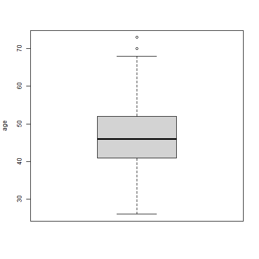

```r
cust.age.boxplot
```

```
## $stats
##      [,1]
## [1,]   26
## [2,]   41
## [3,]   46
## [4,]   52
## [5,]   68
## 
## $n
## [1] 10127
## 
## $conf
##          [,1]
## [1,] 45.82729
## [2,] 46.17271
## 
## $out
## [1] 73 70
## 
## $group
## [1] 1 1
## 
## $names
## [1] ""
```

```r
#using the 1st quartile-1.5*IQR and 3rd quartile+1.5*IQR rule, 
#it is seen that customers over the age of 70 are outliers
age.exc.list <- boxplot.stats(quantitative$Customer_Age)$out

quantitative_less70 <- subset(quantitative,!(Customer_Age %in% age.exc.list))
boxplot(quantitative_less70$Customer_Age, ylab = "age")
```

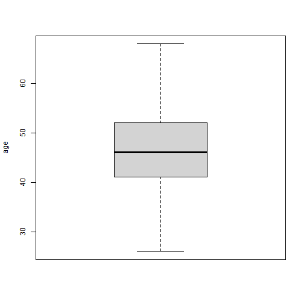

```r
#Card Category
ggplot(bank_data, aes(x=Months_on_book, y= Credit_Limit, shape = Card_Category, color= Card_Category))+
  geom_point() + geom_smooth(method=lm, se=FALSE, fullrange=TRUE)
```

```
## `geom_smooth()` using formula = 'y ~ x'
```

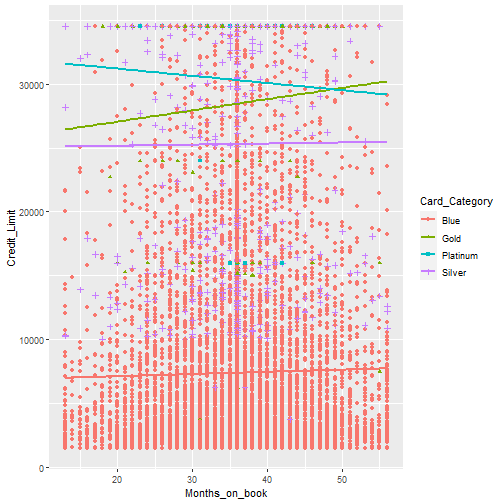

```r
card.exc.list <- c("Silver", "Platinum", "Gold")

#bank_data_bluecard <- subset(bank_data,!(Card_Category %in% card.exc.list))


bank_data_cleaned <- subset(bank_data,!((Customer_Age %in% age.exc.list)| (Card_Category %in% card.exc.list)))

boxplot(bank_data_cleaned$Customer_Age, ylab = "age")
```


```r
# Descriptive Graphs
#histogram
Cust.age.hist <- hist(bank_data_cleaned$Customer_Age, xlab="age", ylab="freq",
                      main="Customer age distribution", col="orange")
```

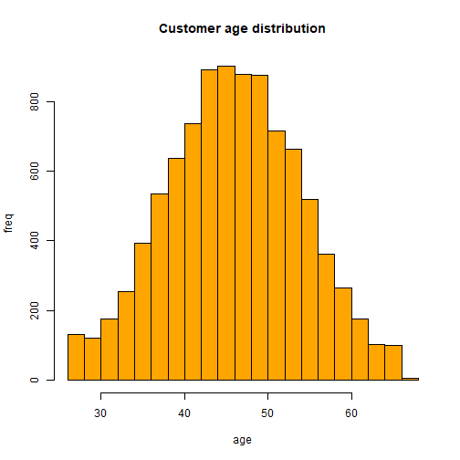

```r
Cust.age.hist
```

```
## $breaks
##  [1] 26 28 30 32 34 36 38 40 42 44 46 48 50 52 54 56 58 60 62 64 66 68
## 
## $counts
##  [1] 132 120 176 254 392 535 637 736 891 900 876 875 714 663 520 362 264 177 104 100   6
## 
## $density
##  [1] 0.0069959720 0.0063599746 0.0093279627 0.0134619462 0.0207759169 0.0283548866 0.0337608650
##  [8] 0.0390078440 0.0472228111 0.0476998092 0.0464278143 0.0463748145 0.0378418486 0.0351388594
## [15] 0.0275598898 0.0191859233 0.0139919440 0.0093809625 0.0055119780 0.0052999788 0.0003179987
## 
## $mids
##  [1] 27 29 31 33 35 37 39 41 43 45 47 49 51 53 55 57 59 61 63 65 67
## 
## $xname
## [1] "bank_data_cleaned$Customer_Age"
## 
## $equidist
## [1] TRUE
## 
## attr(,"class")
## [1] "histogram"
```

```r
#using the histogram, dividing ages into 4 groups seems satisfying

#Creating age groups
bank_data_cleaned[bank_data_cleaned$Customer_Age <= 34, "age_group"] <- 1
bank_data_cleaned[bank_data_cleaned$Customer_Age > 34 & bank_data_cleaned$Customer_Age <= 44, "age_group"] <- 2
bank_data_cleaned[bank_data_cleaned$Customer_Age > 44 & bank_data_cleaned$Customer_Age <= 54, "age_group"] <- 3
bank_data_cleaned[bank_data_cleaned$Customer_Age > 54, "age_group"] <- 4

#grouped age histogram
Grouped.age.hist <- hist(as.numeric(bank_data_cleaned$age_group), xlab="age_group", ylab="freq", breaks=4,
                         main="Customer age group distribution", col="green")
```

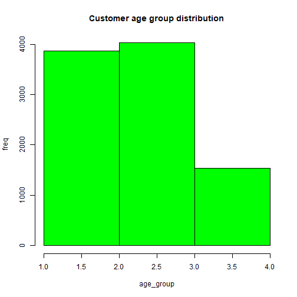

```r
# grouped age piechart
library(RColorBrewer)#for the
myPalette <- brewer.pal(6, "Set2") 
cust.age.piechart <- pie(count(bank_data_cleaned, age_group)$n, border="white", col=myPalette)
```

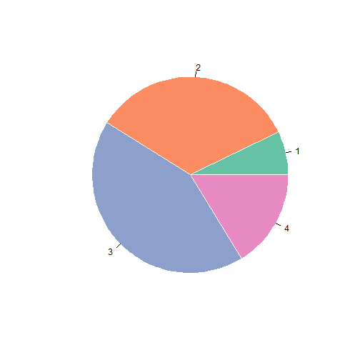

```r
#Dependent Count

ggplot(bank_data_cleaned, aes(x=Dependent_count)) +
  geom_bar(width=1)
```

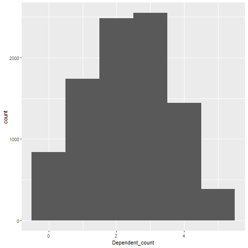

```r
depcount.labels <- c(0, 1, 2, 3, 4, 5)
dependent.count.piechart <- pie(count(bank_data_cleaned, Dependent_count)$n, border="white", col=myPalette, labels = depcount.labels)
```

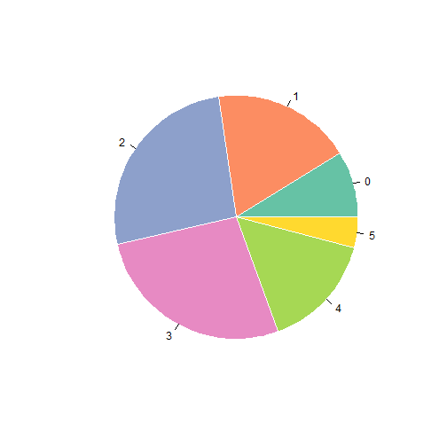

```r
# months on book (how long a customer is using the bank)
#histogram
hist(bank_data_cleaned$Months_on_book)
```

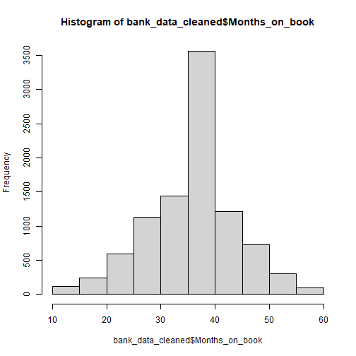

```r
#boxplot
months.onbook.boxplot <- boxplot(quantitative$Months_on_book, ylab = "months")
```

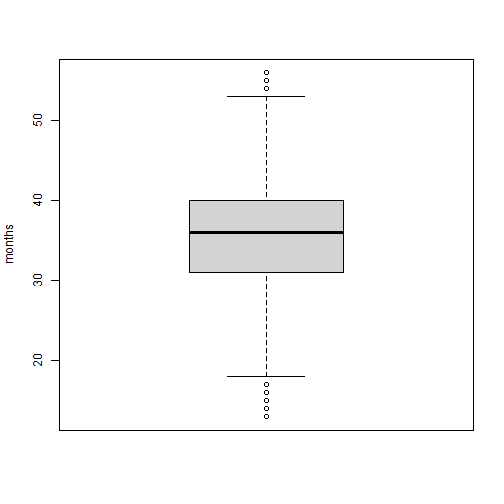

```r
#using the 1st quartile-1.5*IQR and 3rd quartile+1.5*IQR rule, outliers
boxplot.stats(quantitative$Months_on_book)$out
```

```
##   [1] 54 56 56 56 54 56 56 56 54 55 56 56 54 54 56 56 56 56 13 13 56 56 13 56 56 56 15 56 17 13
##  [31] 54 54 13 56 54 13 54 55 54 17 17 56 13 17 16 15 16 56 56 13 56 56 56 17 14 13 13 56 54 54
##  [61] 15 56 16 56 17 17 14 17 55 55 14 13 14 54 54 13 15 13 13 15 13 13 13 17 55 56 56 13 15 55
##  [91] 13 13 55 13 15 16 56 13 56 16 54 16 55 55 16 56 56 17 54 13 13 17 14 56 15 13 13 54 13 17
## [121] 13 14 13 13 56 15 15 16 13 55 56 17 17 15 17 15 13 56 56 13 54 56 55 15 56 15 56 16 17 13
## [151] 15 13 56 56 56 13 56 56 17 13 56 16 55 14 14 16 54 17 17 13 17 14 14 14 54 15 56 55 13 14
## [181] 17 17 56 56 13 15 56 13 56 54 15 55 54 17 56 17 56 54 54 13 13 55 54 55 56 16 56 13 56 55
## [211] 56 56 56 55 54 54 56 55 16 56 56 13 55 16 56 56 54 13 56 56 56 13 56 56 56 54 17 56 56 17
## [241] 55 56 56 13 56 56 56 15 54 13 13 55 56 54 55 56 56 56 56 17 54 15 54 54 17 15 16 55 16 54
## [271] 55 56 56 55 56 56 54 17 55 55 55 54 56 54 13 17 55 56 54 56 15 55 55 16 13 15 56 14 15 55
## [301] 15 55 54 13 13 56 13 56 56 17 13 16 56 56 55 54 16 17 13 16 56 54 56 15 54 55 55 17 16 13
## [331] 54 13 13 56 55 54 56 16 54 16 56 54 17 54 54 16 56 55 15 15 14 13 15 14 55 13 54 15 16 54
## [361] 16 17 16 13 13 17 13 13 15 17 55 15 13 54 13 55 17 13 13 16 16 15 17 14 54 15
```

```r
#Since the outliers in months on books can be identifying on whether the customer is going to churn we decided to keep them in the data set

#Total Relationships Count
ggplot(bank_data_cleaned, aes(x=Total_Relationship_Count)) +
  geom_bar(width=1)
```

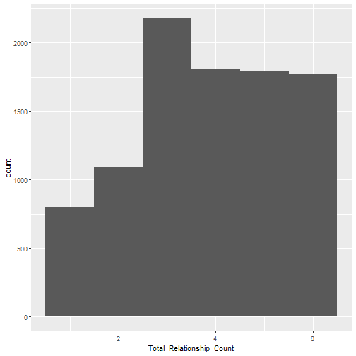

```r
#Months_Inactive_12months
ggplot(bank_data_cleaned, aes(x=Months_Inactive_12_mon)) +
  geom_bar(width=1)
```

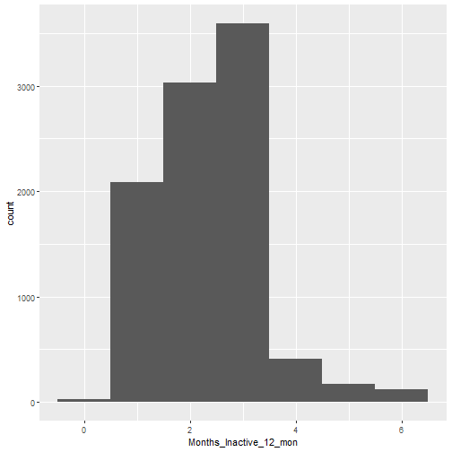

```r
#Contacts Count 12 months
ggplot(bank_data_cleaned, aes(x=Contacts_Count_12_mon)) +
  geom_bar(width=1)
```

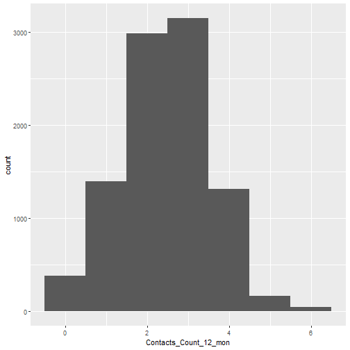

```r
# Credit Limit

#boxplot
credit.limit.boxplot <- boxplot(bank_data_cleaned$Credit_Limit, ylab = "Dollars")
```

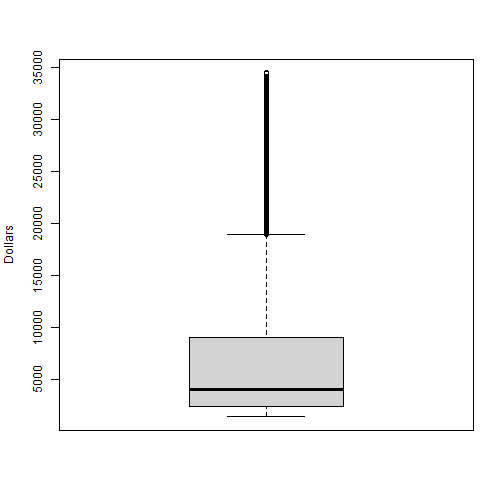

```r
#histogram
hist(bank_data_cleaned$Credit_Limit)
```

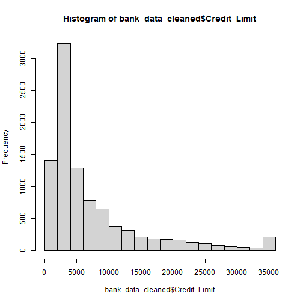

```r
# Total Revolving Balance
#histogram
hist(bank_data_cleaned$Total_Revolving_Bal)
```

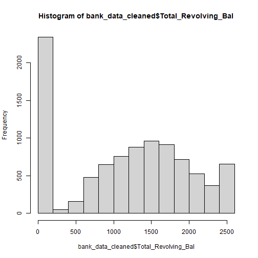

```r
#Average Open to Buy
#histogram
hist(bank_data_cleaned$Avg_Open_To_Buy)
```

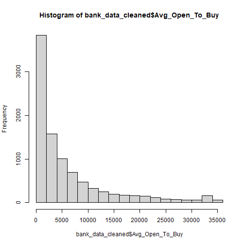

```r
#Total Amount Change Between Q1 and Q4

#histogram
hist(bank_data_cleaned$Total_Amt_Chng_Q4_Q1)
```

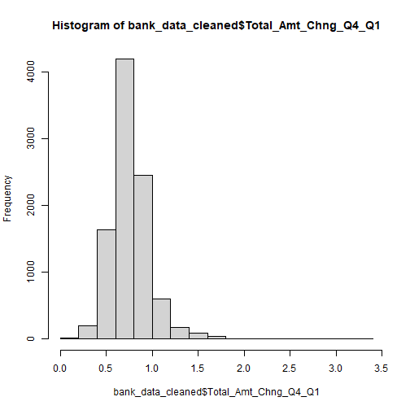

```r
#boxplot
total.amtchng.boxplot <- boxplot(bank_data_cleaned$Total_Amt_Chng_Q4_Q1, ylab = "Dollars")
```

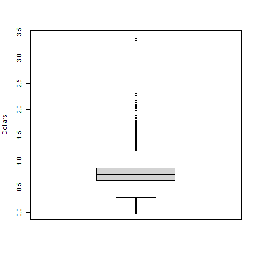

```r
#Total Transaction Amount

#histogram
hist(bank_data_cleaned$Total_Trans_Amt)
```

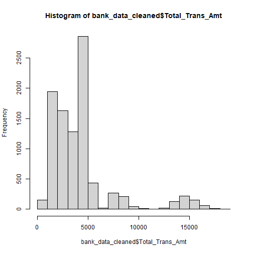

```r
#Total Count Change Between Q1 and Q4

#histogram
hist(bank_data_cleaned$Total_Ct_Chng_Q4_Q1)
```

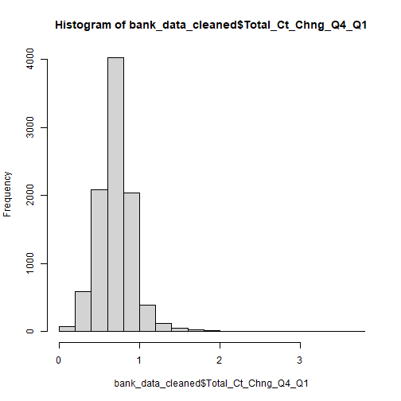

```r
#Average Utilization Rate

#histogram
hist(bank_data_cleaned$Avg_Utilization_Ratio)
```

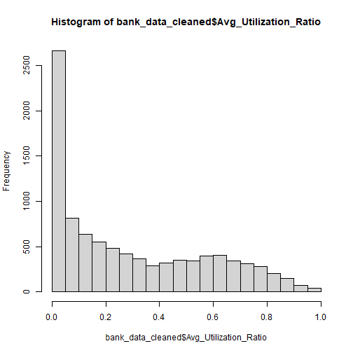

```r
dev.off(dev.list()["RStudioGD"]) #to clear the previous plots on the screen
```

```
## Error in if (which == 1) stop("cannot shut down device 1 (the null device)"): missing value where TRUE/FALSE needed
```

```r
#Histograms
attach(bank_data_cleaned)
par(mfrow=c(3,2))
hist(Avg_Open_To_Buy)
hist(Total_Trans_Amt)
hist(Avg_Utilization_Ratio)
hist(Months_on_book)
hist(Credit_Limit)
hist(table(Months_Inactive_12_mon))
```

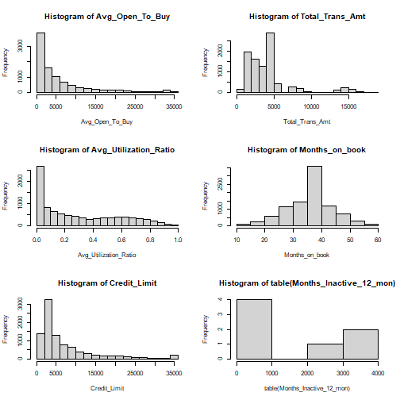

```r
#Categorical Value Visualizations

#Bar plots

barplot(height=tabulate(as.factor(Income_Category)), names=unique(Income_Category), col= myPalette)
barplot(height=tabulate(as.factor(Marital_Status)), names=unique(Income_Category), col= myPalette)
```

```
## Error in barplot.default(height = tabulate(as.factor(Marital_Status)), : incorrect number of names
```

```r
barplot(height=tabulate(as.factor(Education_Level)), names=unique(Income_Category), col= myPalette)
```

```
## Error in barplot.default(height = tabulate(as.factor(Education_Level)), : incorrect number of names
```

```r
#Pie charts

pie(count(Attrition_)$n, border="white", col=myPalette, labels = depcount.labels)
```

```
## Error in count(Attrition_): object 'Attrition_' not found
```

```r
unique(bank_data$Attrition_Flag) #to make sure there are only 2 strings
```

```
## [1] "Existing Customer" "Attrited Customer"
```

```r
#change 'Existing Customer' to 1 and 'Attrited Customer' to 0 and add new column to quantitative
quantitative$attrition_flag_binary <- ifelse(bank_data$Attrition_Flag=='Existing Customer', 1, 0)

#outlier extraction using the 1st quartile-1.5*IQR and 3rd quartile+1.5*IQR rule
boxplot.stats(quantitative$Credit_Limit)$out
```

```
##   [1] 34516 29081 30367 32426 34516 34516 23957 34516 25300 34516 24312 28904 34516 34516 31302
##  [16] 34516 34516 33791 24159 34516 34516 32090 32643 32975 34516 26792 27259 34516 34516 24407
##  [31] 34516 34516 27756 34516 34516 34516 24396 34516 27126 34516 24221 34516 34516 34516 34516
##  [46] 34516 34516 24571 28202 24850 34516 29963 27000 34516 24487 29801 34516 29659 26181 29770
##  [61] 29205 24602 34516 30579 24480 33304 27512 34516 34516 26443 23981 34516 24869 34516 30271
##  [76] 34516 24742 27560 34516 34516 34516 32156 34516 34516 26945 34516 33864 25657 26437 34516
##  [91] 30948 34516 32349 31383 30883 33951 30655 25188 26442 26750 34516 26977 34516 23991 34516
## [106] 26714 24880 34516 34516 33406 34516 34516 34516 34516 34516 24545 34516 34516 25878 34516
## [121] 25666 34516 34516 34516 27088 34516 34516 34516 34516 34516 34516 30503 34516 29543 34516
## [136] 23959 25058 34516 34516 33182 25662 28822 33405 27157 34516 34516 25197 34516 24336 24577
## [151] 29961 33791 28465 34516 34516 23996 30011 32558 32641 27858 34516 34516 34516 24765 31864
## [166] 33180 27992 34516 31258 34516 27310 34516 27732 34516 24296 32938 25790 34516 32338 34516
## [181] 34516 28170 24589 30310 28020 31313 34516 30210 30967 31762 26437 25008 24703 34516 32444
## [196] 34516 25033 34516 34516 34516 30746 34516 34516 34516 24457 26783 25516 34516 34516 28410
## [211] 30753 34516 23848 34516 24936 26101 25618 27389 34516 27029 34516 34516 34516 34516 24073
## [226] 25517 25882 26556 26570 26053 28751 34516 32096 34516 26372 26365 34516 34516 27499 32964
## [241] 34516 34516 30622 34516 33996 34516 31680 34010 24904 34516 30030 27745 34516 25215 24446
## [256] 27347 23870 32056 34516 34516 31501 34516 26566 34516 28830 32024 25907 27175 34516 26222
## [271] 34173 34516 34516 32658 28634 32446 32676 34516 26988 34516 34516 34516 34516 28700 26218
## [286] 34516 26856 34516 34516 34516 27710 34516 34516 34516 34516 34516 31945 34516 25873 27751
## [301] 34516 24580 29893 26124 34516 34516 34516 34516 34516 30137 34516 34516 34516 23973 29200
## [316] 25270 33755 34516 30702 34516 34516 25620 34516 24248 30428 34516 24949 29695 33472 34516
## [331] 28397 34516 34516 34516 34516 32210 29923 34516 32866 34516 31458 34516 34516 34516 28701
## [346] 24149 24657 31668 34516 34516 29812 34516 24126 34516 33408 34516 30733 34516 34516 27781
## [361] 34516 34516 34516 24172 26729 29003 28200 34516 30314 30820 23858 32719 25133 28262 34516
## [376] 34516 24016 26516 34516 34516 34516 34516 34516 34516 26058 34516 34516 31756 34516 34516
## [391] 24528 31954 23898 25837 34516 24534 33384 30560 32182 34516 34516 34516 34516 34516 34516
## [406] 26229 27876 29149 31631 25027 27391 25502 28618 26548 34516 34516 34516 25190 30540 34516
## [421] 32535 24593 26107 34516 34516 34516 30666 34516 27804 25824 31625 32409 34516 30899 26723
## [436] 26792 26174 29939 24931 28327 29551 34516 34516 34516 34516 34516 34516 34516 24299 34516
## [451] 25937 31501 23911 33913 34516 28186 34516 28142 34516 30501 34516 25991 28390 34516 28829
## [466] 33771 24287 25045 27374 34516 34516 34516 34516 34516 25256 34516 34516 31743 27186 29535
## [481] 34516 34516 34516 34516 32838 34516 24033 25293 26129 33371 34516 34516 31978 34516 26496
## [496] 34516 34516 34516 29715 28422 33521 26308 34198 34516 32244 25670 34516 34516 24621 33122
## [511] 34516 34516 30928 34516 25944 30997 26142 34516 30357 34516 24542 26108 26303 25060 28292
## [526] 29100 34516 34516 25856 34516 34516 29638 34516 27378 34516 29195 28253 24250 34516 34516
## [541] 34516 34516 24028 33142 34516 34516 27436 34516 24512 34516 34516 30976 31733 30186 34516
## [556] 34516 34516 28600 34516 25658 32733 34516 34516 34516 34516 23958 25276 34516 29898 34516
## [571] 23981 32611 34516 34516 31636 34516 23925 32431 34516 34516 28229 24868 34058 26690 34516
## [586] 34516 34516 34516 27437 34516 34516 25219 34516 34516 29219 24462 29795 24221 33211 34516
## [601] 34516 34516 34516 34516 34516 34516 34516 25645 28673 25410 34516 27169 32777 24987 34516
## [616] 34516 32106 34516 24431 34516 24256 30300 24379 28930 34516 34516 34516 34496 34516 24735
## [631] 29690 34516 25178 34516 24965 34516 30210 34516 27720 27712 34516 34516 34516 34516 34516
## [646] 34516 34516 34516 34516 34516 34516 24670 34516 34516 31560 34516 29572 26882 34516 25894
## [661] 34516 33184 34516 34516 34516 34516 34516 34516 34516 34516 34516 33441 31987 23981 34516
## [676] 34516 34516 34516 32292 34516 34516 34516 34516 34516 31497 34516 34516 23981 34516 34516
## [691] 34516 34516 34516 31639 34516 34516 26438 34516 34516 31782 34516 34516 34516 27984 24499
## [706] 27318 26692 34516 33256 34516 34516 34516 34516 28852 26840 34516 34516 34516 34516 34516
## [721] 34516 34516 34516 32926 24533 30117 34516 24262 34516 34516 25737 29338 25808 34516 34516
## [736] 34516 25736 29227 34516 34516 23981 34516 28307 34516 34516 30172 28687 25653 34516 29890
## [751] 34516 30379 34516 34516 34516 23981 34516 34516 34516 28605 34516 24244 34516 34458 34516
## [766] 34516 34516 33565 34516 34516 27742 34516 34516 34516 25601 25428 24927 33889 33552 34516
## [781] 29394 24250 33711 31699 34516 34516 33870 34516 29239 34516 34516 31346 30498 29531 34516
## [796] 23981 27670 33874 34516 32535 34516 34516 29038 34516 34516 34516 23981 34516 29528 34516
## [811] 34516 34516 32791 34516 23981 34516 34516 34516 25438 32089 34516 32417 27945 34516 34516
## [826] 34516 34516 29738 34516 34516 32554 32056 29856 34516 28612 24134 27929 34516 34516 32587
## [841] 34516 34516 34516 31832 34427 34516 34516 34516 34516 34516 34516 34516 34516 34516 23889
## [856] 34516 34516 26819 34516 24844 34516 34516 34516 34516 31718 34516 34516 24884 29974 34516
## [871] 34516 32949 32250 34516 23981 34516 23981 34516 34516 34516 34516 34516 34516 34516 34516
## [886] 34516 34516 34516 28570 32563 34516 34516 34516 34516 29295 26423 34516 29937 27514 32275
## [901] 27494 30885 34516 34516 24001 34516 23939 30543 34516 34516 24239 32222 34516 34516 31091
## [916] 34516 27229 34516 34516 34516 34516 28043 34516 34516 34516 34516 34516 34516 34516 34516
## [931] 29076 34516 34516 34516 34140 34516 34516 34516 33779 34516 34516 34516 25217 25187 29865
## [946] 34516 30770 27124 28174 26710 34516 34516 26021 34516 34516 33905 33004 34516 34516 30082
## [961] 34516 34516 26923 26812 31546 34516 34516 34162 23981 34516 34516 34516 28831 26794 34516
## [976] 28564 34516 34516 34516 34516 29808 29663 34516 34516
```

```r
# Total Relationship Count

#boxplot
relationship.count.boxplot <- boxplot(quantitative$Total_Relationship_Count, ylab = "# of products")
relationship.count.boxplot
```

```
## $stats
##      [,1]
## [1,]    1
## [2,]    3
## [3,]    4
## [4,]    5
## [5,]    6
## 
## $n
## [1] 10127
## 
## $conf
##          [,1]
## [1,] 3.968599
## [2,] 4.031401
## 
## $out
## numeric(0)
## 
## $group
## numeric(0)
## 
## $names
## [1] ""
```

```r
#outlier extraction using the 1st quartile-1.5*IQR and 3rd quartile+1.5*IQR rule
boxplot.stats(quantitative$Total_Relationship_Count)$out
```

```
## integer(0)
```

```r
boxplot(subset(quantitative, select=- c(CLIENTNUM, Credit_Limit, Total_Trans_Ct, Total_Revolving_Bal, Contacts_Count_12_mon, Avg_Open_To_Buy, Total_Amt_Chng_Q4_Q1, Total_Trans_Amt)))

#Avg utilization ratios by age groups
avguti.agegrp <- quantitative %>% group_by(age_group) %>% summarise(avg_uti = mean(Avg_Utilization_Ratio))
```

```
## Error in `group_by()`:
## ! Must group by variables found in `.data`.
## ✖ Column `age_group` is not found.
```

```r
plot(avguti.agegrp, type = "o")
```

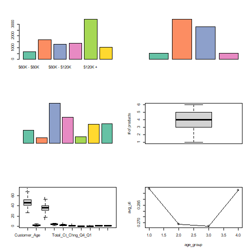

```r
#combined figure
ggplot(data = quantitative, aes(x= as.numeric(age_group), color='red')) +
  geom_histogram(bins = 4, fill="white", show.legend = FALSE, size=1.1) +
  geom_line(data = avguti.agegrp, aes(x=age_group, y=avg_uti), color= 'blue', size=1.1) +
  labs(title= 'Avg uti by age group hist', x = 'age_group', y='Count') +   scale_y_continuous(
    
    # Features of the first axis
    name = "First Axis",
    
    # Add a second axis and specify its features
    sec.axis = sec_axis(~./10000, name="Second Axis")
  )
```

```
## Warning: Using `size` aesthetic for lines was deprecated in ggplot2 3.4.0.
## ℹ Please use `linewidth` instead.
## This warning is displayed once every 8 hours.
## Call `lifecycle::last_lifecycle_warnings()` to see where this warning was generated.
```

```
## Error in `geom_histogram()`:
## ! Problem while computing aesthetics.
## ℹ Error occurred in the 1st layer.
## Caused by error in `check_aesthetics()`:
## ! Aesthetics must be either length 1 or the same as the data (10127)
## ✖ Fix the following mappings: `x`
```

```r
#Months inactive
library(yarrr) #to make colors transparent
```

```
## Loading required package: jpeg
```

```
## Loading required package: BayesFactor
```

```
## Loading required package: coda
```

```
## Loading required package: Matrix
```

```
## ************
## Welcome to BayesFactor 0.9.12-4.4. If you have questions, please contact Richard Morey (richarddmorey@gmail.com).
## 
## Type BFManual() to open the manual.
## ************
```

```
## Loading required package: circlize
```

```
## ========================================
## circlize version 0.4.15
## CRAN page: https://cran.r-project.org/package=circlize
## Github page: https://github.com/jokergoo/circlize
## Documentation: https://jokergoo.github.io/circlize_book/book/
## 
## If you use it in published research, please cite:
## Gu, Z. circlize implements and enhances circular visualization
##   in R. Bioinformatics 2014.
## 
## This message can be suppressed by:
##   suppressPackageStartupMessages(library(circlize))
## ========================================
```

```
## yarrr v0.1.5. Citation info at citation('yarrr'). Package guide at yarrr.guide()
```

```
## Email me at Nathaniel.D.Phillips.is@gmail.com
```

```
## 
## Attaching package: 'yarrr'
```

```
## The following object is masked from 'package:ggplot2':
## 
##     diamonds
```

```r
hist(bank_data$Months_Inactive_12_mon, col = yarrr::transparent('red',trans.val = 0.9))
hist(bank_data$Contacts_Count_12_mon, col = yarrr::transparent('blue', trans.val = 0.8), add = TRUE)

hist(bank_data$Total_Trans_Ct)

#investigate correlation
#we can add one column after we decide conditions as churn number
#and we can investigate the correlation this column with other columns
library(corrplot)
```

```
## corrplot 0.92 loaded
```

```r
corr_quant <- subset(quantitative, select = -c(CLIENTNUM, Dependent_count, age_group, Naive_Bayes_Classifier_Attrition_Flag_Card_Category_Contacts_Count_12_mon_Dependent_count_Education_Level_Months_Inactive_12_mon_1, Naive_Bayes_Classifier_Attrition_Flag_Card_Category_Contacts_Count_12_mon_Dependent_count_Education_Level_Months_Inactive_12_mon_2))
corralted = cor(corr_quant)
corrplot(corralted, method = 'color', order = 'alphabet')

#create copy of qualitative data and make it quantitative
qual_to_quant <- qualitative

#change categories to the numeric values
qual_to_quant$Attrition_Flag <- ifelse(qual_to_quant$Attrition_Flag == 'Existing Customer', 1, 0)

qual_to_quant$Gender <- ifelse(qual_to_quant$Gender == 'M', 1, 0)

unique(bank_data$Education_Level)
```

```
## [1] "High School"   "Graduate"      "Uneducated"    "Unknown"       "College"      
## [6] "Post-Graduate" "Doctorate"
```

```r
qual_to_quant$Education_Level[qual_to_quant$Education_Level == 'Unknown'] <- 0
qual_to_quant$Education_Level[qual_to_quant$Education_Level == 'Uneducated'] <- 1
qual_to_quant$Education_Level[qual_to_quant$Education_Level == 'High School'] <- 2
qual_to_quant$Education_Level[qual_to_quant$Education_Level == 'College'] <- 3
qual_to_quant$Education_Level[qual_to_quant$Education_Level == 'Graduate'] <- 4
qual_to_quant$Education_Level[qual_to_quant$Education_Level == 'Post-Graduate'] <- 5
qual_to_quant$Education_Level[qual_to_quant$Education_Level == 'Doctorate'] <- 6
qual_to_quant$Education_Level = as.numeric(as.character(qual_to_quant$Education_Level))

unique(bank_data$Marital_Status)
```

```
## [1] "Married"  "Single"   "Unknown"  "Divorced"
```

```r
qual_to_quant$Marital_Status[qual_to_quant$Marital_Status == 'Unknown'] <- 0
qual_to_quant$Marital_Status[qual_to_quant$Marital_Status == 'Single'] <- 1
qual_to_quant$Marital_Status[qual_to_quant$Marital_Status == 'Married'] <- 2
qual_to_quant$Marital_Status[qual_to_quant$Marital_Status == 'Divorced'] <- 3
qual_to_quant$Marital_Status = as.numeric(as.character(qual_to_quant$Marital_Status))

unique(bank_data$Income_Category)
```

```
## [1] "$60K - $80K"    "Less than $40K" "$80K - $120K"   "$40K - $60K"    "$120K +"       
## [6] "Unknown"
```

```r
qual_to_quant$Income_Category[qual_to_quant$Income_Category == 'Unknown'] <- 0
qual_to_quant$Income_Category[qual_to_quant$Income_Category == 'Less than $40K'] <- 1
qual_to_quant$Income_Category[qual_to_quant$Income_Category == '$40K - $60K'] <- 2
qual_to_quant$Income_Category[qual_to_quant$Income_Category == '$60K - $80K'] <- 3
qual_to_quant$Income_Category[qual_to_quant$Income_Category == '$80K - $120K'] <- 4
qual_to_quant$Income_Category[qual_to_quant$Income_Category == '$120K +'] <- 5
qual_to_quant$Income_Category = as.numeric(as.character(qual_to_quant$Income_Category))

unique(bank_data$Card_Category)
```

```
## [1] "Blue"     "Gold"     "Silver"   "Platinum"
```

```r
qual_to_quant$Card_Category[qual_to_quant$Card_Category == 'Silver'] <- 0
qual_to_quant$Card_Category[qual_to_quant$Card_Category == 'Gold'] <- 1
qual_to_quant$Card_Category[qual_to_quant$Card_Category == 'Platinum'] <- 2
qual_to_quant$Card_Category[qual_to_quant$Card_Category == 'Blue'] <- 3
qual_to_quant$Card_Category = as.numeric(as.character(qual_to_quant$Card_Category))

corr_qual_to_quant = cor(qual_to_quant)
corrplot(corr_qual_to_quant, method = 'number')

#function to normalize value
normalizer_fnc <- function(x) {
  (x - min(x)) / (max(x) - min(x))
}

quan_normalized <- as.data.frame(lapply(quantitative[2:18], normalizer_fnc))
qual_to_quant_normalized <- as.data.frame(lapply(qual_to_quant[2:6], normalizer_fnc))

cdplot(factor(attrition_flag_binary)~ Total_Trans_Ct, data=quantitative)

cdplot(factor(attrition_flag_binary)~ Total_Revolving_Bal, data=quantitative)
```

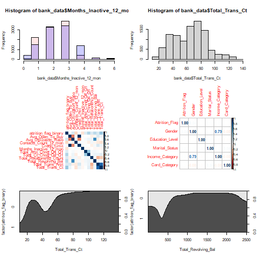

```r
#we need to calculate chi square for the categorical values 
#to see are they dependent or not
#assume conf interval 95%
table(quantitative$attrition_flag_binary, quantitative$age_group)
```

```
## Error in table(quantitative$attrition_flag_binary, quantitative$age_group): all arguments must have the same length
```

```r
chisq.test(quantitative$attrition_flag_binary, quantitative$age_group, correct=FALSE)
```

```
## Warning in chisq.test(quantitative$attrition_flag_binary, quantitative$age_group, : Chi-squared
## approximation may be incorrect
```

```
## 
## 	Chi-squared test for given probabilities
## 
## data:  quantitative$attrition_flag_binary
## X-squared = 1627, df = 10126, p-value = 1
```

```r
table(quantitative$attrition_flag_binary, quantitative$Dependent_count)
```

```
##    
##        0    1    2    3    4    5
##   0  135  269  417  482  260   64
##   1  769 1569 2238 2250 1314  360
```

```r
chisq.test(quantitative$attrition_flag_binary, quantitative$Dependent_count, correct=FALSE)
```

```
## 
## 	Pearson's Chi-squared test
## 
## data:  quantitative$attrition_flag_binary and quantitative$Dependent_count
## X-squared = 9.4764, df = 5, p-value = 0.0915
```

```r
table(quantitative$attrition_flag_binary, quantitative$Total_Relationship_Count)
```

```
##    
##        1    2    3    4    5    6
##   0  233  346  400  225  227  196
##   1  677  897 1905 1687 1664 1670
```

```r
chisq.test(quantitative$attrition_flag_binary, quantitative$Total_Relationship_Count, correct=FALSE)
```

```
## 
## 	Pearson's Chi-squared test
## 
## data:  quantitative$attrition_flag_binary and quantitative$Total_Relationship_Count
## X-squared = 284.07, df = 5, p-value < 2.2e-16
```

```r
table(quantitative$attrition_flag_binary, quantitative$Contacts_Count_12_mon)
```

```
##    
##        0    1    2    3    4    5    6
##   0    7  108  403  681  315   59   54
##   1  392 1391 2824 2699 1077  117    0
```

```r
chisq.test(quantitative$attrition_flag_binary, quantitative$Contacts_Count_12_mon, correct=FALSE)
```

```
## 
## 	Pearson's Chi-squared test
## 
## data:  quantitative$attrition_flag_binary and quantitative$Contacts_Count_12_mon
## X-squared = 586.64, df = 6, p-value < 2.2e-16
```

```r
table(qual_to_quant$Attrition_Flag, qual_to_quant$Gender)
```

```
##    
##        0    1
##   0  930  697
##   1 4428 4072
```

```r
chisq.test(qual_to_quant$Attrition_Flag, qual_to_quant$Gender, correct=FALSE)
```

```
## 
## 	Pearson's Chi-squared test
## 
## data:  qual_to_quant$Attrition_Flag and qual_to_quant$Gender
## X-squared = 14.068, df = 1, p-value = 0.0001763
```

```r
table(qual_to_quant$Attrition_Flag, qual_to_quant$Education_Level)
```

```
##    
##        0    1    2    3    4    5    6
##   0  256  237  306  154  487   92   95
##   1 1263 1250 1707  859 2641  424  356
```

```r
chisq.test(qual_to_quant$Attrition_Flag, qual_to_quant$Education_Level, correct=FALSE)
```

```
## 
## 	Pearson's Chi-squared test
## 
## data:  qual_to_quant$Attrition_Flag and qual_to_quant$Education_Level
## X-squared = 12.511, df = 6, p-value = 0.05149
```

```r
table(qual_to_quant$Attrition_Flag, qual_to_quant$Marital_Status)
```

```
##    
##        0    1    2    3
##   0  129  668  709  121
##   1  620 3275 3978  627
```

```r
chisq.test(qual_to_quant$Attrition_Flag, qual_to_quant$Marital_Status, correct=FALSE)
```

```
## 
## 	Pearson's Chi-squared test
## 
## data:  qual_to_quant$Attrition_Flag and qual_to_quant$Marital_Status
## X-squared = 6.0561, df = 3, p-value = 0.1089
```

```r
table(qual_to_quant$Attrition_Flag, qual_to_quant$Income_Category)
```

```
##    
##        0    1    2    3    4    5
##   0  187  612  271  189  242  126
##   1  925 2949 1519 1213 1293  601
```

```r
chisq.test(qual_to_quant$Attrition_Flag, qual_to_quant$Income_Category, correct=FALSE)
```

```
## 
## 	Pearson's Chi-squared test
## 
## data:  qual_to_quant$Attrition_Flag and qual_to_quant$Income_Category
## X-squared = 12.832, df = 5, p-value = 0.025
```

```r
#simulate.p.value
table(qual_to_quant$Attrition_Flag, qual_to_quant$Card_Category)
```

```
##    
##        0    1    2    3
##   0   82   21    5 1519
##   1  473   95   15 7917
```

```r
chisq.test(qual_to_quant$Attrition_Flag, qual_to_quant$Card_Category, correct=FALSE, simulate.p.value=TRUE)
```

```
## 
## 	Pearson's Chi-squared test with simulated p-value (based on 2000 replicates)
## 
## data:  qual_to_quant$Attrition_Flag and qual_to_quant$Card_Category
## X-squared = 2.2342, df = NA, p-value = 0.5397
```

```r
table(quantitative$attrition_flag_binary, quantitative$Months_Inactive_12_mon)
```

```
##    
##        0    1    2    3    4    5    6
##   0   15  100  505  826  130   32   19
##   1   14 2133 2777 3020  305  146  105
```

```r
chisq.test(quantitative$attrition_flag_binary, quantitative$Months_Inactive_12_mon, correct=FALSE, simulate.p.value=TRUE)
```

```
## 
## 	Pearson's Chi-squared test with simulated p-value (based on 2000 replicates)
## 
## data:  quantitative$attrition_flag_binary and quantitative$Months_Inactive_12_mon
## X-squared = 396.46, df = NA, p-value = 0.0004998
```

```r
table(quantitative$attrition_flag_binary, quantitative$Months_on_book)
```

```
##    
##       13   14   15   16   17   18   19   20   21   22   23   24   25   26   27   28   29   30
##   0    7    1    9    3    4   13    6   13   10   20   12   28   31   24   23   43   34   58
##   1   63   15   25   26   35   45   57   61   73   85  104  132  134  162  183  232  207  242
##    
##       31   32   33   34   35   36   37   38   39   40   41   42   43   44   45   46   47   48
##   0   34   44   48   57   45  430   62   57   64   45   51   36   42   42   33   36   24   27
##   1  284  245  257  296  272 2033  296  290  277  288  246  235  231  188  194  161  147  135
##    
##       49   50   51   52   53   54   55   56
##   0   24   25   16   12    7    6    4   17
##   1  117   71   64   50   71   47   38   86
```

```r
chisq.test(quantitative$attrition_flag_binary, quantitative$Months_on_book, correct=FALSE, simulate.p.value=TRUE)
```

```
## 
## 	Pearson's Chi-squared test with simulated p-value (based on 2000 replicates)
## 
## data:  quantitative$attrition_flag_binary and quantitative$Months_on_book
## X-squared = 58.525, df = NA, p-value = 0.05747
```

```r
table(quantitative$attrition_flag_binary, quantitative$Credit_Limit)
```

```
##    
##     1438.3 1439 1440 1441 1442 1443 1446 1449 1451 1452 1454 1456 1457 1458 1459 1460 1461 1462
##    
##     1466 1467 1468 1469 1470 1471 1472 1473 1474 1475 1476 1477 1478 1479 1480 1481 1483 1484
##    
##     1485 1486 1488 1489 1490 1491 1492 1493 1494 1495 1502 1503 1504 1506 1507 1508 1511 1512
##    
##     1513 1514 1515 1516 1517 1518 1519 1520 1521 1522 1525 1527 1528 1529 1530 1531 1532 1533
##    
##     1534 1535 1536 1537 1538 1539 1540 1543 1544 1545 1546 1547 1548 1550 1551 1552 1553 1554
##    
##     1555 1556 1558 1560 1561 1562 1564 1565 1567 1568 1569 1570 1571 1572 1573 1574 1575 1576
##    
##     1577 1578 1579 1580 1583 1584 1585 1586 1588 1590 1591 1592 1593 1594 1595 1596 1601 1602
##    
##     1603 1604 1605 1606 1609 1610 1611 1612 1613 1614 1615 1616 1617 1618 1620 1621 1622 1623
##    
##     1624 1625 1626 1628 1629 1630 1631 1632 1633 1634 1635 1636 1637 1638 1639 1640 1641 1643
##    
##     1644 1645 1647 1648 1649 1651 1652 1653 1654 1655 1656 1657 1659 1661 1662 1663 1664 1665
##    
##     1666 1667 1669 1670 1671 1672 1674 1675 1676 1677 1678 1679 1681 1682 1684 1685 1686 1687
##    
##     1688 1689 1690 1691 1693 1694 1695 1696 1697 1698 1699 1701 1702 1704 1705 1706 1707 1708
##    
##     1709 1711 1713 1714 1715 1717 1719 1720 1721 1722 1723 1724 1726 1727 1728 1730 1731 1732
##    
##     1734 1735 1736 1737 1738 1740 1741 1744 1745 1746 1748 1749 1750 1751 1752 1753 1754 1755
##    
##     1757 1758 1759 1760 1761 1762 1763 1764 1765 1766 1768 1770 1771 1773 1774 1775 1776 1778
##    
##     1779 1780 1781 1783 1784 1785 1786 1787 1788 1789 1790 1791 1792 1793 1794 1795 1796 1798
##    
##     1801 1803 1804 1806 1808 1809 1811 1812 1813 1814 1815 1816 1817 1818 1819 1820 1821 1822
##    
##     1824 1825 1826 1827 1828 1829 1830 1832 1833 1834 1835 1836 1837 1838 1839 1840 1841 1842
##    
##     1843 1844 1845 1848 1849 1850 1852 1853 1854 1855 1856 1857 1858 1859 1860 1861 1862 1863
##    
##     1864 1866 1867 1868 1869 1870 1871 1872 1873 1874 1876 1877 1878 1879 1880 1882 1883 1884
##    
##     1886 1888 1889 1890 1891 1892 1893 1894 1895 1896 1897 1898 1899 1900 1901 1902 1904 1905
##    
##     1906 1909 1910 1911 1912 1913 1914 1915 1916 1918 1919 1920 1921 1922 1923 1924 1925 1926
##    
##     1927 1928 1929 1930 1931 1933 1934 1935 1936 1937 1938 1939 1942 1943 1944 1946 1947 1950
##    
##     1951 1952 1953 1954 1956 1957 1959 1960 1961 1962 1963 1964 1965 1966 1967 1968 1970 1971
##    
##     1972 1973 1975 1976 1977 1978 1979 1980 1981 1982 1983 1984 1986 1989 1990 1991 1993 1994
##    
##     1996 1997 1998 2000 2001 2002 2003 2004 2005 2006 2009 2010 2012 2013 2014 2015 2016 2017
##    
##     2018 2019 2020 2021 2022 2023 2024 2025 2027 2028 2029 2030 2031 2032 2033 2035 2036 2037
##    
##     2038 2040 2041 2042 2043 2045 2046 2047 2048 2049 2051 2052 2053 2054 2055 2057 2059 2060
##    
##     2061 2062 2063 2064 2066 2067 2069 2070 2071 2072 2074 2075 2077 2078 2080 2081 2082 2084
##    
##     2085 2086 2088 2089 2090 2092 2094 2096 2097 2099 2100 2104 2105 2106 2107 2109 2110 2111
##    
##     2112 2114 2115 2118 2120 2121 2122 2123 2124 2125 2126 2127 2128 2129 2131 2132 2133 2134
##    
##     2135 2136 2137 2138 2140 2141 2142 2143 2144 2145 2146 2147 2148 2149 2151 2152 2153 2154
##    
##     2155 2156 2157 2158 2159 2160 2161 2162 2163 2164 2165 2166 2167 2168 2169 2170 2171 2172
##    
##     2173 2174 2175 2177 2178 2179 2180 2181 2182 2184 2185 2186 2187 2188 2189 2190 2191 2192
##    
##     2193 2194 2195 2196 2197 2199 2201 2202 2203 2204 2205 2206 2207 2208 2209 2210 2211 2212
##    
##     2213 2214 2215 2216 2218 2219 2220 2221 2222 2223 2224 2225 2226 2227 2228 2229 2230 2231
##    
##     2232 2233 2234 2235 2236 2237 2238 2239 2240 2241 2242 2243 2245 2246 2247 2248 2250 2252
##    
##     2253 2254 2255 2256 2257 2258 2259 2260 2261 2262 2263 2264 2265 2266 2267 2268 2269 2270
##    
##     2271 2272 2273 2274 2275 2276 2278 2279 2280 2281 2282 2283 2284 2285 2286 2288 2289 2290
##    
##     2291 2292 2293 2294 2295 2296 2297 2298 2299 2300 2302 2303 2304 2305 2306 2307 2308 2310
##    
##     2311 2312 2313 2314 2315 2316 2317 2318 2319 2321 2322 2323 2324 2325 2326 2328 2329 2330
##    
##     2331 2333 2334 2335 2337 2338 2339 2340 2341 2343 2344 2345 2346 2347 2348 2350 2351 2352
##    
##     2353 2354 2355 2357 2358 2359 2360 2361 2363 2364 2366 2367 2368 2369 2370 2371 2372 2373
##    
##     2374 2375 2376 2377 2378 2379 2381 2382 2383 2384 2385 2387 2388 2391 2392 2393 2394 2395
##    
##     2396 2397 2400 2401 2402 2403 2404 2405 2406 2407 2410 2411 2413 2414 2415 2416 2417 2418
##    
##     2419 2420 2421 2422 2423 2424 2425 2426 2427 2428 2429 2430 2431 2432 2433 2434 2435 2436
##    
##     2437 2440 2441 2442 2444 2445 2446 2447 2448 2449 2450 2451 2452 2453 2454 2456 2457 2458
##    
##     2459 2461 2462 2463 2464 2465 2466 2467 2468 2469 2470 2471 2472 2473 2474 2475 2476 2477
##    
##     2478 2479 2480 2481 2482 2483 2484 2485 2486 2488 2490 2491 2492 2493 2494 2495 2496 2497
##    
##     2498 2500 2501 2502 2503 2504 2505 2506 2507 2508 2509 2510 2513 2514 2515 2516 2517 2519
##    
##     2520 2521 2522 2523 2524 2525 2526 2527 2528 2529 2531 2532 2533 2534 2535 2536 2537 2539
##    
##     2540 2541 2542 2543 2544 2545 2546 2547 2548 2549 2550 2551 2552 2553 2555 2556 2557 2558
##    
##     2559 2560 2561 2562 2563 2564 2566 2567 2568 2569 2570 2571 2572 2573 2574 2575 2576 2577
##    
##     2578 2579 2580 2581 2582 2583 2584 2585 2586 2588 2589 2590 2591 2592 2593 2594 2595 2596
##    
##     2597 2598 2599 2600 2601 2602 2604 2605 2606 2607 2608 2609 2610 2611 2613 2615 2616 2617
##    
##     2618 2619 2620 2621 2622 2623 2624 2625 2626 2628 2629 2631 2632 2633 2634 2636 2637 2638
##    
##     2639 2640 2641 2642 2644 2645 2646 2647 2648 2650 2652 2653 2654 2655 2656 2657 2658 2659
##    
##     2661 2663 2664 2665 2667 2669 2670 2671 2672 2673 2675 2676 2677 2679 2680 2683 2684 2685
##    
##     2686 2687 2688 2689 2690 2691 2692 2694 2695 2697 2699 2700 2701 2702 2703 2704 2705 2706
##    
##     2707 2708 2709 2710 2711 2712 2713 2715 2716 2717 2718 2719 2720 2721 2722 2723 2724 2725
##    
##     2726 2727 2728 2730 2731 2732 2733 2734 2735 2736 2737 2740 2741 2742 2743 2745 2747 2748
##    
##     2749 2751 2753 2754 2755 2756 2757 2758 2759 2760 2761 2762 2763 2765 2766 2768 2770 2771
##    
##     2772 2773 2774 2775 2776 2777 2778 2780 2781 2782 2783 2784 2786 2787 2788 2789 2790 2791
##    
##     2792 2793 2795 2796 2797 2798 2799 2800 2801 2802 2803 2804 2806 2807 2808 2809 2810 2811
##    
##     2812 2813 2814 2815 2816 2817 2818 2819 2821 2822 2826 2827 2829 2830 2831 2832 2833 2834
##    
##     2835 2836 2837 2838 2840 2841 2843 2844 2845 2846 2847 2848 2849 2850 2851 2852 2853 2855
##    
##     2856 2857 2858 2859 2860 2863 2864 2865 2866 2867 2868 2870 2872 2873 2874 2875 2876 2877
##    
##     2879 2880 2881 2882 2883 2884 2885 2886 2887 2888 2890 2892 2894 2895 2896 2897 2898 2899
##    
##     2900 2901 2902 2903 2904 2905 2907 2909 2910 2911 2912 2913 2915 2916 2917 2918 2919 2920
##    
##     2921 2922 2923 2925 2926 2927 2929 2930 2932 2933 2934 2936 2937 2938 2939 2940 2941 2942
##    
##     2943 2944 2945 2946 2947 2948 2950 2951 2952 2953 2954 2956 2957 2960 2961 2962 2963 2964
##    
##     2965 2966 2967 2968 2969 2971 2972 2973 2974 2976 2977 2978 2979 2980 2981 2983 2984 2985
##    
##     2986 2987 2989 2990 2991 2992 2993 2994 2996 2997 2998 2999 3001 3002 3003 3005 3006 3007
##    
##     3008 3009 3011 3012 3014 3015 3017 3019 3021 3022 3023 3024 3025 3026 3027 3028 3029 3030
##    
##     3031 3032 3033 3034 3035 3036 3038 3040 3042 3043 3044 3046 3047 3049 3050 3051 3052 3054
##    
##     3055 3056 3057 3059 3061 3062 3065 3067 3068 3069 3071 3072 3073 3074 3075 3076 3077 3079
##    
##     3080 3081 3082 3083 3084 3085 3086 3088 3089 3090 3091 3092 3093 3094 3095 3096 3097 3099
##    
##     3100 3101 3102 3103 3104 3106 3107 3108 3109 3110 3111 3112 3114 3115 3116 3117 3118 3119
##    
##     3120 3123 3124 3125 3126 3127 3128 3131 3132 3133 3135 3136 3137 3138 3139 3140 3141 3142
##    
##     3143 3144 3146 3147 3148 3150 3152 3156 3157 3158 3159 3160 3161 3164 3165 3167 3168 3170
##    
##     3171 3172 3173 3174 3175 3176 3178 3179 3181 3182 3183 3184 3185 3186 3187 3188 3189 3190
##    
##     3191 3192 3193 3195 3196 3198 3199 3200 3201 3202 3203 3205 3206 3208 3209 3210 3212 3213
##    
##     3214 3216 3219 3220 3221 3222 3223 3224 3226 3228 3229 3230 3231 3232 3233 3234 3235 3236
##    
##     3238 3239 3240 3241 3242 3243 3244 3245 3246 3249 3250 3251 3252 3254 3255 3256 3257 3258
##    
##     3261 3263 3264 3265 3266 3269 3271 3272 3273 3275 3276 3277 3278 3279 3280 3281 3282 3283
##    
##     3287 3288 3290 3291 3292 3293 3295 3296 3297 3298 3299 3300 3301 3302 3304 3305 3306 3307
##    
##     3308 3310 3311 3312 3313 3315 3316 3317 3318 3319 3322 3323 3324 3326 3327 3328 3329 3331
##    
##     3333 3334 3335 3336 3337 3339 3340 3342 3343 3346 3347 3349 3350 3351 3352 3353 3355 3356
##    
##     3358 3359 3360 3361 3367 3368 3369 3370 3371 3372 3375 3376 3377 3378 3379 3380 3382 3383
##    
##     3384 3386 3387 3388 3390 3391 3394 3396 3397 3398 3399 3400 3401 3402 3404 3410 3411 3413
##    
##     3414 3416 3417 3418 3420 3421 3422 3423 3424 3426 3427 3428 3429 3430 3433 3435 3436 3437
##    
##     3438 3439 3442 3443 3444 3445 3448 3449 3450 3451 3452 3453 3454 3455 3456 3458 3460 3461
##    
##     3462 3466 3468 3469 3471 3472 3474 3476 3477 3478 3480 3481 3482 3485 3489 3490 3491 3492
##    
##     3495 3497 3498 3499 3500 3502 3503 3504 3505 3506 3509 3510 3511 3512 3515 3517 3518 3519
##    
##     3520 3521 3523 3524 3525 3526 3532 3533 3534 3535 3536 3537 3538 3539 3540 3541 3542 3544
##    
##     3545 3546 3547 3548 3549 3552 3553 3554 3555 3556 3558 3559 3560 3562 3563 3566 3568 3569
##    
##     3570 3573 3575 3578 3581 3583 3585 3586 3589 3590 3591 3592 3594 3595 3599 3600 3601 3602
##    
##     3603 3604 3605 3606 3607 3608 3609 3610 3611 3614 3615 3616 3617 3618 3624 3625 3626 3629
##    
##     3632 3635 3636 3637 3638 3639 3640 3642 3645 3646 3647 3649 3650 3651 3652 3653 3654 3657
##    
##     3659 3660 3663 3664 3665 3666 3667 3668 3669 3670 3672 3673 3674 3675 3676 3680 3681 3682
##    
##     3683 3685 3687 3688 3696 3698 3699 3701 3702 3705 3706 3709 3710 3711 3714 3716 3717 3719
##    
##     3720 3723 3727 3728 3730 3731 3733 3734 3735 3736 3741 3742 3743 3744 3745 3747 3749 3750
##    
##     3751 3755 3758 3759 3761 3764 3766 3767 3768 3770 3771 3773 3775 3778 3781 3782 3783 3784
##    
##     3785 3786 3787 3788 3789 3790 3791 3792 3793 3794 3795 3796 3797 3798 3802 3803 3804 3805
##    
##     3807 3808 3809 3811 3812 3815 3818 3819 3821 3823 3827 3828 3829 3832 3838 3839 3841 3842
##    
##     3843 3844 3845 3846 3848 3849 3850 3851 3853 3855 3858 3860 3861 3862 3864 3868 3870 3871
##    
##     3874 3875 3876 3877 3879 3880 3881 3882 3883 3888 3889 3890 3891 3892 3893 3895 3897 3899
##    
##     3900 3901 3906 3908 3911 3913 3914 3918 3919 3920 3924 3926 3927 3929 3930 3933 3934 3936
##    
##     3939 3940 3942 3943 3944 3946 3947 3949 3952 3955 3959 3961 3964 3967 3968 3970 3973 3976
##    
##     3977 3979 3980 3981 3983 3984 3989 3991 3992 3995 3998 3999 4002 4003 4005 4006 4008 4009
##    
##     4010 4012 4014 4015 4016 4020 4021 4022 4023 4025 4026 4028 4034 4035 4036 4038 4039 4041
##    
##     4042 4043 4045 4047 4048 4049 4051 4057 4058 4060 4061 4063 4065 4066 4068 4072 4073 4074
##    
##     4075 4076 4085 4086 4088 4090 4091 4092 4093 4095 4096 4097 4098 4100 4103 4107 4108 4109
##    
##     4111 4112 4115 4116 4117 4119 4120 4121 4123 4129 4130 4131 4132 4133 4134 4135 4136 4138
##    
##     4139 4141 4142 4143 4145 4146 4147 4150 4152 4153 4154 4155 4158 4161 4162 4163 4165 4166
##    
##     4167 4169 4170 4173 4174 4175 4176 4177 4178 4180 4181 4182 4184 4185 4186 4187 4188 4189
##    
##     4192 4195 4196 4198 4199 4202 4203 4204 4205 4206 4207 4209 4210 4212 4213 4214 4216 4222
##    
##     4223 4224 4225 4228 4230 4232 4234 4235 4237 4241 4244 4245 4246 4247 4248 4249 4250 4251
##    
##     4252 4254 4255 4256 4257 4259 4260 4262 4263 4265 4267 4268 4269 4271 4274 4277 4281 4283
##    
##     4284 4287 4288 4291 4297 4299 4304 4307 4310 4311 4312 4315 4316 4317 4318 4319 4320 4323
##    
##     4325 4327 4328 4331 4332 4333 4335 4341 4342 4343 4345 4348 4349 4353 4354 4361 4363 4364
##    
##     4365 4366 4369 4370 4373 4375 4376 4377 4380 4382 4384 4386 4388 4389 4390 4391 4394 4395
##    
##     4396 4397 4402 4404 4406 4408 4409 4410 4411 4413 4416 4417 4419 4423 4426 4428 4429 4430
##    
##     4431 4432 4433 4436 4438 4439 4440 4442 4445 4446 4450 4451 4453 4458 4459 4460 4461 4462
##    
##     4464 4465 4466 4467 4468 4469 4470 4473 4475 4476 4477 4478 4479 4480 4489 4490 4493 4499
##    
##     4500 4502 4503 4505 4507 4511 4512 4513 4514 4516 4517 4522 4523 4527 4531 4532 4533 4534
##    
##     4535 4539 4540 4541 4542 4543 4546 4548 4549 4552 4553 4554 4555 4556 4557 4559 4561 4562
##    
##     4565 4568 4570 4572 4573 4575 4576 4579 4580 4583 4586 4587 4588 4589 4592 4595 4596 4597
##    
##     4598 4599 4601 4602 4604 4606 4607 4608 4610 4613 4617 4618 4620 4621 4623 4626 4628 4629
##    
##     4631 4632 4637 4640 4642 4645 4646 4650 4651 4654 4658 4660 4661 4662 4663 4666 4668 4669
##    
##     4670 4671 4675 4682 4683 4685 4688 4692 4693 4694 4696 4697 4698 4700 4701 4702 4703 4704
##    
##     4705 4707 4708 4710 4712 4716 4717 4718 4720 4721 4724 4725 4726 4728 4731 4734 4736 4737
##    
##     4738 4739 4740 4742 4743 4745 4746 4748 4752 4753 4754 4755 4757 4759 4760 4761 4762 4765
##    
##     4772 4776 4778 4779 4781 4783 4784 4785 4786 4788 4789 4790 4798 4800 4802 4806 4813 4815
##    
##     4819 4821 4822 4824 4826 4829 4830 4834 4836 4838 4840 4841 4844 4846 4847 4848 4850 4852
##    
##     4854 4855 4860 4861 4862 4868 4871 4874 4878 4882 4883 4894 4902 4905 4906 4907 4908 4913
##    
##     4915 4916 4917 4920 4928 4930 4934 4935 4938 4939 4940 4941 4942 4943 4944 4945 4946 4947
##    
##     4948 4949 4950 4951 4953 4955 4959 4960 4963 4964 4969 4970 4972 4975 4976 4977 4978 4980
##    
##     4982 4983 4985 4988 4994 4995 4998 4999 5000 5002 5005 5007 5012 5013 5014 5015 5016 5018
##    
##     5021 5023 5024 5026 5027 5030 5031 5033 5037 5039 5042 5043 5045 5051 5054 5056 5061 5062
##    
##     5065 5068 5069 5070 5071 5073 5076 5084 5087 5090 5093 5095 5096 5097 5099 5100 5104 5106
##    
##     5108 5110 5116 5118 5119 5120 5122 5124 5128 5129 5130 5131 5137 5139 5140 5141 5145 5146
##    
##     5152 5153 5154 5155 5156 5157 5158 5159 5162 5168 5169 5173 5175 5176 5180 5181 5182 5184
##    
##     5188 5189 5190 5195 5202 5204 5207 5210 5214 5216 5218 5219 5222 5225 5228 5230 5232 5238
##    
##     5239 5240 5242 5245 5246 5248 5249 5254 5256 5257 5258 5260 5261 5264 5265 5266 5267 5268
##    
##     5269 5270 5272 5275 5279 5281 5282 5284 5287 5288 5293 5295 5297 5298 5299 5302 5306 5317
##    
##     5319 5323 5325 5330 5331 5332 5335 5338 5341 5342 5344 5346 5349 5351 5353 5357 5362 5363
##    
##     5366 5369 5370 5371 5374 5376 5379 5380 5381 5383 5384 5386 5387 5390 5391 5393 5395 5396
##    
##     5397 5398 5399 5400 5402 5403 5406 5409 5413 5417 5420 5422 5424 5426 5427 5431 5435 5438
##    
##     5441 5443 5444 5446 5448 5449 5450 5452 5454 5455 5456 5462 5464 5465 5466 5471 5472 5476
##    
##     5478 5479 5481 5483 5484 5486 5489 5492 5494 5495 5496 5497 5500 5501 5504 5505 5506 5508
##    
##     5510 5512 5516 5520 5523 5525 5527 5528 5530 5535 5536 5540 5541 5542 5543 5544 5546 5547
##    
##     5549 5550 5553 5556 5557 5559 5561 5562 5569 5570 5573 5576 5577 5578 5579 5583 5585 5589
##    
##     5590 5594 5596 5597 5600 5605 5608 5611 5612 5616 5619 5624 5625 5626 5630 5632 5633 5634
##    
##     5638 5639 5640 5642 5644 5645 5647 5649 5652 5654 5655 5657 5659 5660 5662 5663 5666 5667
##    
##     5668 5674 5677 5678 5685 5686 5688 5693 5699 5700 5701 5702 5708 5711 5712 5713 5714 5715
##    
##     5716 5719 5721 5723 5724 5726 5731 5735 5738 5741 5746 5750 5756 5758 5762 5763 5764 5768
##    
##     5771 5773 5774 5776 5779 5780 5781 5784 5785 5791 5794 5795 5797 5798 5800 5801 5802 5807
##    
##     5813 5814 5815 5816 5821 5822 5824 5825 5826 5830 5833 5839 5841 5842 5843 5844 5845 5846
##    
##     5848 5851 5852 5853 5855 5856 5858 5859 5862 5865 5869 5871 5876 5877 5881 5882 5884 5887
##    
##     5894 5898 5903 5905 5908 5911 5913 5916 5918 5920 5923 5924 5926 5927 5928 5930 5931 5937
##    
##     5940 5941 5945 5947 5950 5951 5956 5965 5967 5972 5975 5983 5984 5987 5988 5989 5991 5993
##    
##     5996 5997 5999 6006 6012 6018 6022 6024 6028 6030 6033 6034 6035 6036 6038 6039 6041 6043
##    
##     6049 6052 6053 6054 6058 6059 6060 6062 6065 6071 6074 6075 6077 6078 6080 6081 6083 6085
##    
##     6088 6089 6091 6094 6099 6100 6102 6103 6104 6109 6111 6114 6116 6118 6121 6125 6128 6130
##    
##     6131 6139 6143 6145 6146 6152 6153 6157 6158 6159 6160 6162 6167 6168 6169 6172 6174 6175
##    
##     6176 6182 6184 6185 6188 6189 6193 6197 6205 6210 6214 6218 6223 6224 6225 6228 6230 6231
##    
##     6235 6236 6242 6243 6244 6245 6247 6248 6249 6250 6256 6259 6261 6263 6265 6266 6269 6272
##    
##     6273 6274 6275 6276 6278 6280 6292 6313 6314 6315 6316 6318 6327 6329 6330 6331 6332 6335
##    
##     6338 6340 6346 6347 6348 6352 6355 6361 6362 6363 6366 6369 6370 6371 6373 6376 6380 6383
##    
##     6384 6385 6387 6391 6392 6394 6397 6400 6401 6407 6414 6417 6423 6425 6426 6441 6443 6448
##    
##     6451 6452 6453 6455 6457 6458 6462 6463 6465 6467 6469 6472 6475 6476 6479 6481 6482 6492
##    
##     6500 6501 6507 6508 6509 6510 6511 6514 6519 6524 6526 6530 6538 6540 6541 6543 6546 6548
##    
##     6551 6565 6568 6572 6576 6577 6584 6587 6590 6593 6602 6605 6606 6607 6608 6610 6611 6614
##    
##     6615 6616 6617 6618 6622 6623 6626 6628 6629 6630 6633 6636 6637 6644 6648 6649 6658 6660
##    
##     6662 6663 6673 6674 6679 6680 6690 6692 6698 6703 6704 6705 6710 6713 6715 6720 6721 6723
##    
##     6725 6728 6729 6730 6732 6733 6735 6739 6741 6743 6746 6748 6751 6763 6765 6769 6772 6778
##    
##     6779 6784 6797 6798 6803 6805 6811 6812 6813 6814 6824 6827 6828 6834 6836 6846 6848 6849
##    
##     6853 6854 6859 6861 6866 6867 6880 6882 6884 6885 6888 6893 6895 6897 6899 6903 6904 6905
##    
##     6911 6921 6922 6925 6929 6931 6933 6936 6941 6942 6943 6946 6953 6954 6959 6960 6966 6967
##    
##     6968 6971 6973 6976 6978 6979 6982 6985 6990 6991 6996 7000 7010 7015 7020 7023 7026 7030
##    
##     7037 7038 7045 7049 7050 7051 7056 7061 7062 7064 7065 7066 7075 7077 7081 7084 7087 7088
##    
##     7093 7098 7102 7106 7108 7109 7112 7114 7115 7116 7118 7119 7128 7130 7133 7135 7136 7139
##    
##     7140 7142 7147 7150 7151 7154 7158 7165 7169 7173 7176 7181 7182 7184 7185 7187 7189 7191
##    
##     7195 7196 7199 7200 7201 7202 7204 7207 7210 7212 7215 7216 7222 7223 7225 7226 7231 7232
##    
##     7234 7238 7244 7246 7251 7253 7255 7260 7261 7262 7264 7266 7268 7270 7272 7277 7278 7282
##    
##     7288 7290 7291 7293 7298 7299 7304 7306 7316 7317 7319 7323 7326 7327 7328 7333 7336 7340
##    
##     7345 7348 7349 7350 7353 7357 7359 7361 7362 7372 7381 7382 7385 7386 7398 7400 7410 7411
##    
##     7418 7421 7427 7428 7434 7440 7451 7452 7453 7457 7459 7464 7469 7473 7474 7475 7477 7478
##    
##     7484 7486 7487 7492 7498 7499 7500 7501 7504 7507 7508 7514 7522 7530 7531 7532 7534 7535
##    
##     7536 7537 7539 7540 7547 7551 7552 7553 7554 7558 7560 7562 7563 7564 7565 7566 7567 7570
##    
##     7571 7577 7578 7582 7583 7584 7587 7591 7594 7595 7596 7599 7600 7603 7607 7608 7613 7616
##    
##     7623 7627 7632 7633 7636 7638 7645 7646 7650 7653 7659 7660 7664 7667 7680 7684 7685 7692
##    
##     7693 7699 7706 7709 7711 7712 7717 7723 7738 7742 7744 7751 7753 7756 7758 7762 7764 7766
##    
##     7768 7769 7772 7773 7776 7788 7789 7790 7791 7793 7801 7802 7803 7819 7821 7825 7832 7839
##    
##     7840 7853 7860 7862 7866 7869 7871 7872 7879 7881 7882 7884 7897 7901 7904 7906 7924 7925
##    
##     7926 7927 7928 7932 7935 7936 7939 7940 7942 7949 7951 7953 7958 7959 7966 7970 7976 7979
##    
##     7982 7984 7985 7997 8004 8012 8013 8014 8017 8018 8022 8025 8026 8029 8031 8037 8051 8054
##    
##     8058 8061 8063 8064 8065 8070 8074 8075 8077 8082 8083 8086 8087 8091 8096 8101 8103 8109
##    
##     8110 8111 8120 8121 8128 8129 8133 8135 8136 8138 8141 8147 8148 8149 8154 8155 8156 8159
##    
##     8162 8167 8168 8169 8171 8184 8185 8186 8190 8203 8204 8206 8208 8217 8220 8224 8228 8230
##    
##     8232 8241 8242 8243 8249 8256 8257 8258 8259 8260 8264 8267 8276 8279 8283 8284 8285 8290
##    
##     8294 8297 8302 8307 8308 8309 8311 8314 8315 8318 8320 8322 8325 8327 8329 8331 8332 8333
##    
##     8340 8346 8348 8353 8358 8362 8365 8374 8376 8377 8383 8386 8389 8390 8396 8398 8401 8404
##    
##     8406 8411 8416 8418 8420 8426 8431 8434 8436 8438 8440 8444 8446 8449 8455 8459 8464 8466
##    
##     8475 8476 8477 8480 8482 8494 8495 8500 8504 8506 8507 8511 8512 8513 8514 8516 8519 8520
##    
##     8529 8532 8547 8549 8551 8561 8566 8567 8571 8572 8580 8581 8583 8587 8589 8592 8596 8597
##    
##     8599 8603 8604 8621 8624 8628 8632 8633 8638 8644 8645 8650 8654 8656 8663 8666 8667 8668
##    
##     8670 8671 8673 8682 8685 8687 8688 8693 8694 8695 8696 8698 8700 8701 8705 8706 8708 8712
##    
##     8713 8714 8717 8729 8737 8738 8739 8740 8744 8748 8749 8757 8758 8760 8766 8767 8769 8771
##    
##     8777 8783 8786 8787 8791 8793 8795 8796 8798 8801 8808 8818 8823 8827 8829 8837 8840 8842
##    
##     8848 8851 8854 8856 8858 8861 8863 8869 8874 8876 8881 8886 8892 8896 8900 8902 8904 8906
##    
##     8916 8917 8919 8923 8924 8925 8930 8940 8953 8956 8958 8960 8961 8963 8969 8973 8979 8983
##    
##     8989 8990 8995 8997 8998 9005 9007 9013 9017 9025 9026 9030 9031 9033 9036 9037 9043 9050
##    
##     9051 9055 9060 9065 9070 9073 9074 9076 9078 9080 9086 9090 9091 9092 9094 9095 9096 9097
##    
##     9104 9106 9109 9110 9114 9117 9121 9124 9129 9131 9132 9133 9137 9139 9148 9149 9165 9172
##    
##     9173 9178 9180 9183 9186 9191 9199 9204 9215 9216 9220 9226 9227 9230 9231 9234 9235 9238
##    
##     9239 9243 9246 9247 9248 9256 9257 9261 9264 9267 9272 9274 9283 9293 9294 9297 9298 9300
##    
##     9303 9314 9317 9336 9343 9344 9347 9351 9352 9355 9357 9364 9366 9369 9371 9375 9376 9382
##    
##     9383 9389 9396 9397 9405 9410 9422 9426 9428 9430 9431 9432 9433 9437 9442 9449 9451 9452
##    
##     9453 9457 9463 9465 9466 9474 9476 9478 9484 9491 9502 9505 9511 9512 9515 9517 9519 9521
##    
##     9524 9525 9535 9546 9549 9550 9551 9554 9559 9560 9569 9576 9577 9580 9589 9592 9594 9595
##    
##     9598 9599 9611 9617 9619 9620 9633 9634 9641 9642 9648 9652 9654 9661 9662 9664 9671 9673
##    
##     9678 9680 9682 9683 9684 9689 9690 9697 9701 9703 9705 9706 9711 9716 9719 9721 9723 9725
##    
##     9727 9728 9733 9734 9735 9738 9742 9748 9749 9752 9758 9759 9760 9761 9764 9766 9771 9773
##    
##     9778 9782 9786 9788 9791 9797 9805 9810 9815 9816 9817 9819 9827 9829 9830 9843 9851 9852
##    
##     9854 9856 9857 9859 9863 9871 9873 9874 9875 9880 9881 9887 9890 9899 9904 9906 9908 9909
##    
##     9916 9918 9919 9924 9926 9930 9943 9944 9947 9949 9956 9959 9964 9966 9974 9977 9981 9989
##    
##     9995 10001 10007 10009 10016 10017 10018 10021 10023 10024 10029 10031 10033 10039 10057
##    
##     10060 10061 10062 10074 10077 10091 10097 10100 10110 10111 10117 10127 10130 10133 10136
##    
##     10144 10155 10177 10186 10190 10195 10214 10215 10216 10226 10227 10230 10239 10241 10244
##    
##     10247 10253 10254 10257 10260 10262 10264 10266 10271 10272 10273 10284 10286 10290 10292
##    
##     10301 10305 10306 10309 10317 10320 10325 10329 10331 10332 10343 10344 10350 10351 10353
##    
##     10357 10360 10374 10378 10386 10388 10398 10400 10408 10417 10431 10448 10452 10457 10458
##    
##     10462 10466 10467 10486 10488 10492 10503 10509 10514 10529 10531 10533 10534 10540 10541
##    
##     10543 10566 10569 10573 10580 10584 10585 10587 10588 10600 10602 10604 10606 10607 10610
##    
##     10614 10619 10620 10642 10648 10651 10677 10682 10688 10693 10696 10698 10699 10700 10705
##    
##     10711 10714 10721 10723 10729 10730 10733 10741 10745 10747 10748 10753 10761 10762 10775
##    
##     10790 10795 10797 10798 10800 10816 10817 10824 10826 10830 10834 10836 10850 10851 10858
##    
##     10859 10873 10874 10877 10879 10880 10882 10885 10886 10896 10901 10908 10916 10931 10946
##    
##     10948 10949 10953 10960 10961 10962 10972 10973 10974 10979 10980 10982 10984 10991 10998
##    
##     11000 11012 11023 11025 11037 11042 11059 11060 11062 11067 11068 11077 11086 11091 11096
##    
##     11097 11098 11099 11102 11106 11107 11109 11114 11115 11117 11121 11127 11128 11135 11154
##    
##     11155 11164 11167 11176 11186 11188 11189 11191 11209 11210 11213 11221 11229 11236 11238
##    
##     11239 11242 11247 11249 11250 11252 11261 11262 11272 11277 11280 11281 11287 11309 11314
##    
##     11316 11318 11320 11327 11328 11329 11332 11336 11338 11341 11343 11346 11352 11354 11358
##    
##     11362 11366 11367 11371 11373 11374 11376 11392 11409 11410 11419 11422 11427 11432 11434
##    
##     11438 11444 11450 11463 11464 11467 11473 11474 11476 11477 11486 11494 11498 11501 11502
##    
##     11508 11511 11512 11521 11522 11524 11529 11533 11535 11536 11538 11545 11548 11550 11552
##    
##     11557 11558 11561 11568 11583 11594 11596 11600 11605 11606 11617 11619 11627 11629 11634
##    
##     11638 11642 11651 11656 11669 11670 11671 11684 11692 11696 11698 11699 11710 11714 11721
##    
##     11722 11726 11741 11742 11749 11750 11751 11760 11761 11765 11770 11773 11777 11778 11782
##    
##     11789 11791 11794 11806 11808 11811 11814 11819 11827 11840 11851 11859 11862 11876 11879
##    
##     11880 11881 11882 11884 11888 11894 11898 11900 11901 11905 11906 11909 11910 11915 11919
##    
##     11922 11926 11927 11942 11946 11948 11954 11959 11962 11964 11975 11976 11997 12007 12010
##    
##     12024 12033 12045 12050 12055 12059 12064 12073 12078 12084 12086 12091 12094 12100 12101
##    
##     12114 12151 12154 12155 12159 12163 12165 12169 12174 12181 12182 12186 12203 12207 12208
##    
##     12211 12214 12217 12218 12219 12222 12228 12229 12230 12240 12248 12250 12254 12262 12265
##    
##     12268 12270 12280 12283 12286 12287 12291 12294 12295 12299 12301 12302 12310 12315 12338
##    
##     12342 12355 12359 12362 12366 12373 12375 12386 12391 12397 12398 12399 12405 12406 12420
##    
##     12421 12423 12458 12463 12464 12494 12495 12510 12512 12518 12535 12539 12540 12544 12547
##    
##     12552 12554 12555 12559 12569 12578 12581 12587 12588 12590 12605 12609 12610 12616 12618
##    
##     12621 12630 12633 12634 12643 12648 12663 12675 12685 12691 12695 12698 12702 12714 12716
##    
##     12725 12740 12745 12756 12763 12764 12766 12773 12778 12781 12786 12793 12804 12810 12813
##    
##     12814 12815 12830 12833 12836 12852 12856 12860 12871 12873 12875 12878 12882 12889 12890
##    
##     12893 12902 12906 12914 12917 12918 12932 12933 12935 12938 12944 12945 12948 12952 12956
##    
##     12958 12967 12972 12978 12994 13001 13003 13005 13019 13026 13032 13035 13039 13046 13048
##    
##     13049 13056 13062 13067 13068 13080 13090 13091 13092 13093 13095 13100 13103 13109 13114
##    
##     13116 13126 13129 13131 13138 13162 13165 13169 13172 13174 13184 13187 13189 13193 13197
##    
##     13199 13206 13219 13220 13233 13241 13258 13259 13276 13284 13287 13298 13301 13303 13306
##    
##     13312 13313 13324 13344 13349 13354 13355 13356 13362 13363 13364 13376 13381 13382 13384
##    
##     13387 13395 13397 13399 13407 13409 13411 13426 13427 13429 13430 13431 13432 13435 13439
##    
##     13441 13445 13448 13450 13452 13453 13457 13473 13477 13478 13483 13490 13509 13513 13532
##    
##     13535 13546 13551 13553 13565 13587 13589 13590 13598 13602 13608 13609 13613 13623 13625
##    
##     13626 13632 13637 13650 13651 13655 13662 13666 13669 13670 13679 13694 13704 13709 13719
##    
##     13720 13731 13733 13734 13735 13743 13745 13747 13753 13768 13769 13770 13771 13784 13804
##    
##     13812 13816 13818 13824 13840 13848 13860 13867 13873 13878 13882 13883 13884 13894 13904
##    
##     13906 13908 13911 13919 13921 13933 13940 13951 13961 13984 13991 13994 14002 14015 14028
##    
##     14035 14041 14044 14046 14057 14072 14111 14131 14135 14140 14143 14164 14201 14217 14228
##    
##     14241 14244 14257 14265 14266 14270 14281 14290 14302 14304 14305 14308 14310 14314 14315
##    
##     14316 14320 14322 14324 14335 14344 14345 14365 14366 14370 14382 14386 14388 14409 14416
##    
##     14418 14434 14438 14447 14450 14458 14470 14480 14485 14501 14521 14527 14535 14539 14543
##    
##     14544 14546 14551 14563 14566 14575 14581 14593 14596 14607 14612 14622 14627 14630 14632
##    
##     14646 14657 14670 14682 14690 14699 14701 14713 14728 14734 14746 14767 14774 14782 14784
##    
##     14785 14800 14803 14804 14806 14817 14821 14825 14828 14831 14839 14840 14853 14854 14858
##    
##     14869 14881 14895 14897 14899 14902 14910 14914 14915 14918 14926 14938 14948 14951 14958
##    
##     14963 14973 14976 14979 14987 14999 15008 15011 15016 15017 15026 15027 15030 15034 15043
##    
##     15048 15060 15069 15088 15100 15101 15104 15108 15109 15124 15133 15142 15155 15164 15186
##    
##     15195 15198 15202 15219 15221 15223 15242 15248 15261 15279 15292 15315 15326 15340 15341
##    
##     15355 15365 15370 15377 15405 15410 15412 15422 15428 15433 15439 15449 15459 15468 15471
##    
##     15472 15483 15487 15488 15490 15504 15524 15525 15534 15535 15554 15569 15578 15583 15594
##    
##     15610 15618 15626 15631 15633 15638 15641 15648 15677 15698 15699 15700 15704 15713 15733
##    
##     15755 15769 15785 15795 15796 15809 15815 15821 15845 15871 15875 15894 15897 15898 15904
##    
##     15911 15913 15928 15936 15939 15942 15944 15965 15970 15977 15982 15987 16002 16026 16031
##    
##     16033 16034 16037 16040 16043 16049 16050 16054 16059 16081 16099 16105 16127 16138 16156
##    
##     16163 16191 16199 16207 16208 16227 16239 16254 16258 16268 16277 16284 16286 16290 16312
##    
##     16317 16320 16335 16349 16351 16362 16386 16388 16393 16406 16411 16424 16427 16433 16434
##    
##     16435 16443 16453 16476 16494 16496 16509 16541 16546 16547 16553 16565 16575 16583 16592
##    
##     16594 16604 16611 16612 16627 16634 16659 16665 16667 16677 16692 16703 16722 16727 16730
##    
##     16739 16741 16747 16748 16763 16766 16791 16794 16813 16815 16828 16835 16867 16868 16903
##    
##     16909 16912 16915 16920 16928 16929 16950 16952 16954 16983 16985 16998 17018 17023 17030
##    
##     17054 17072 17077 17087 17096 17116 17126 17131 17156 17158 17161 17162 17165 17190 17196
##    
##     17198 17218 17228 17230 17236 17239 17268 17277 17285 17298 17302 17304 17306 17328 17343
##    
##     17345 17350 17374 17391 17393 17404 17412 17437 17438 17450 17504 17506 17523 17531 17536
##    
##     17539 17540 17542 17557 17561 17575 17576 17603 17606 17625 17627 17628 17642 17646 17655
##    
##     17656 17657 17667 17673 17678 17682 17686 17698 17706 17721 17742 17744 17753 17764 17785
##    
##     17811 17812 17814 17818 17827 17835 17846 17884 17887 17890 17894 17905 17909 17925 17934
##    
##     17965 17970 17978 17996 17999 18000 18001 18004 18008 18022 18026 18037 18038 18046 18056
##    
##     18064 18072 18075 18085 18096 18102 18123 18128 18142 18177 18178 18202 18206 18214 18224
##    
##     18226 18229 18232 18253 18266 18274 18278 18284 18293 18295 18325 18332 18336 18341 18349
##    
##     18352 18358 18379 18386 18410 18418 18431 18432 18442 18457 18477 18512 18513 18524 18531
##    
##     18535 18550 18551 18563 18570 18571 18578 18582 18584 18591 18660 18672 18679 18693 18713
##    
##     18721 18733 18734 18737 18749 18750 18776 18797 18799 18800 18806 18819 18821 18862 18871
##    
##     18873 18886 18889 18927 18951 18956 18964 18965 18974 18975 18980 18991 19000 19030 19032
##    
##     19033 19040 19044 19055 19063 19074 19075 19081 19090 19099 19107 19110 19114 19116 19127
##    
##     19136 19138 19141 19150 19156 19159 19188 19192 19198 19214 19220 19252 19259 19262 19270
##    
##     19272 19279 19281 19300 19324 19333 19349 19350 19354 19360 19366 19373 19387 19402 19412
##    
##     19430 19435 19458 19482 19534 19594 19595 19629 19630 19636 19665 19666 19671 19704 19709
##    
##     19711 19713 19715 19719 19724 19727 19762 19763 19782 19793 19802 19826 19838 19843 19846
##    
##     19849 19853 19865 19897 19900 19939 19940 19962 19995 19999 20001 20013 20030 20050 20056
##    
##     20080 20101 20114 20117 20130 20144 20148 20156 20176 20178 20229 20230 20231 20237 20241
##    
##     20274 20304 20311 20337 20348 20356 20371 20401 20410 20420 20434 20437 20459 20466 20485
##    
##     20501 20533 20543 20614 20620 20631 20633 20640 20695 20701 20708 20724 20734 20741 20749
##    
##     20755 20756 20758 20769 20783 20789 20791 20798 20803 20811 20860 20865 20882 20891 20895
##    
##     20912 20929 20958 20968 20974 20979 21006 21032 21046 21065 21067 21079 21084 21096 21114
##    
##     21134 21142 21144 21148 21158 21161 21163 21165 21178 21226 21242 21304 21308 21317 21322
##    
##     21325 21328 21329 21331 21350 21351 21358 21359 21374 21378 21382 21390 21398 21416 21425
##    
##     21430 21434 21498 21526 21543 21548 21551 21573 21585 21590 21592 21615 21617 21620 21630
##    
##     21637 21646 21670 21679 21680 21681 21684 21691 21695 21696 21697 21714 21718 21721 21740
##    
##     21751 21754 21756 21782 21794 21800 21805 21815 21839 21869 21872 21875 21877 21906 21922
##    
##     21927 21952 21953 21961 22036 22054 22067 22074 22075 22103 22104 22120 22125 22127 22140
##    
##     22143 22149 22157 22224 22226 22243 22294 22304 22322 22332 22352 22355 22361 22380 22382
##    
##     22399 22437 22487 22558 22599 22639 22651 22664 22715 22718 22720 22722 22725 22729 22741
##    
##     22754 22770 22855 22863 22886 22906 22913 22917 22919 22938 22956 22981 22993 23000 23007
##    
##     23008 23018 23026 23032 23034 23051 23058 23070 23090 23103 23124 23125 23128 23138 23209
##    
##     23218 23223 23240 23250 23260 23271 23355 23362 23381 23391 23399 23402 23412 23424 23447
##    
##     23453 23457 23459 23462 23486 23502 23507 23510 23512 23539 23542 23561 23566 23603 23622
##    
##     23642 23665 23692 23700 23712 23714 23731 23742 23760 23848 23858 23870 23889 23898 23911
##    
##     23925 23939 23957 23958 23959 23973 23981 23991 23996 24001 24016 24028 24033 24073 24126
##    
##     24134 24149 24159 24172 24221 24239 24244 24248 24250 24256 24262 24287 24296 24299 24312
##    
##     24336 24379 24396 24407 24431 24446 24457 24462 24480 24487 24499 24512 24528 24533 24534
##    
##     24542 24545 24571 24577 24580 24589 24593 24602 24621 24657 24670 24703 24735 24742 24765
##    
##     24844 24850 24868 24869 24880 24884 24904 24927 24931 24936 24949 24965 24987 25008 25027
##    
##     25033 25045 25058 25060 25133 25178 25187 25188 25190 25197 25215 25217 25219 25256 25270
##    
##     25276 25293 25300 25410 25428 25438 25502 25516 25517 25601 25618 25620 25645 25653 25657
##    
##     25658 25662 25666 25670 25736 25737 25790 25808 25824 25837 25856 25873 25878 25882 25894
##    
##     25907 25937 25944 25991 26021 26053 26058 26101 26107 26108 26124 26129 26142 26174 26181
##    
##     26218 26222 26229 26303 26308 26365 26372 26423 26437 26438 26442 26443 26496 26516 26548
##    
##     26556 26566 26570 26690 26692 26710 26714 26723 26729 26750 26783 26792 26794 26812 26819
##    
##     26840 26856 26882 26923 26945 26977 26988 27000 27029 27088 27124 27126 27157 27169 27175
##    
##     27186 27229 27259 27310 27318 27347 27374 27378 27389 27391 27436 27437 27494 27499 27512
##    
##     27514 27560 27670 27710 27712 27720 27732 27742 27745 27751 27756 27781 27804 27858 27876
##    
##     27929 27945 27984 27992 28020 28043 28142 28170 28174 28186 28200 28202 28229 28253 28262
##    
##     28292 28307 28327 28390 28397 28410 28422 28465 28564 28570 28600 28605 28612 28618 28634
##    
##     28673 28687 28700 28701 28751 28822 28829 28830 28831 28852 28904 28930 29003 29038 29076
##    
##     29081 29100 29149 29195 29200 29205 29219 29227 29239 29295 29338 29394 29528 29531 29535
##    
##     29543 29551 29572 29638 29659 29663 29690 29695 29715 29738 29770 29795 29801 29808 29812
##    
##     29856 29865 29890 29893 29898 29923 29937 29939 29961 29963 29974 30011 30030 30082 30117
##    
##     30137 30172 30186 30210 30271 30300 30310 30314 30357 30367 30379 30428 30498 30501 30503
##    
##     30540 30543 30560 30579 30622 30655 30666 30702 30733 30746 30753 30770 30820 30883 30885
##    
##     30899 30928 30948 30967 30976 30997 31091 31258 31302 31313 31346 31383 31458 31497 31501
##    
##     31546 31560 31625 31631 31636 31639 31668 31680 31699 31718 31733 31743 31756 31762 31782
##    
##     31832 31864 31945 31954 31978 31987 32024 32056 32089 32090 32096 32106 32156 32182 32210
##    
##     32222 32244 32250 32275 32292 32338 32349 32409 32417 32426 32431 32444 32446 32535 32554
##    
##     32558 32563 32587 32611 32641 32643 32658 32676 32719 32733 32777 32791 32838 32866 32926
##    
##     32938 32949 32964 32975 33004 33122 33142 33180 33182 33184 33211 33256 33304 33371 33384
##    
##     33405 33406 33408 33441 33472 33521 33552 33565 33711 33755 33771 33779 33791 33864 33870
##    
##     33874 33889 33905 33913 33951 33996 34010 34058 34140 34162 34173 34198 34427 34458 34496
##    
##     34516
##  [ reached getOption("max.print") -- omitted 2 rows ]
```

```r
chisq.test(quantitative$attrition_flag_binary, quantitative$Credit_Limit, correct=FALSE, simulate.p.value=TRUE)
```

```
## 
## 	Pearson's Chi-squared test with simulated p-value (based on 2000 replicates)
## 
## data:  quantitative$attrition_flag_binary and quantitative$Credit_Limit
## X-squared = 6159.6, df = NA, p-value = 0.7091
```

```r
table(quantitative$attrition_flag_binary, quantitative$Total_Revolving_Bal)
```

```
##    
##        0  132  134  145  154  157  159  168  170  186  191  193  198  199  204  211  214  215
##    
##      216  219  228  230  232  234  238  243  257  261  264  268  274  275  278  284  287  288
##    
##      289  304  306  312  316  317  318  321  326  327  330  331  347  350  351  357  361  377
##    
##      382  390  392  395  396  397  399  400  411  412  417  424  425  429  431  432  442  450
##    
##      451  455  456  457  458  460  461  462  463  464  468  470  471  476  477  478  479  482
##    
##      484  487  488  489  491  492  493  494  495  496  499  500  501  502  503  504  507  509
##    
##      510  511  512  513  514  518  520  522  524  526  527  528  531  532  533  534  535  537
##    
##      538  540  541  542  543  544  545  546  548  549  550  552  554  556  557  560  561  563
##    
##      564  568  569  570  572  573  574  576  577  578  580  581  582  583  584  585  587  588
##    
##      590  592  593  595  596  597  598  599  600  601  603  604  605  606  607  609  610  611
##    
##      612  613  614  615  618  620  621  622  623  625  627  628  629  630  631  632  633  634
##    
##      635  636  637  638  639  640  641  642  643  644  647  648  650  651  653  654  655  656
##    
##      657  658  659  660  661  662  663  665  666  668  670  671  672  673  674  675  676  679
##    
##      680  681  682  683  684  685  686  687  688  689  690  691  693  694  695  696  697  698
##    
##      699  700  701  702  703  704  706  707  708  709  710  713  714  715  716  717  718  719
##    
##      720  721  722  723  724  725  726  727  728  729  730  731  733  734  735  736  737  738
##    
##      739  740  741  743  744  745  746  747  748  749  750  751  752  753  754  755  756  757
##    
##      758  759  760  761  762  763  764  765  766  768  769  770  771  772  773  774  775  776
##    
##      777  778  779  780  781  782  783  784  785  786  787  788  789  790  791  792  793  794
##    
##      795  796  797  798  799  800  801  802  803  804  805  806  807  808  809  810  811  812
##    
##      813  814  815  816  817  818  819  820  821  822  823  824  825  827  828  829  830  831
##    
##      833  834  835  836  837  838  839  840  841  842  843  844  845  846  847  848  849  850
##    
##      851  852  854  855  856  857  858  859  860  861  862  863  864  865  866  867  868  869
##    
##      870  871  872  873  874  875  876  877  878  879  880  881  882  883  885  886  887  888
##    
##      889  890  891  892  893  894  895  896  897  898  900  901  902  903  904  905  906  907
##    
##      908  909  910  911  912  913  914  915  916  917  918  919  920  921  922  923  924  925
##    
##      926  927  928  929  930  931  932  933  934  935  936  938  939  940  941  942  943  944
##    
##      945  946  947  948  949  950  951  952  953  954  955  956  957  958  959  960  961  962
##    
##      963  964  965  966  967  968  969  970  971  972  973  974  975  976  977  978  979  980
##    
##      981  982  983  984  985  986  987  988  989  990  991  992  993  994  995  996  997  998
##    
##      999 1000 1001 1002 1003 1004 1005 1006 1007 1008 1009 1010 1011 1012 1013 1014 1015 1016
##    
##     1017 1018 1019 1020 1021 1022 1023 1024 1025 1026 1027 1028 1029 1030 1031 1032 1033 1034
##    
##     1035 1036 1037 1038 1039 1040 1041 1042 1043 1044 1045 1046 1047 1048 1049 1050 1051 1052
##    
##     1053 1054 1055 1056 1057 1058 1059 1060 1061 1062 1063 1064 1066 1067 1068 1069 1070 1071
##    
##     1072 1073 1074 1075 1076 1077 1078 1079 1080 1081 1082 1083 1084 1085 1086 1087 1088 1089
##    
##     1090 1091 1092 1093 1094 1095 1096 1097 1099 1100 1101 1102 1103 1104 1105 1106 1107 1108
##    
##     1109 1110 1111 1112 1113 1114 1115 1116 1117 1118 1119 1120 1121 1122 1123 1124 1125 1126
##    
##     1127 1128 1129 1130 1131 1132 1133 1134 1135 1136 1138 1139 1140 1141 1142 1143 1144 1145
##    
##     1146 1147 1148 1149 1150 1151 1152 1153 1154 1155 1156 1157 1158 1159 1160 1161 1162 1163
##    
##     1164 1165 1166 1167 1168 1169 1170 1171 1172 1173 1174 1175 1176 1177 1178 1179 1180 1181
##    
##     1182 1183 1184 1185 1186 1187 1188 1189 1190 1191 1192 1193 1194 1195 1196 1197 1198 1199
##    
##     1200 1201 1202 1203 1204 1205 1206 1207 1208 1209 1210 1211 1212 1213 1214 1215 1216 1217
##    
##     1218 1219 1220 1221 1222 1223 1224 1225 1226 1227 1228 1229 1230 1231 1232 1233 1234 1235
##    
##     1236 1237 1238 1239 1240 1241 1242 1243 1244 1245 1246 1247 1248 1249 1250 1251 1252 1253
##    
##     1254 1255 1256 1257 1258 1259 1260 1261 1262 1263 1264 1265 1266 1267 1268 1269 1270 1271
##    
##     1272 1273 1274 1275 1276 1277 1278 1279 1280 1281 1282 1283 1284 1285 1286 1287 1288 1289
##    
##     1290 1291 1292 1293 1294 1295 1296 1297 1298 1299 1300 1301 1302 1303 1304 1305 1306 1307
##    
##     1308 1309 1310 1311 1312 1313 1314 1315 1316 1317 1318 1319 1320 1321 1322 1323 1324 1325
##    
##     1326 1327 1328 1329 1330 1331 1332 1333 1334 1335 1336 1337 1338 1339 1340 1341 1342 1343
##    
##     1344 1345 1346 1347 1348 1349 1350 1351 1352 1353 1354 1355 1356 1357 1358 1359 1360 1361
##    
##     1362 1363 1364 1365 1366 1367 1368 1369 1370 1371 1372 1373 1374 1375 1376 1377 1378 1379
##    
##     1380 1381 1382 1383 1384 1385 1386 1387 1388 1389 1390 1391 1392 1393 1394 1395 1396 1397
##    
##     1398 1399 1400 1401 1402 1403 1404 1405 1406 1407 1408 1409 1410 1411 1412 1413 1414 1415
##    
##     1416 1417 1418 1419 1420 1421 1422 1423 1424 1425 1426 1427 1428 1429 1430 1431 1432 1433
##    
##     1434 1435 1436 1437 1438 1439 1440 1441 1442 1443 1444 1445 1446 1447 1448 1449 1450 1451
##    
##     1452 1453 1454 1455 1456 1457 1458 1459 1460 1461 1462 1463 1464 1465 1466 1467 1468 1469
##    
##     1470 1471 1472 1473 1474 1475 1476 1477 1478 1479 1480 1481 1482 1483 1484 1485 1486 1487
##    
##     1488 1489 1490 1491 1492 1493 1494 1495 1496 1497 1498 1499 1500 1501 1502 1503 1504 1505
##    
##     1506 1507 1508 1509 1510 1511 1512 1513 1514 1515 1516 1517 1518 1519 1520 1521 1522 1523
##    
##     1524 1525 1526 1527 1528 1529 1530 1531 1532 1533 1534 1535 1536 1537 1538 1539 1540 1541
##    
##     1542 1543 1544 1545 1546 1547 1548 1549 1550 1551 1552 1553 1554 1555 1556 1557 1558 1559
##    
##     1560 1561 1562 1563 1564 1565 1566 1567 1568 1569 1570 1571 1572 1573 1574 1575 1576 1577
##    
##     1578 1579 1580 1581 1582 1583 1584 1585 1586 1587 1588 1589 1590 1591 1592 1593 1594 1595
##    
##     1596 1597 1598 1599 1600 1601 1602 1603 1604 1605 1606 1607 1608 1609 1610 1611 1612 1613
##    
##     1614 1616 1617 1618 1619 1620 1621 1622 1623 1624 1625 1626 1627 1628 1629 1630 1631 1632
##    
##     1633 1634 1635 1636 1637 1638 1639 1640 1641 1642 1643 1644 1645 1646 1647 1648 1649 1650
##    
##     1651 1652 1654 1655 1656 1657 1658 1659 1660 1661 1662 1663 1664 1665 1666 1667 1668 1669
##    
##     1670 1671 1672 1673 1674 1675 1676 1677 1678 1679 1680 1681 1682 1683 1684 1685 1686 1687
##    
##     1688 1689 1690 1691 1692 1693 1694 1695 1696 1697 1698 1699 1700 1701 1702 1703 1704 1705
##    
##     1706 1707 1708 1709 1710 1711 1712 1713 1714 1715 1716 1717 1718 1719 1720 1721 1722 1723
##    
##     1724 1725 1726 1727 1728 1729 1730 1731 1732 1733 1734 1735 1736 1737 1738 1739 1740 1741
##    
##     1742 1743 1744 1745 1746 1747 1748 1749 1750 1751 1752 1753 1754 1756 1757 1758 1759 1760
##    
##     1761 1762 1763 1764 1765 1766 1767 1768 1769 1770 1771 1772 1773 1774 1775 1776 1777 1778
##    
##     1779 1780 1781 1782 1783 1784 1785 1786 1787 1788 1789 1790 1791 1792 1793 1794 1795 1796
##    
##     1797 1798 1799 1800 1801 1802 1803 1804 1805 1806 1807 1808 1809 1810 1811 1812 1813 1814
##    
##     1815 1816 1817 1818 1819 1820 1821 1822 1823 1824 1825 1826 1828 1829 1830 1832 1833 1834
##    
##     1835 1836 1837 1838 1839 1840 1841 1843 1844 1845 1846 1847 1848 1850 1851 1852 1853 1854
##    
##     1855 1856 1857 1858 1859 1860 1861 1862 1863 1864 1865 1867 1868 1869 1870 1871 1872 1873
##    
##     1874 1875 1876 1877 1878 1879 1880 1881 1882 1883 1884 1885 1886 1887 1888 1889 1890 1891
##    
##     1892 1893 1894 1895 1896 1897 1898 1899 1900 1901 1902 1903 1904 1905 1906 1907 1908 1909
##    
##     1910 1911 1912 1913 1914 1915 1916 1917 1919 1920 1921 1922 1923 1924 1925 1926 1927 1928
##    
##     1929 1930 1931 1932 1933 1934 1935 1936 1937 1938 1939 1940 1941 1942 1943 1944 1945 1946
##    
##     1947 1948 1950 1951 1952 1953 1954 1955 1956 1957 1958 1959 1960 1961 1962 1963 1964 1965
##    
##     1966 1967 1968 1969 1970 1971 1972 1973 1974 1975 1976 1977 1978 1979 1980 1981 1982 1983
##    
##     1984 1985 1986 1987 1988 1989 1990 1991 1992 1993 1994 1995 1996 1997 1998 1999 2000 2001
##    
##     2002 2003 2004 2005 2006 2007 2008 2010 2011 2012 2013 2014 2015 2016 2017 2018 2019 2020
##    
##     2021 2022 2023 2024 2025 2026 2027 2028 2029 2030 2031 2032 2033 2034 2035 2036 2037 2038
##    
##     2039 2040 2041 2042 2043 2044 2045 2047 2048 2049 2050 2051 2052 2053 2054 2055 2056 2057
##    
##     2058 2059 2060 2061 2065 2066 2068 2069 2070 2071 2072 2073 2074 2076 2077 2078 2079 2080
##    
##     2081 2082 2083 2084 2085 2086 2087 2088 2089 2090 2091 2092 2093 2094 2095 2096 2097 2098
##    
##     2099 2100 2101 2102 2103 2104 2105 2107 2108 2109 2111 2113 2114 2115 2116 2117 2118 2119
##    
##     2120 2121 2122 2123 2124 2126 2127 2128 2129 2130 2131 2133 2134 2135 2136 2137 2138 2139
##    
##     2140 2142 2143 2144 2145 2146 2147 2148 2149 2150 2151 2152 2154 2155 2156 2157 2158 2159
##    
##     2160 2162 2163 2164 2165 2167 2168 2169 2170 2171 2172 2173 2174 2175 2176 2177 2178 2179
##    
##     2180 2181 2182 2183 2184 2185 2186 2188 2189 2190 2191 2192 2193 2195 2196 2197 2198 2199
##    
##     2200 2201 2202 2203 2204 2205 2206 2207 2208 2209 2210 2211 2213 2214 2215 2216 2217 2218
##    
##     2219 2220 2221 2222 2223 2224 2225 2226 2227 2228 2229 2230 2231 2232 2233 2234 2235 2236
##    
##     2238 2239 2240 2241 2242 2245 2246 2247 2248 2249 2250 2251 2252 2253 2256 2257 2258 2259
##    
##     2260 2262 2263 2264 2265 2266 2267 2268 2269 2270 2271 2272 2273 2274 2276 2277 2278 2279
##    
##     2280 2281 2282 2283 2284 2286 2288 2289 2290 2292 2293 2294 2295 2296 2297 2298 2299 2300
##    
##     2301 2302 2303 2305 2306 2307 2308 2309 2310 2311 2312 2314 2315 2316 2317 2318 2319 2320
##    
##     2321 2322 2323 2324 2326 2327 2328 2330 2331 2332 2335 2336 2337 2338 2340 2341 2342 2344
##    
##     2345 2347 2349 2350 2351 2352 2353 2354 2355 2356 2357 2359 2360 2361 2362 2363 2364 2365
##    
##     2366 2369 2370 2371 2372 2373 2374 2375 2376 2377 2378 2379 2380 2381 2382 2384 2385 2386
##    
##     2387 2388 2389 2390 2391 2395 2396 2397 2398 2399 2400 2401 2402 2403 2404 2407 2408 2409
##    
##     2410 2411 2412 2413 2414 2415 2416 2417 2418 2420 2421 2422 2423 2424 2425 2426 2429 2430
##    
##     2431 2432 2434 2435 2437 2439 2440 2441 2442 2443 2444 2446 2448 2449 2450 2451 2452 2453
##    
##     2455 2457 2458 2459 2460 2461 2462 2463 2464 2465 2466 2467 2468 2470 2472 2473 2474 2475
##    
##     2477 2480 2481 2482 2485 2486 2487 2488 2489 2490 2491 2493 2495 2496 2497 2498 2499 2500
##    
##     2501 2504 2505 2506 2507 2508 2509 2511 2512 2513 2514 2517
##  [ reached getOption("max.print") -- omitted 2 rows ]
```

```r
chisq.test(quantitative$attrition_flag_binary, quantitative$Total_Revolving_Bal, correct=FALSE, simulate.p.value=TRUE)
```

```
## 
## 	Pearson's Chi-squared test with simulated p-value (based on 2000 replicates)
## 
## data:  quantitative$attrition_flag_binary and quantitative$Total_Revolving_Bal
## X-squared = 2898.8, df = NA, p-value = 0.0004998
```

```r
table(quantitative$attrition_flag_binary, quantitative$Avg_Open_To_Buy)
```

```
##    
##       3  10  14  15  24  28  29  36  39  41  42  48  50  53  58  59  61  64  65  68  71  79  82
##    
##      85  91  95  97 100 101 103 106 108 109 111 114 115 116 117 129.3 130 132 133 135 137 138
##    
##     140 141 142 144 146 152 153 154 156 157 158 160 170 171 176 177 178 179 180 183 184 185 187
##    
##     188 189 190 191 195 196 201 203 204 206 208 210 210.3 212.3 213 214 215.3 217 218 220 220.3
##    
##     221 223 224 224.3 225 226 227 229 230 231 234 235 236 237.3 239 240 241.3 242 243 244 246
##    
##     249 250 251 252 254 255 255.3 256 257 258 259 261 263 265 266 267 268 269.3 270 272 273 275
##    
##     276 276.3 277 278 279 280 281 282 283 285 285.3 288 289 290 291 292 294 296 297.3 298 299
##    
##     300 301 304 305 305.3 308 310 311 313.3 315 316 317 318 318.3 319 320 321 323 324 326 328
##    
##     329 330 330.3 331 332 333 334 335 336 338 339 340 342 343 346 347.3 348 349 350 352 353 354
##    
##     355 356 357 358 358.3 362 364 365 366 367 369 370 371 372 373 374 375 376 377 378 378.3
##    
##     380.3 382 382.3 383 383.3 384 385 386 387 388 389 390 392 393 394 395 397 398 399 400 401
##    
##     402 403 404 405 406 407 407.3 408 408.3 410 411 413 413.3 414 415 416 417 418 419 421 423
##    
##     424 426 429 431 433 434 435 435.3 436 436.3 437 438 439 440 441 441.3 442 443 444 445 446
##    
##     447 448 448.3 449 450 450.3 452 452.3 453 454 455 456 457 457.3 460 460.3 461.3 462 463 464
##    
##     465 466 467 469 470 472 472.3 473.3 474 475 477 478 479 480 481 482 483 484 485 486 487 488
##    
##     489 489.3 490 491 492 493 494 496 497 498 501 502 503 505 506 507 508 509 510 510.3 511 512
##    
##     513 514 515 516 517 518 519 522 523 523.3 524 525.3 526 527 528 528.3 529 530 530.3 532
##    
##     532.3 533 534 534.3 536 537 538 538.3 539 540 541 542 543 544 544.3 545 546 546.3 547 548
##    
##     548.3 550 551 552 552.3 553 554 555 555.3 556 557 558 560 561 561.3 562 562.3 563 564 565
##    
##     566 567 569 569.3 570 571 573 574 574.3 575 575.3 576 576.3 577 578 578.3 579.3 580 582
##    
##     582.3 583 583.3 584 585 586 587 587.3 588 589 590 591 591.3 592 593 593.3 594 595 596 597
##    
##     598 599 600 600.3 602 603 604 604.3 605 606 607 608 609 610 611 612 613 614 616 617 618 619
##    
##     619.3 620 620.3 621 622 622.3 623 624 624.3 625 626 626.3 627 627.3 628 629 630 630.3 631
##    
##     632 633 634 635 637 637.3 638 639 640 641 641.3 643 644 644.3 645 646 647 648 648.3 649 650
##    
##     650.3 651 651.3 652 652.3 653 655.3 656 658 658.3 659 660 662 663 664 665 665.3 666 666.3
##    
##     667 667.3 668 669 670 671 672 673 673.3 674 675 676 678 679 679.3 680 681 682 682.3 683
##    
##     683.3 684 684.3 685 686 688 688.3 689 690 691 691.3 692 692.3 693 693.3 694 695 695.3 696
##    
##     697 698 698.3 699.3 700 700.3 701 701.3 702 703 703.3 704 705 706 708 708.3 709 711 712
##    
##     712.3 713 713.3 714 715 716 716.3 717 717.3 718 719 720 720.3 722 723 724 725 725.3 726 727
##    
##     728 728.3 729 730 730.3 731 732 733 734 735 735.3 736.3 737 738 739 740 741 742 742.3 743
##    
##     744 745 746 747 748 749 749.3 750 750.3 751.3 752 752.3 753 754 755 756 756.3 757 757.3 758
##    
##     758.3 759.3 760 761 762 763 764 764.3 765 765.3 766 767 768 768.3 769 770 770.3 771 772
##    
##     772.3 773 773.3 774 775 775.3 777 777.3 778 779 780 781 782 783 784 785 786 787 788 790
##    
##     790.3 791 791.3 793 794 796 796.3 797 797.3 798 799 799.3 800 801 802 802.3 803 803.3 804
##    
##     805 806 807 808 808.3 809 810 811 812 813 814 815 816 817 818 819 820 821 822 823 824 825
##    
##     826 827 827.3 828 829 830 831 832 832.3 833 834 834.3 835 836 837 837.3 838 839 839.3 840
##    
##     841 842 843 844 845 846 847 848 849 850 851 852 853 854 855 855.3 856 856.3 857 859 860 861
##    
##     862 862.3 863 864 865 866 867 868 869 871 872 873 874 875 877 878 879 880 881 882 883 884
##    
##     886 887 888 889 890 891 892 893 894 894.3 895 896 897 897.3 898 899 900 900.3 901 901.3 902
##    
##     903 903.3 904 905 906 908 909 910 911 913 914 915 916.3 917 918 919 920 921 922 923 924 925
##    
##     926 926.3 927 928 928.3 929 930 931 932 933 934 935 936 937 938 939 940 941 942 943 943.3
##    
##     944 945 946 947 947.3 948 949 950 951 952 953 954 955 956 957 958 959.3 960 961 962 963 964
##    
##     965 966 967 968 969 970 970.3 972 973 974 975 976 978 979 980 980.3 983 983.3 984 985 986
##    
##     988 989 990 991 992 993 994 995 996 997 998 1000 1001 1002 1003 1004 1005 1008 1009 1010
##    
##     1011 1012 1013 1014 1015 1016 1017 1018 1019 1020 1021 1022 1023 1024 1026 1027 1028 1029
##    
##     1030 1031 1032 1033 1034 1035 1036 1037 1038 1039 1040 1041 1042 1043 1044 1045 1046 1047
##    
##     1048 1049 1050 1051 1052 1053 1054 1055 1056 1057 1058 1059 1060 1061 1062 1063 1064 1068
##    
##     1069 1070 1071 1072 1073 1074 1075 1076 1077 1077.3 1078 1080 1081 1082 1083 1084 1085 1086
##    
##     1088 1089 1090 1091 1092 1093 1094 1095 1096 1097 1098 1099 1102 1105 1107 1108 1109 1110
##    
##     1111 1111.3 1112 1113 1114 1116 1117 1118 1121 1122 1123 1124 1125 1126 1126.3 1127 1128
##    
##     1129 1130 1131 1132 1132.3 1133 1134 1135 1136 1138 1141 1142 1143 1144 1145 1146 1147 1149
##    
##     1150 1151 1152 1153 1154 1155 1156 1157 1158 1159 1160 1161 1162 1165 1166 1168 1169 1170
##    
##     1172 1173 1175 1178 1179 1180 1181 1182 1183 1185 1186 1187 1188 1189 1192 1193 1194 1195
##    
##     1196 1197 1198 1202 1204 1205 1206 1207 1208 1209 1210 1211 1212 1213 1215 1216 1217 1219
##    
##     1221 1222 1223 1224 1225 1226 1228 1229 1230 1231 1234 1237 1239 1240 1241 1244 1245 1247
##    
##     1248 1249 1250 1252 1253 1254 1255 1256 1257 1258 1260 1263 1264 1265 1266 1267 1268 1268.3
##    
##     1272 1276 1277 1278 1280 1281 1285 1287 1290 1291 1293 1295 1296 1297 1298 1299 1300 1303
##    
##     1304 1305 1306 1308 1312 1313 1314 1315 1316 1317 1320 1321 1322 1324 1325 1326 1329 1330
##    
##     1331 1332 1334 1335 1336 1337 1338 1340 1341 1342 1343 1345 1347 1348 1349 1350 1351 1352
##    
##     1353 1354 1356 1357 1359 1361 1363 1364 1365 1366 1368 1369 1370 1371 1372 1373 1375 1376
##    
##     1378 1379 1380 1381 1382 1383 1384 1385 1386 1387 1389 1391 1392 1393 1394 1395 1396 1397
##    
##     1398 1400 1401 1402 1405 1406 1407 1408 1411 1412 1413 1416 1417 1419 1420 1421 1422 1426
##    
##     1427 1428 1431 1432 1433 1434 1435 1436 1438 1438.3 1439 1440 1441 1443 1445 1446 1447 1449
##    
##     1451 1452 1455 1456 1457 1460 1461 1462 1465 1466 1467 1468 1469 1470 1471 1473 1474 1475
##    
##     1476 1477 1478 1479 1481 1482 1483 1484 1485 1486 1487 1488 1489 1490 1491 1492 1493 1494
##    
##     1495 1496 1497 1498 1499 1500 1502 1503 1504 1506 1507 1508 1509 1511 1512 1513 1514 1515
##    
##     1516 1518 1519 1520 1521 1522 1523 1524 1526 1527 1528 1529 1530 1531 1533 1534 1535 1536
##    
##     1537 1538 1539 1540 1542 1544 1545 1546 1547 1548 1549 1550 1551 1552 1554 1555 1556 1557
##    
##     1560 1561 1564 1565 1566 1567 1568 1569 1570 1571 1572 1573 1574 1575 1576 1577 1578 1579
##    
##     1580 1581 1583 1585 1586 1587 1588 1589 1590 1591 1592 1593 1594 1596 1597 1598 1599 1600
##    
##     1601 1602 1603 1604 1605 1606 1607 1609 1610 1611 1612 1613 1614 1615 1616 1617 1620 1621
##    
##     1622 1623 1624 1625 1626 1627 1628 1629 1630 1631 1632 1633 1635 1636 1637 1638 1639 1640
##    
##     1641 1642 1643 1644 1645 1649 1650 1651 1652 1653 1654 1655 1656 1657 1658 1659 1660 1661
##    
##     1662 1663 1664 1665 1666 1667 1668 1669 1670 1671 1674 1675 1676 1677 1678 1679 1681 1682
##    
##     1684 1685 1686 1688 1689 1690 1691 1692 1693 1694 1695 1696 1698 1699 1704 1705 1706 1707
##    
##     1708 1709 1710 1711 1713 1714 1715 1717 1719 1720 1721 1722 1723 1724 1725 1728 1729 1730
##    
##     1731 1732 1734 1735 1736 1737 1738 1739 1740 1741 1742 1743 1744 1745 1746 1747 1748 1749
##    
##     1750 1751 1752 1754 1755 1756 1757 1759 1760 1761 1762 1763 1764 1765 1766 1768 1769 1772
##    
##     1773 1774 1776 1777 1779 1780 1781 1785 1786 1787 1788 1789 1790 1791 1795 1800 1801 1802
##    
##     1803 1804 1805 1806 1807 1809 1810 1811 1812 1814 1815 1816 1817 1818 1820 1824 1825 1827
##    
##     1828 1829 1830 1831 1832 1833 1834 1835 1836 1837 1838 1839 1841 1842 1844 1847 1848 1850
##    
##     1851 1852 1853 1854 1855 1856 1857 1860 1861 1862 1863 1864 1866 1868 1869 1870 1871 1874
##    
##     1877 1880 1881 1882 1883 1884 1885 1886 1887 1888 1889 1890 1893 1894 1895 1896 1897 1898
##    
##     1900 1902 1904 1905 1906 1907 1912 1914 1915 1916 1920 1922 1925 1926 1927 1930 1931 1934
##    
##     1935 1936 1937 1938 1939 1940 1941 1942 1943 1944 1945 1946 1947 1949 1950 1951 1952 1954
##    
##     1955 1956 1959 1960 1961 1962 1963 1964 1965 1966 1967 1970 1971 1972 1974 1976 1977 1978
##    
##     1979 1980 1981 1983 1984 1986 1988 1991 1993 1994 1995 1997 1998 2000 2001 2002 2003 2004
##    
##     2006 2007 2008 2009 2012 2013 2015 2016 2018 2020 2022 2023 2024 2025 2027 2028 2031 2032
##    
##     2033 2035 2037 2038 2043 2046 2049 2050 2051 2052 2053 2054 2055 2056 2058 2059 2060 2062
##    
##     2063 2067 2068 2069 2070 2071 2072 2073 2074 2075 2077 2081 2083 2084 2087 2089 2091 2092
##    
##     2094 2096 2097 2099 2100 2101 2102 2105 2107 2111 2112 2113 2114 2116 2119 2120 2121 2123
##    
##     2125 2127 2131 2132 2135 2138 2140 2141 2143 2144 2145 2147 2148 2151 2152 2153 2154 2155
##    
##     2156 2157 2158 2160 2161 2163 2164 2165 2166 2167 2169 2172 2173 2178 2179 2183 2184 2185
##    
##     2187 2190 2191 2192 2197 2199 2201 2203 2206 2208 2209 2210 2212 2213 2214 2215 2217 2218
##    
##     2220 2221 2222 2224 2225 2227 2228 2229 2230 2231 2232 2235 2237 2238 2240 2242 2243 2244
##    
##     2246 2247 2248 2250 2254 2255 2256 2258 2259 2261 2262 2263 2264 2265 2266 2267 2269 2270
##    
##     2273 2276 2277 2278 2279 2281 2282 2283 2286 2288 2289 2291 2292 2295 2296 2297 2298 2299
##    
##     2300 2301 2302 2303 2304 2307 2309 2313 2314 2315 2317 2320 2322 2323 2327 2328 2330 2331
##    
##     2333 2337 2338 2339 2341 2342 2344 2346 2347 2349 2350 2351 2352 2355 2356 2358 2359 2360
##    
##     2363 2364 2365 2367 2369 2370 2371 2372 2373 2379 2380 2382 2383 2384 2385 2387 2390 2391
##    
##     2393 2394 2396 2399 2400 2402 2403 2406 2407 2408 2411 2416 2417 2419 2423 2424 2425 2426
##    
##     2427 2428 2429 2430 2431 2432 2434 2437 2438 2440 2441 2442 2443 2444 2447 2448 2449 2450
##    
##     2454 2456 2458 2461 2463 2464 2465 2466 2467 2468 2469 2470 2471 2473 2475 2476 2477 2478
##    
##     2482 2484 2485 2486 2488 2490 2491 2492 2493 2496 2497 2498 2499 2501 2502 2504 2505 2506
##    
##     2507 2508 2509 2512 2515 2516 2517 2518 2519 2521 2522 2523 2524 2526 2529 2531 2532 2533
##    
##     2536 2537 2539 2540 2542 2543 2544 2547 2550 2556 2557 2558 2559 2560 2561 2562 2563 2564
##    
##     2565 2566 2567 2568 2569 2570 2573 2574 2577 2578 2579 2583 2584 2585 2586 2590 2591 2592
##    
##     2594 2595 2599 2600 2601 2610 2613 2615 2620 2623 2625 2626 2628 2636 2637 2639 2640 2641
##    
##     2642 2643 2644 2646 2648 2650 2651 2652 2653 2654 2656 2658 2659 2660 2661 2663 2664 2665
##    
##     2667 2668 2669 2671 2672 2673 2675 2676 2677 2682 2684 2685 2687 2689 2691 2692 2694 2695
##    
##     2698 2699 2700 2703 2704 2705 2706 2707 2708 2709 2710 2711 2712 2713 2717 2719 2720 2721
##    
##     2723 2725 2726 2727 2728 2730 2732 2736 2737 2738 2739 2742 2746 2747 2756 2759 2760 2761
##    
##     2762 2763 2765 2767 2768 2770 2772 2774 2776 2778 2779 2780 2786 2790 2791 2792 2796 2799
##    
##     2801 2803 2804 2807 2808 2809 2814 2815 2816 2819 2820 2822 2823 2826 2831 2835 2836 2837
##    
##     2840 2841 2846 2848 2849 2851 2854 2857 2858 2860 2861 2862 2864 2865 2867 2868 2869 2873
##    
##     2874 2876 2877 2878 2879 2882 2883 2884 2886 2887 2888 2889 2890 2893 2894 2895 2896 2897
##    
##     2898 2900 2903 2907 2909 2910 2912 2913 2914 2915 2916 2918 2919 2920 2925 2926 2927 2928
##    
##     2930 2933 2935 2936 2938 2940 2941 2943 2944 2945 2949 2952 2954 2957 2958 2959 2960 2962
##    
##     2963 2965 2966 2967 2968 2969 2971 2972 2978 2979 2980 2981 2983 2984 2988 2990 2991 2993
##    
##     2994 2995 2997 2999 3001 3002 3003 3004 3006 3012 3015 3017 3019 3021 3022 3024 3032 3033
##    
##     3035 3036 3038 3041 3042 3046 3050 3052 3056 3057 3059 3061 3065 3066 3068 3071 3072 3073
##    
##     3074 3075 3076 3077 3078 3081 3082 3083 3084 3085 3086 3088 3090 3091 3094 3095 3096 3097
##    
##     3098 3099 3101 3104 3105 3106 3109 3116 3121 3123 3124 3126 3127 3128 3130 3131 3135 3137
##    
##     3139 3143 3144 3146 3147 3148 3150 3151 3155 3157 3158 3159 3161 3166 3168 3172 3175 3176
##    
##     3177 3178 3184 3187 3189 3190 3192 3196 3198 3199 3200 3201 3202 3206 3207 3208 3209 3212
##    
##     3214 3216 3218 3220 3221 3222 3223 3224 3226 3228 3229 3231 3233 3234 3236 3237 3239 3240
##    
##     3241 3243 3244 3245 3249 3250 3254 3257 3258 3259 3261 3262 3264 3265 3268 3269 3270 3274
##    
##     3276 3277 3278 3279 3280 3281 3290 3291 3292 3293 3295 3297 3300 3302 3304 3305 3307 3309
##    
##     3310 3311 3312 3313 3314 3316 3317 3318 3319 3321 3322 3324 3325 3327 3328 3329 3331 3335
##    
##     3337 3338 3339 3340 3342 3344 3345 3346 3348 3349 3350 3352 3353 3356 3361 3364 3365 3367
##    
##     3372 3373 3375 3377 3378 3379 3382 3387 3388 3389 3391 3392 3393 3394 3395 3399 3401 3403
##    
##     3404 3408 3411 3413 3414 3415 3416 3418 3422 3423 3424 3427 3429 3430 3432 3434 3435 3439
##    
##     3440 3441 3442 3443 3449 3450 3451 3452 3454 3455 3459 3460 3461 3465 3469 3470 3471 3472
##    
##     3474 3475 3476 3477 3478 3479 3480 3483 3488 3489 3492 3495 3496 3497 3498 3500 3502 3504
##    
##     3507 3508 3509 3511 3513 3515 3517 3518 3519 3521 3522 3523 3525 3528 3529 3531 3532 3534
##    
##     3536 3537 3538 3539 3540 3544 3546 3547 3549 3552 3553 3554 3555 3556 3557 3558 3559 3561
##    
##     3562 3565 3566 3567 3569 3572 3573 3575 3577 3578 3582 3583 3585 3586 3588 3593 3594 3595
##    
##     3596 3598 3599 3601 3604 3605 3606 3607 3612 3613 3614 3616 3617 3624 3627 3628 3632 3635
##    
##     3638 3639 3642 3643 3644 3647 3648 3651 3652 3654 3655 3657 3658 3659 3664 3665 3668 3670
##    
##     3671 3672 3675 3676 3680 3681 3682 3685 3687 3688 3689 3694 3696 3697 3698 3700 3701 3703
##    
##     3704 3705 3708 3709 3710 3712 3714 3716 3717 3723 3727 3728 3729 3730 3731 3732 3734 3735
##    
##     3738 3739 3740 3741 3744 3746 3747 3749 3754 3756 3757 3759 3762 3764 3768 3770 3771 3773
##    
##     3774 3775 3776 3777 3778 3780 3781 3782 3783 3785 3786 3788 3789 3790 3791 3793 3794 3795
##    
##     3796 3797 3798 3807 3815 3817 3818 3821 3824 3828 3831 3833 3834 3835 3841 3845 3847 3848
##    
##     3849 3850 3853 3858 3862 3863 3865 3872 3873 3876 3877 3879 3881 3887 3889 3892 3893 3894
##    
##     3899 3900 3901 3902 3906 3911 3913 3914 3917 3919 3920 3921 3924 3930 3932 3933 3936 3938
##    
##     3941 3943 3945 3948 3952 3956 3959 3962 3969 3972 3973 3974 3976 3980 3981 3982 3983 3985
##    
##     3987 3988 3989 3998 3999 4001 4004 4005 4006 4007 4010 4012 4015 4018 4020 4023 4025 4026
##    
##     4028 4032 4036 4040 4041 4042 4043 4045 4047 4048 4049 4052 4054 4055 4057 4058 4059 4063
##    
##     4066 4067 4068 4070 4072 4074 4076 4077 4081 4084 4085 4086 4087 4088 4089 4090 4092 4093
##    
##     4095 4097 4098 4099 4100 4109 4110 4112 4114 4115 4117 4118 4120 4121 4127 4129 4130 4131
##    
##     4132 4134 4136 4138 4139 4141 4144 4152 4153 4154 4155 4156 4159 4163 4164 4165 4166 4167
##    
##     4169 4170 4171 4174 4178 4180 4181 4182 4186 4187 4188 4189 4191 4192 4198 4199 4201 4204
##    
##     4205 4207 4209 4210 4215 4222 4225 4229 4232 4233 4235 4237 4238 4241 4247 4249 4252 4253
##    
##     4254 4255 4256 4259 4260 4262 4263 4266 4267 4273 4274 4279 4280 4281 4282 4283 4287 4290
##    
##     4296 4297 4300 4304 4305 4307 4309 4316 4320 4323 4326 4327 4331 4332 4333 4335 4337 4338
##    
##     4339 4341 4343 4344 4346 4350 4354 4355 4359 4360 4363 4365 4366 4367 4368 4370 4373 4375
##    
##     4380 4382 4383 4384 4387 4388 4389 4390 4391 4394 4396 4398 4406 4407 4408 4411 4415 4417
##    
##     4418 4419 4421 4422 4425 4428 4429 4430 4432 4435 4436 4440 4442 4443 4446 4447 4449 4451
##    
##     4455 4456 4458 4460 4467 4471 4472 4473 4475 4476 4477 4479 4481 4483 4489 4490 4491 4492
##    
##     4496 4497 4499 4500 4501 4502 4503 4505 4507 4509 4510 4514 4519 4523 4527 4531 4532 4535
##    
##     4541 4546 4550 4554 4555 4556 4558 4560 4562 4568 4572 4573 4576 4577 4579 4580 4581 4582
##    
##     4586 4588 4589 4592 4596 4598 4600 4601 4602 4606 4607 4610 4613 4618 4620 4625 4626 4627
##    
##     4629 4632 4637 4638 4643 4646 4653 4655 4656 4657 4662 4663 4664 4666 4668 4670 4675 4680
##    
##     4681 4684 4686 4688 4692 4693 4694 4696 4697 4700 4702 4704 4708 4710 4712 4714 4715 4716
##    
##     4717 4720 4721 4723 4726 4727 4733 4737 4738 4739 4740 4746 4748 4752 4753 4754 4755 4757
##    
##     4760 4762 4767 4768 4771 4772 4774 4776 4777 4778 4780 4781 4784 4786 4789 4790 4791 4795
##    
##     4796 4798 4800 4801 4803 4806 4811 4812 4813 4821 4826 4827 4829 4830 4832 4833 4834 4838
##    
##     4839 4841 4842 4846 4848 4850 4855 4861 4862 4868 4871 4874 4880 4882 4883 4886 4888 4892
##    
##     4893 4895 4896 4897 4898 4901 4902 4904 4907 4908 4911 4912 4917 4921 4924 4927 4930 4933
##    
##     4935 4945 4946 4947 4948 4951 4952 4960 4963 4966 4969 4972 4978 4982 4984 4988 4992 4994
##    
##     4995 4996 5006 5009 5010 5013 5018 5022 5026 5027 5030 5032 5033 5039 5045 5051 5054 5055
##    
##     5056 5057 5058 5061 5063 5067 5068 5069 5070 5071 5075 5076 5086 5092 5093 5095 5096 5097
##    
##     5100 5101 5103 5104 5105 5106 5111 5115 5117 5118 5120 5123 5126 5127 5128 5130 5131 5132
##    
##     5137 5139 5142 5145 5151 5155 5168 5173 5174 5175 5176 5179 5181 5195 5196 5200 5201 5204
##    
##     5205 5207 5209 5210 5213 5215 5218 5219 5220 5225 5228 5229 5234 5235 5236 5237 5238 5240
##    
##     5244 5246 5248 5249 5253 5254 5260 5263 5264 5265 5266 5267 5269 5271 5272 5274 5277 5281
##    
##     5287 5293 5295 5297 5298 5301 5304 5307 5308 5311 5317 5322 5328 5330 5332 5334 5337 5338
##    
##     5341 5343 5346 5350 5351 5357 5360 5361 5363 5364 5369 5371 5373 5378 5381 5386 5391 5397
##    
##     5398 5399 5401 5402 5407 5408 5409 5417 5420 5422 5424 5431 5435 5437 5444 5447 5448 5451
##    
##     5452 5455 5456 5464 5465 5466 5471 5472 5476 5477 5481 5482 5490 5496 5498 5500 5501 5504
##    
##     5508 5510 5517 5523 5531 5534 5536 5537 5538 5542 5544 5545 5547 5549 5550 5551 5559 5562
##    
##     5568 5569 5570 5576 5578 5579 5583 5589 5590 5596 5597 5605 5606 5607 5611 5612 5616 5619
##    
##     5627 5636 5637 5639 5640 5644 5645 5647 5648 5653 5655 5667 5668 5671 5674 5679 5682 5683
##    
##     5685 5686 5688 5693 5702 5703 5705 5706 5711 5714 5717 5718 5720 5721 5723 5725 5728 5731
##    
##     5735 5738 5742 5743 5750 5751 5752 5754 5755 5756 5758 5761 5763 5768 5773 5775 5777 5778
##    
##     5780 5783 5784 5785 5786 5790 5791 5792 5794 5795 5796 5798 5801 5807 5810 5814 5816 5817
##    
##     5818 5821 5822 5824 5826 5830 5839 5840 5843 5845 5851 5855 5858 5859 5869 5871 5879 5880
##    
##     5881 5882 5883 5885 5893 5898 5903 5905 5908 5909 5913 5914 5917 5918 5919 5925 5926 5928
##    
##     5929 5930 5931 5934 5938 5940 5941 5946 5948 5950 5951 5960 5961 5964 5971 5972 5973 5977
##    
##     5981 5983 5984 5988 5989 5990 5997 6002 6011 6012 6014 6018 6022 6026 6027 6028 6030 6031
##    
##     6033 6034 6036 6037 6038 6042 6043 6048 6052 6056 6058 6060 6061 6062 6070 6071 6074 6075
##    
##     6081 6086 6088 6091 6093 6094 6095 6097 6098 6099 6102 6103 6110 6112 6114 6116 6124 6135
##    
##     6146 6152 6155 6158 6162 6167 6168 6175 6182 6183 6184 6186 6189 6191 6194 6204 6207 6212
##    
##     6220 6224 6227 6228 6231 6232 6235 6243 6245 6253 6255 6257 6259 6260 6264 6267 6271 6275
##    
##     6277 6278 6279 6282 6287 6288 6292 6293 6295 6298 6300 6305 6306 6314 6319 6320 6325 6327
##    
##     6330 6343 6347 6348 6350 6351 6353 6355 6357 6358 6360 6362 6365 6367 6369 6370 6373 6391
##    
##     6392 6394 6397 6399 6406 6413 6414 6416 6423 6426 6427 6428 6429 6435 6438 6440 6443 6444
##    
##     6451 6453 6457 6458 6462 6464 6465 6471 6472 6474 6476 6479 6480 6481 6482 6487 6488 6495
##    
##     6499 6500 6501 6506 6508 6510 6523 6526 6538 6540 6543 6547 6548 6552 6561 6563 6568 6569
##    
##     6573 6576 6577 6578 6579 6580 6590 6593 6602 6605 6607 6612 6613 6615 6618 6622 6629 6632
##    
##     6636 6637 6641 6650 6658 6661 6662 6676 6678 6688 6691 6697 6700 6704 6705 6709 6714 6717
##    
##     6721 6723 6724 6730 6732 6734 6736 6738 6740 6750 6764 6765 6767 6768 6772 6773 6776 6778
##    
##     6781 6791 6811 6818 6824 6827 6829 6832 6835 6839 6846 6848 6849 6854 6859 6861 6864 6867
##    
##     6868 6872 6875 6881 6882 6883 6892 6893 6894 6896 6897 6899 6901 6906 6915 6921 6924 6925
##    
##     6926 6931 6935 6936 6942 6944 6945 6946 6952 6955 6958 6961 6965 6970 6973 6976 6977 6979
##    
##     6980 6982 6985 6992 6993 6995 6996 6998 7008 7011 7015 7016 7018 7022 7023 7031 7032 7033
##    
##     7035 7037 7041 7042 7045 7046 7047 7049 7051 7056 7066 7069 7077 7082 7083 7084 7085 7090
##    
##     7095 7098 7102 7108 7109 7115 7125 7126 7128 7133 7135 7139 7140 7141 7143 7157 7158 7166
##    
##     7176 7177 7185 7191 7195 7196 7200 7202 7204 7205 7209 7210 7211 7214 7215 7217 7222 7224
##    
##     7225 7227 7234 7243 7244 7246 7247 7252 7253 7255 7257 7260 7263 7264 7265 7267 7268 7277
##    
##     7278 7282 7284 7288 7289 7291 7294 7296 7298 7299 7302 7304 7306 7307 7312 7314 7315 7316
##    
##     7319 7323 7327 7340 7343 7359 7361 7366 7370 7375 7380 7381 7391 7392 7400 7408 7413 7415
##    
##     7421 7422 7423 7426 7428 7432 7434 7439 7441 7442 7443 7447 7448 7451 7452 7453 7455 7457
##    
##     7462 7464 7469 7471 7474 7477 7478 7484 7487 7493 7494 7495 7496 7499 7500 7508 7512 7514
##    
##     7517 7519 7525 7526 7527 7529 7530 7531 7532 7534 7535 7538 7539 7541 7549 7551 7552 7553
##    
##     7556 7557 7558 7559 7562 7564 7566 7568 7575 7577 7579 7582 7583 7587 7589 7591 7593 7598
##    
##     7605 7613 7617 7619 7621 7624 7628 7629 7632 7636 7646 7648 7656 7661 7663 7664 7667 7673
##    
##     7677 7681 7684 7689 7690 7693 7694 7695 7700 7702 7704 7706 7710 7712 7714 7718 7719 7721
##    
##     7722 7723 7729 7733 7738 7740 7743 7744 7750 7756 7758 7762 7769 7772 7775 7785 7788 7789
##    
##     7792 7797 7805 7806 7818 7824 7825 7826 7830 7832 7838 7840 7842 7843 7850 7852 7855 7858
##    
##     7860 7866 7869 7875 7876 7884 7887 7888 7889 7891 7895 7897 7903 7904 7906 7908 7923 7927
##    
##     7928 7939 7953 7955 7956 7958 7966 7968 7969 7970 7972 7979 7985 7989 7993 7994 7995 7997
##    
##     7998 8000 8003 8006 8010 8012 8013 8014 8015 8017 8020 8022 8025 8045 8057 8065 8069 8070
##    
##     8072 8074 8075 8077 8081 8083 8086 8087 8088 8090 8101 8102 8103 8109 8116 8121 8127 8131
##    
##     8135 8138 8144 8147 8149 8154 8156 8167 8171 8176 8186 8188 8191 8201 8203 8208 8211 8215
##    
##     8217 8224 8228 8241 8242 8254 8262 8268 8273 8282 8289 8290 8291 8305 8307 8309 8311 8320
##    
##     8322 8325 8329 8331 8332 8338 8348 8350 8352 8359 8362 8363 8365 8374 8375 8379 8383 8386
##    
##     8390 8394 8396 8404 8405 8406 8416 8418 8421 8424 8426 8427 8429 8430 8431 8435 8437 8439
##    
##     8453 8458 8459 8465 8470 8476 8477 8480 8482 8483 8486 8490 8506 8511 8512 8513 8516 8519
##    
##     8521 8525 8530 8531 8532 8537 8549 8550 8554 8567 8570 8575 8576 8578 8583 8586 8587 8588
##    
##     8597 8602 8604 8611 8616 8619 8623 8624 8632 8634 8635 8636 8638 8640 8646 8647 8654 8656
##    
##     8658 8661 8662 8666 8668 8672 8673 8681 8685 8688 8696 8699 8716 8739 8741 8746 8749 8750
##    
##     8754 8757 8760 8762 8766 8768 8776 8781 8791 8798 8799 8810 8815 8816 8818 8823 8827 8831
##    
##     8833 8835 8836 8838 8839 8842 8844 8845 8849 8851 8852 8855 8857 8860 8869 8870 8875 8876
##    
##     8879 8881 8886 8890 8893 8902 8904 8906 8908 8910 8913 8915 8916 8924 8927 8934 8942 8945
##    
##     8953 8955 8958 8959 8961 8963 8967 8969 8977 8983 8988 8989 8990 8995 8999 9007 9008 9013
##    
##     9020 9027 9033 9034 9036 9039 9051 9060 9064 9068 9070 9075 9076 9086 9090 9094 9096 9100
##    
##     9107 9110 9111 9114 9120 9127 9129 9144 9148 9149 9154 9156 9163 9165 9174 9177 9185 9186
##    
##     9189 9194 9205 9220 9222 9225 9227 9234 9236 9237 9238 9243 9246 9248 9254 9257 9267 9291
##    
##     9292 9293 9299 9303 9309 9318 9321 9332 9345 9348 9353 9354 9359 9368 9370 9372 9374 9380
##    
##     9381 9383 9384 9398 9403 9405 9408 9410 9412 9413 9420 9421 9423 9430 9436 9442 9448 9454
##    
##     9461 9462 9465 9466 9476 9490 9491 9497 9507 9515 9519 9522 9528 9530 9537 9542 9545 9546
##    
##     9549 9552 9555 9557 9560 9569 9570 9572 9576 9580 9582 9584 9594 9600 9605 9611 9614 9627
##    
##     9633 9637 9641 9661 9663 9664 9673 9675 9681 9684 9685 9697 9701 9706 9717 9720 9721 9722
##    
##     9725 9728 9729 9734 9741 9750 9751 9757 9760 9764 9774 9775 9777 9786 9798 9799 9801 9812
##    
##     9813 9814 9815 9816 9823 9825 9827 9830 9835 9840 9851 9855 9857 9861 9864 9874 9885 9890
##    
##     9898 9904 9909 9916 9919 9921 9924 9930 9933 9941 9942 9945 9949 9950 9957 9959 9966 9978
##    
##     9979 9986 9987 9995 9996 10001 10002 10008 10012 10019 10031 10033 10035 10044 10045 10051
##    
##     10054 10055 10057 10059 10061 10077 10081 10085 10091 10092 10100 10104 10112 10115 10120
##    
##     10123 10131 10135 10136 10141 10149 10160 10166 10168 10175 10181 10195 10197 10203 10215
##    
##     10224 10226 10228 10229 10234 10246 10253 10254 10277 10283 10284 10286 10287 10291 10292
##    
##     10294 10296 10305 10309 10318 10319 10321 10325 10327 10334 10336 10337 10338 10350 10352
##    
##     10356 10357 10367 10369 10374 10385 10386 10391 10393 10402 10410 10411 10426 10431 10433
##    
##     10446 10450 10458 10466 10479 10486 10494 10503 10504 10507 10513 10524 10529 10534 10543
##    
##     10545 10546 10566 10569 10573 10576 10583 10600 10610 10623 10635 10638 10639 10644 10660
##    
##     10667 10670 10674 10677 10685 10694 10699 10703 10712 10721 10729 10735 10750 10752 10755
##    
##     10757 10765 10774 10776 10786 10788 10795 10796 10808 10813 10815 10816 10822 10824 10827
##    
##     10834 10844 10848 10853 10858 10859 10862 10867 10890 10891 10894 10906 10907 10908 10924
##    
##     10925 10935 10936 10937 10938 10946 10952 10961 10962 10966 10972 10973 10974 10979 11003
##    
##     11008 11017 11023 11025 11031 11033 11034 11039 11040 11042 11044 11046 11051 11059 11061
##    
##     11062 11067 11072 11074 11078 11082 11088 11091 11094 11096 11097 11099 11103 11106 11109
##    
##     11117 11124 11126 11130 11136 11143 11144 11147 11156 11164 11166 11167 11169 11188 11191
##    
##     11199 11213 11220 11232 11236 11239 11247 11250 11252 11253 11254 11259 11263 11273 11289
##    
##     11294 11295 11309 11314 11320 11331 11336 11338 11341 11343 11346 11350 11352 11354 11359
##    
##     11362 11363 11392 11396 11406 11412 11420 11423 11434 11436 11437 11438 11444 11449 11463
##    
##     11464 11474 11475 11477 11480 11486 11487 11508 11511 11517 11518 11519 11524 11528 11531
##    
##     11536 11537 11538 11545 11548 11558 11567 11573 11577 11604 11606 11607 11619 11627 11629
##    
##     11634 11635 11640 11656 11659 11664 11670 11675 11687 11709 11717 11722 11724 11734 11738
##    
##     11742 11743 11744 11750 11751 11756 11760 11772 11773 11778 11798 11802 11804 11806 11808
##    
##     11817 11818 11826 11827 11831 11846 11848 11851 11859 11862 11865 11869 11871 11879 11887
##    
##     11891 11895 11901 11905 11910 11914 11919 11920 11921 11923 11943 11950 11954 11974 11984
##    
##     12002 12010 12018 12024 12034 12046 12052 12062 12064 12066 12073 12090 12091 12094 12105
##    
##     12106 12113 12127 12133 12138 12140 12150 12154 12155 12160 12165 12177 12183 12191 12203
##    
##     12205 12207 12208 12209 12211 12217 12218 12222 12223 12228 12232 12237 12241 12242 12244
##    
##     12248 12254 12257 12259 12270 12271 12275 12277 12281 12283 12289 12315 12330 12335 12342
##    
##     12344 12355 12356 12359 12361 12362 12366 12372 12373 12387 12393 12397 12398 12401 12402
##    
##     12404 12405 12409 12411 12413 12418 12419 12420 12430 12432 12441 12457 12459 12464 12476
##    
##     12494 12507 12531 12559 12571 12585 12589 12593 12607 12613 12616 12630 12634 12635 12636
##    
##     12639 12643 12653 12662 12671 12676 12677 12680 12685 12718 12720 12745 12746 12761 12762
##    
##     12764 12766 12770 12790 12797 12798 12810 12830 12833 12843 12856 12858 12860 12861 12871
##    
##     12873 12890 12896 12914 12925 12938 12956 12967 12978 13000 13003 13005 13009 13017 13019
##    
##     13057 13066 13067 13077 13080 13086 13089 13090 13096 13100 13108 13124 13126 13127 13138
##    
##     13144 13150 13162 13166 13172 13174 13184 13197 13198 13209 13219 13226 13235 13241 13254
##    
##     13262 13264 13279 13284 13295 13301 13313 13314 13315 13324 13335 13347 13349 13352 13354
##    
##     13362 13384 13385 13387 13397 13410 13423 13425 13426 13427 13432 13435 13441 13448 13450
##    
##     13470 13474 13478 13494 13505 13513 13521 13526 13529 13532 13538 13562 13565 13602 13605
##    
##     13616 13625 13626 13632 13635 13637 13639 13640 13650 13651 13653 13658 13662 13666 13670
##    
##     13678 13679 13697 13698 13702 13705 13711 13713 13714 13720 13725 13733 13734 13743 13745
##    
##     13751 13762 13764 13769 13780 13783 13785 13786 13804 13808 13812 13818 13819 13820 13861
##    
##     13863 13867 13868 13873 13875 13876 13882 13894 13898 13900 13904 13908 13909 13922 13926
##    
##     13967 13994 13995 14004 14006 14007 14014 14015 14022 14025 14033 14037 14044 14053 14055
##    
##     14072 14093 14094 14095 14110 14150 14152 14156 14170 14180 14195 14201 14212 14217 14221
##    
##     14223 14226 14227 14233 14246 14270 14281 14291 14311 14320 14322 14325 14326 14327 14330
##    
##     14335 14339 14345 14365 14376 14387 14401 14416 14418 14424 14437 14447 14450 14460 14478
##    
##     14480 14487 14493 14501 14509 14521 14535 14539 14543 14544 14558 14570 14575 14576 14598
##    
##     14601 14607 14611 14615 14622 14630 14632 14639 14642 14663 14666 14684 14688 14696 14728
##    
##     14735 14736 14745 14746 14752 14758 14763 14774 14786 14787 14793 14800 14808 14810 14820
##    
##     14821 14853 14857 14866 14869 14880 14888 14889 14891 14895 14897 14898 14899 14902 14926
##    
##     14930 14938 14970 14973 14979 14984 14988 15008 15015 15022 15025 15026 15027 15043 15056
##    
##     15060 15080 15087 15091 15102 15107 15108 15109 15113 15119 15126 15142 15146 15157 15186
##    
##     15195 15201 15204 15212 15231 15232 15236 15250 15257 15267 15285 15310 15322 15326 15334
##    
##     15336 15347 15365 15366 15373 15377 15381 15389 15393 15396 15409 15410 15412 15425 15432
##    
##     15433 15439 15441 15443 15449 15451 15454 15459 15473 15487 15490 15491 15510 15516 15518
##    
##     15527 15533 15550 15553 15563 15578 15583 15589 15594 15610 15618 15628 15633 15639 15648
##    
##     15659 15692 15699 15704 15736 15738 15769 15788 15792 15794 15796 15809 15827 15854 15871
##    
##     15890 15897 15898 15918 15925 15929 15935 15938 15939 15942 15944 15947 15963 15977 15982
##    
##     15984 15985 15987 15996 16011 16012 16016 16017 16025 16037 16043 16050 16054 16063 16066
##    
##     16067 16071 16084 16099 16127 16138 16155 16158 16163 16171 16177 16191 16199 16203 16209
##    
##     16214 16216 16229 16250 16259 16278 16279 16282 16283 16284 16290 16305 16317 16320 16321
##    
##     16347 16348 16356 16361 16367 16369 16379 16389 16406 16433 16435 16457 16463 16526 16538
##    
##     16540 16547 16553 16575 16580 16582 16598 16611 16620 16625 16639 16641 16650 16651 16659
##    
##     16661 16678 16682 16694 16703 16721 16722 16731 16747 16757 16763 16788 16800 16815 16841
##    
##     16843 16848 16854 16867 16868 16915 16925 16950 16952 16956 16957 16967 16972 16980 16983
##    
##     16984 16993 17009 17010 17018 17028 17045 17046 17051 17054 17087 17092 17095 17116 17117
##    
##     17125 17131 17132 17140 17153 17161 17168 17193 17198 17208 17236 17239 17246 17247 17262
##    
##     17271 17281 17305 17306 17314 17315 17328 17336 17338 17343 17349 17360 17380 17432 17435
##    
##     17436 17438 17441 17444 17476 17478 17496 17523 17528 17529 17531 17557 17561 17566 17576
##    
##     17590 17597 17602 17608 17614 17644 17655 17656 17665 17667 17678 17684 17685 17686 17691
##    
##     17708 17753 17774 17775 17782 17783 17785 17788 17803 17812 17814 17827 17839 17841 17852
##    
##     17909 17922 17932 17942 17948 17957 17991 18022 18023 18037 18040 18046 18047 18057 18070
##    
##     18075 18118 18119 18128 18142 18174 18178 18184 18217 18229 18231 18237 18278 18284 18293
##    
##     18295 18319 18324 18325 18340 18370 18379 18386 18388 18397 18408 18410 18416 18418 18437
##    
##     18454 18477 18479 18486 18490 18501 18503 18539 18548 18550 18563 18567 18571 18577 18578
##    
##     18583 18616 18623 18625 18642 18644 18646 18656 18665 18701 18725 18732 18734 18737 18747
##    
##     18763 18776 18797 18802 18819 18825 18826 18834 18873 18891 18914 18930 18949 18959 18975
##    
##     18985 18992 19012 19022 19032 19037 19038 19044 19046 19056 19064 19073 19074 19075 19087
##    
##     19090 19091 19101 19106 19116 19128 19138 19179 19182 19188 19194 19210 19212 19214 19220
##    
##     19254 19255 19277 19328 19332 19333 19350 19351 19357 19358 19364 19382 19386 19402 19415
##    
##     19417 19430 19432 19445 19462 19487 19509 19526 19534 19535 19553 19607 19612 19623 19626
##    
##     19629 19648 19678 19690 19704 19711 19724 19739 19745 19772 19835 19865 19868 19916 19936
##    
##     19939 19940 19954 19956 19962 19963 19966 19988 19995 20001 20024 20028 20080 20089 20093
##    
##     20094 20114 20133 20176 20178 20206 20253 20304 20315 20321 20328 20352 20362 20368 20401
##    
##     20423 20426 20430 20438 20455 20474 20476 20485 20488 20509 20543 20565 20569 20584 20588
##    
##     20599 20606 20614 20636 20642 20660 20728 20744 20754 20758 20776 20789 20791 20802 20804
##    
##     20850 20865 20866 20879 20907 20908 20912 20919 20932 20940 20958 20968 20971 20974 21030
##    
##     21042 21045 21048 21067 21072 21096 21114 21142 21148 21154 21158 21160 21162 21170 21215
##    
##     21238 21245 21260 21285 21290 21317 21328 21359 21369 21374 21378 21382 21385 21390 21398
##    
##     21404 21407 21411 21413 21414 21416 21430 21441 21442 21479 21517 21524 21543 21549 21551
##    
##     21566 21593 21598 21617 21630 21655 21681 21684 21706 21740 21754 21756 21768 21774 21782
##    
##     21784 21811 21815 21841 21846 21855 21867 21881 21889 21896 21901 21903 21906 21909 21917
##    
##     21927 21932 21936 21950 21961 21970 21982 22008 22009 22012 22041 22050 22063 22074 22125
##    
##     22132 22188 22192 22193 22206 22235 22251 22278 22285 22294 22297 22301 22334 22372 22380
##    
##     22382 22386 22411 22419 22431 22439 22444 22448 22461 22469 22476 22514 22520 22527 22557
##    
##     22573 22582 22592 22595 22599 22611 22616 22664 22679 22680 22697 22718 22720 22733 22754
##    
##     22766 22810 22844 22855 22883 22917 22942 22947 22949 22963 22978 22989 22993 23047 23059
##    
##     23066 23140 23157 23178 23180 23188 23200 23225 23228 23250 23263 23286 23348 23375 23377
##    
##     23388 23399 23421 23441 23453 23463 23480 23486 23502 23516 23526 23531 23539 23571 23578
##    
##     23594 23603 23618 23654 23714 23716 23742 23746 23770 23870 23893 23898 23900 23927 23937
##    
##     23957 23970 23972 23973 23981 23992 24016 24024 24025 24028 24044 24049 24052 24074 24132
##    
##     24145 24147 24150 24153 24163 24175 24180 24183 24197 24217 24239 24250 24290 24296 24310
##    
##     24348 24377 24394 24409 24462 24513 24562 24569 24575 24577 24593 24654 24655 24719 24783
##    
##     24800 24813 24842 24884 24902 24904 24910 24956 24962 24965 24973 25007 25016 25029 25045
##    
##     25060 25082 25090 25121 25133 25149 25162 25190 25196 25209 25224 25225 25276 25291 25306
##    
##     25321 25375 25401 25410 25485 25487 25498 25546 25582 25610 25670 25677 25680 25682 25685
##    
##     25756 25808 25865 25937 25967 25973 25991 26021 26031 26047 26071 26095 26107 26109 26124
##    
##     26139 26142 26181 26191 26218 26229 26257 26305 26308 26311 26314 26400 26423 26445 26543
##    
##     26544 26550 26593 26615 26628 26660 26680 26690 26723 26733 26743 26779 26794 26801 26802
##    
##     26804 26856 26878 26976 27000 27001 27005 27080 27088 27126 27164 27169 27173 27186 27229
##    
##     27249 27259 27310 27319 27359 27368 27380 27431 27435 27437 27443 27456 27670 27685 27708
##    
##     27710 27745 27759 27768 27781 27804 27860 27869 27872 27885 27890 27920 27931 27942 27945
##    
##     27986 27988 27992 27997 28002 28005 28076 28170 28204 28205 28253 28264 28280 28292 28303
##    
##     28347 28379 28392 28411 28465 28471 28484 28508 28516 28542 28544 28600 28605 28618 28640
##    
##     28667 28673 28701 28707 28769 28779 28781 28829 28830 28865 28867 28923 28925 28930 29016
##    
##     29076 29092 29096 29102 29119 29134 29149 29161 29172 29179 29189 29193 29219 29228 29239
##    
##     29245 29295 29305 29349 29489 29538 29578 29580 29620 29657 29691 29695 29715 29723 29740
##    
##     29808 29868 29890 29893 29923 29937 29939 30028 30029 30118 30125 30150 30169 30186 30256
##    
##     30262 30279 30297 30310 30319 30354 30365 30388 30411 30430 30458 30472 30540 30542 30560
##    
##     30561 30586 30601 30622 30655 30674 30719 30733 30768 30792 30813 30849 30858 30893 30899
##    
##     30955 30961 31069 31090 31095 31121 31176 31184 31185 31285 31314 31386 31454 31471 31501
##    
##     31535 31546 31581 31595 31625 31631 31714 31718 31733 31759 31782 31831 31835 31848 31864
##    
##     31938 31987 31999 32028 32064 32073 32081 32087 32090 32096 32099 32106 32108 32113 32118
##    
##     32130 32135 32142 32155 32163 32182 32184 32186 32188 32199 32201 32211 32219 32222 32223
##    
##     32224 32240 32242 32243 32244 32252 32253 32263 32274 32300 32303 32311 32313 32315 32328
##    
##     32329 32333 32339 32342 32351 32360 32380 32381 32387 32393 32394 32396 32401 32403 32407
##    
##     32409 32414 32417 32418 32420 32428 32430 32439 32440 32446 32455 32461 32463 32464 32471
##    
##     32476 32478 32484 32494 32497 32499 32506 32508 32520 32525 32529 32532 32535 32551 32552
##    
##     32553 32554 32557 32562 32563 32568 32578 32582 32586 32591 32593 32601 32603 32615 32616
##    
##     32623 32634 32643 32644 32645 32652 32658 32668 32669 32670 32672 32677 32686 32690 32693
##    
##     32700 32709 32714 32719 32723 32733 32736 32742 32748 32753 32755 32759 32774 32777 32785
##    
##     32790 32793 32798 32814 32815 32817 32818 32824 32830 32831 32837 32850 32852 32854 32858
##    
##     32864 32867 32874 32875 32877 32878 32881 32882 32887 32898 32899 32915 32919 32921 32928
##    
##     32933 32936 32938 32948 32950 32954 32957 32967 32973 32974 32976 32979 32983 32985 32987
##    
##     32989 33001 33002 33007 33015 33021 33022 33025 33028 33032 33038 33039 33040 33043 33047
##    
##     33048 33050 33052 33055 33063 33064 33072 33076 33080 33081 33083 33089 33090 33095 33096
##    
##     33099 33100 33105 33110 33120 33128 33132 33134 33135 33136 33142 33145 33147 33157 33159
##    
##     33160 33167 33169 33172 33174 33175 33179 33187 33193 33200 33203 33205 33208 33209 33211
##    
##     33218 33222 33231 33237 33238 33243 33250 33252 33253 33256 33257 33261 33262 33272 33280
##    
##     33286 33287 33288 33297 33314 33318 33319 33326 33331 33334 33336 33346 33353 33355 33360
##    
##     33363 33371 33376 33382 33384 33385 33390 33398 33405 33408 33410 33412 33417 33424 33425
##    
##     33431 33432 33434 33441 33443 33448 33449 33450 33452 33458 33465 33468 33469 33470 33471
##    
##     33473 33492 33493 33494 33498 33503 33514 33516 33527 33532 33541 33552 33574 33575 33577
##    
##     33582 33583 33585 33591 33597 33599 33603 33609 33612 33625 33628 33636 33654 33662 33685
##    
##     33686 33691 33702 33706 33709 33710 33714 33716 33719 33720 33729 33735 33742 33744 33755
##    
##     33756 33765 33771 33778 33783 33791 33802 33803 33829 33840 33848 33859 33870 33878 33913
##    
##     33931 33944 33947 33951 33966 33967 33973 33974 33985 34058 34084 34116 34117 34119 34140
##    
##     34227 34238 34286 34297 34300 34302 34362 34516
##  [ reached getOption("max.print") -- omitted 2 rows ]
```

```r
chisq.test(quantitative$attrition_flag_binary, quantitative$Avg_Open_To_Buy, correct=FALSE, simulate.p.value=TRUE)
```

```
## 
## 	Pearson's Chi-squared test with simulated p-value (based on 2000 replicates)
## 
## data:  quantitative$attrition_flag_binary and quantitative$Avg_Open_To_Buy
## X-squared = 6954.3, df = NA, p-value = 0.03948
```

```r
table(quantitative$attrition_flag_binary, quantitative$Total_Amt_Chng_Q4_Q1)
```

```
##    
##      0 0.01 0.018 0.046 0.061 0.072 0.101 0.12 0.153 0.163 0.166 0.175 0.176 0.183 0.187 0.196
##    
##     0.198 0.2 0.202 0.204 0.212 0.222 0.225 0.228 0.233 0.236 0.238 0.24 0.241 0.242 0.251 0.256
##    
##     0.262 0.266 0.275 0.276 0.278 0.279 0.28 0.289 0.293 0.294 0.296 0.298 0.299 0.301 0.304
##    
##     0.305 0.307 0.308 0.309 0.31 0.311 0.312 0.313 0.314 0.315 0.319 0.32 0.321 0.322 0.323
##    
##     0.324 0.325 0.329 0.33 0.331 0.332 0.337 0.34 0.341 0.342 0.343 0.344 0.345 0.346 0.347
##    
##     0.348 0.349 0.35 0.352 0.354 0.356 0.357 0.358 0.359 0.36 0.361 0.362 0.363 0.365 0.366
##    
##     0.367 0.368 0.369 0.37 0.371 0.372 0.373 0.374 0.375 0.376 0.377 0.378 0.379 0.38 0.381
##    
##     0.382 0.383 0.384 0.386 0.387 0.388 0.389 0.39 0.391 0.392 0.393 0.394 0.395 0.396 0.397
##    
##     0.398 0.399 0.4 0.401 0.402 0.403 0.404 0.405 0.406 0.407 0.408 0.409 0.41 0.411 0.412 0.413
##    
##     0.414 0.415 0.416 0.417 0.418 0.419 0.42 0.421 0.422 0.423 0.424 0.425 0.426 0.427 0.428
##    
##     0.429 0.43 0.431 0.432 0.433 0.434 0.435 0.436 0.437 0.438 0.439 0.44 0.441 0.442 0.443
##    
##     0.444 0.445 0.446 0.447 0.448 0.449 0.45 0.451 0.452 0.453 0.454 0.455 0.456 0.457 0.458
##    
##     0.459 0.46 0.461 0.462 0.463 0.464 0.465 0.466 0.467 0.468 0.469 0.47 0.471 0.472 0.473
##    
##     0.474 0.475 0.476 0.477 0.478 0.479 0.48 0.481 0.482 0.483 0.484 0.485 0.486 0.487 0.488
##    
##     0.489 0.49 0.491 0.492 0.493 0.494 0.495 0.496 0.497 0.498 0.499 0.5 0.501 0.502 0.503 0.504
##    
##     0.505 0.506 0.507 0.508 0.509 0.51 0.511 0.512 0.513 0.514 0.515 0.516 0.517 0.518 0.519
##    
##     0.52 0.521 0.522 0.523 0.524 0.525 0.526 0.527 0.528 0.529 0.53 0.531 0.532 0.533 0.534
##    
##     0.535 0.536 0.537 0.538 0.539 0.54 0.541 0.542 0.543 0.544 0.545 0.546 0.547 0.548 0.549
##    
##     0.55 0.551 0.552 0.553 0.554 0.555 0.556 0.557 0.558 0.559 0.56 0.561 0.562 0.563 0.564
##    
##     0.565 0.566 0.567 0.568 0.569 0.57 0.571 0.572 0.573 0.574 0.575 0.576 0.577 0.578 0.579
##    
##     0.58 0.581 0.582 0.583 0.584 0.585 0.586 0.587 0.588 0.589 0.59 0.591 0.592 0.593 0.594
##    
##     0.595 0.596 0.597 0.598 0.599 0.6 0.601 0.602 0.603 0.604 0.605 0.606 0.607 0.608 0.609 0.61
##    
##     0.611 0.612 0.613 0.614 0.615 0.616 0.617 0.618 0.619 0.62 0.621 0.622 0.623 0.624 0.625
##    
##     0.626 0.627 0.628 0.629 0.63 0.631 0.632 0.633 0.634 0.635 0.636 0.637 0.638 0.639 0.64
##    
##     0.641 0.642 0.643 0.644 0.645 0.646 0.647 0.648 0.649 0.65 0.651 0.652 0.653 0.654 0.655
##    
##     0.656 0.657 0.658 0.659 0.66 0.661 0.662 0.663 0.664 0.665 0.666 0.667 0.668 0.669 0.67
##    
##     0.671 0.672 0.673 0.674 0.675 0.676 0.677 0.678 0.679 0.68 0.681 0.682 0.683 0.684 0.685
##    
##     0.686 0.687 0.688 0.689 0.69 0.691 0.692 0.693 0.694 0.695 0.696 0.697 0.698 0.699 0.7 0.701
##    
##     0.702 0.703 0.704 0.705 0.706 0.707 0.708 0.709 0.71 0.711 0.712 0.713 0.714 0.715 0.716
##    
##     0.717 0.718 0.719 0.72 0.721 0.722 0.723 0.724 0.725 0.726 0.727 0.728 0.729 0.73 0.731
##    
##     0.732 0.733 0.734 0.735 0.736 0.737 0.738 0.739 0.74 0.741 0.742 0.743 0.744 0.745 0.746
##    
##     0.747 0.748 0.749 0.75 0.751 0.752 0.753 0.754 0.755 0.756 0.757 0.758 0.759 0.76 0.761
##    
##     0.762 0.763 0.764 0.765 0.766 0.767 0.768 0.769 0.77 0.771 0.772 0.773 0.774 0.775 0.776
##    
##     0.777 0.778 0.779 0.78 0.781 0.782 0.783 0.784 0.785 0.786 0.787 0.788 0.789 0.79 0.791
##    
##     0.792 0.793 0.794 0.795 0.796 0.797 0.798 0.799 0.8 0.801 0.802 0.803 0.804 0.805 0.806
##    
##     0.807 0.808 0.809 0.81 0.811 0.812 0.813 0.814 0.815 0.816 0.817 0.818 0.819 0.82 0.821
##    
##     0.822 0.823 0.824 0.825 0.826 0.827 0.828 0.829 0.83 0.831 0.832 0.833 0.834 0.835 0.836
##    
##     0.837 0.838 0.839 0.84 0.841 0.842 0.843 0.844 0.845 0.846 0.847 0.848 0.849 0.85 0.851
##    
##     0.852 0.853 0.854 0.855 0.856 0.857 0.858 0.859 0.86 0.861 0.862 0.863 0.864 0.865 0.866
##    
##     0.867 0.868 0.869 0.87 0.871 0.872 0.873 0.874 0.875 0.876 0.877 0.878 0.879 0.88 0.881
##    
##     0.882 0.883 0.884 0.885 0.886 0.887 0.888 0.889 0.89 0.891 0.892 0.893 0.894 0.895 0.896
##    
##     0.897 0.898 0.899 0.9 0.901 0.902 0.903 0.904 0.905 0.906 0.907 0.908 0.909 0.91 0.911 0.912
##    
##     0.913 0.914 0.915 0.916 0.917 0.918 0.919 0.92 0.921 0.922 0.923 0.924 0.925 0.926 0.927
##    
##     0.928 0.929 0.93 0.931 0.932 0.933 0.934 0.935 0.936 0.937 0.938 0.939 0.94 0.941 0.942
##    
##     0.943 0.944 0.945 0.946 0.947 0.948 0.949 0.95 0.951 0.952 0.953 0.954 0.955 0.956 0.957
##    
##     0.958 0.959 0.96 0.961 0.962 0.963 0.964 0.965 0.966 0.967 0.968 0.969 0.97 0.971 0.972
##    
##     0.973 0.974 0.975 0.976 0.977 0.978 0.979 0.98 0.981 0.982 0.983 0.984 0.985 0.986 0.987
##    
##     0.988 0.989 0.99 0.991 0.992 0.993 0.994 0.995 0.996 0.997 0.998 0.999  1 1.001 1.002 1.003
##    
##     1.004 1.005 1.006 1.007 1.008 1.009 1.01 1.011 1.012 1.013 1.014 1.015 1.016 1.017 1.018
##    
##     1.019 1.02 1.021 1.022 1.023 1.024 1.025 1.026 1.027 1.028 1.029 1.03 1.031 1.032 1.033
##    
##     1.034 1.035 1.036 1.037 1.038 1.039 1.04 1.041 1.042 1.043 1.044 1.045 1.046 1.047 1.048
##    
##     1.049 1.05 1.051 1.052 1.053 1.054 1.055 1.056 1.057 1.058 1.059 1.06 1.061 1.062 1.063
##    
##     1.064 1.065 1.067 1.068 1.07 1.071 1.072 1.073 1.074 1.075 1.076 1.077 1.078 1.079 1.08
##    
##     1.081 1.082 1.084 1.085 1.087 1.088 1.089 1.09 1.091 1.092 1.095 1.096 1.097 1.098 1.099 1.1
##    
##     1.101 1.102 1.103 1.106 1.107 1.108 1.109 1.11 1.111 1.113 1.114 1.116 1.117 1.119 1.12
##    
##     1.121 1.122 1.123 1.124 1.125 1.126 1.127 1.128 1.129 1.13 1.132 1.133 1.134 1.135 1.137
##    
##     1.138 1.139 1.142 1.143 1.144 1.145 1.146 1.148 1.149 1.152 1.154 1.155 1.156 1.158 1.159
##    
##     1.16 1.161 1.162 1.163 1.164 1.165 1.166 1.167 1.168 1.169 1.171 1.172 1.173 1.174 1.175
##    
##     1.177 1.178 1.181 1.182 1.184 1.186 1.189 1.19 1.193 1.194 1.195 1.196 1.197 1.198 1.199
##    
##     1.201 1.202 1.203 1.204 1.205 1.207 1.209 1.211 1.212 1.214 1.216 1.219 1.222 1.223 1.224
##    
##     1.226 1.227 1.228 1.229 1.23 1.232 1.234 1.235 1.236 1.238 1.239 1.24 1.242 1.243 1.246
##    
##     1.248 1.25 1.251 1.252 1.254 1.255 1.256 1.257 1.258 1.259 1.26 1.261 1.262 1.264 1.265
##    
##     1.266 1.268 1.269 1.271 1.274 1.275 1.276 1.279 1.28 1.281 1.282 1.283 1.284 1.285 1.288
##    
##     1.289 1.292 1.293 1.294 1.295 1.296 1.297 1.299 1.3 1.301 1.302 1.304 1.306 1.307 1.308 1.31
##    
##     1.312 1.314 1.315 1.316 1.317 1.318 1.319 1.32 1.321 1.322 1.323 1.324 1.326 1.327 1.328
##    
##     1.329 1.334 1.335 1.336 1.337 1.342 1.344 1.345 1.346 1.348 1.349 1.351 1.356 1.357 1.359
##    
##     1.36 1.362 1.363 1.364 1.368 1.369 1.371 1.373 1.375 1.376 1.378 1.385 1.389 1.391 1.392
##    
##     1.393 1.394 1.399 1.4 1.404 1.405 1.408 1.409 1.41 1.411 1.412 1.416 1.419 1.423 1.424 1.426
##    
##     1.43 1.432 1.433 1.434 1.437 1.441 1.449 1.451 1.454 1.455 1.456 1.458 1.46 1.464 1.465
##    
##     1.466 1.467 1.468 1.479 1.481 1.483 1.485 1.486 1.487 1.488 1.492 1.493 1.494 1.503 1.504
##    
##     1.505 1.509 1.514 1.515 1.516 1.519 1.52 1.521 1.524 1.525 1.526 1.53 1.541 1.542 1.546
##    
##     1.553 1.554 1.558 1.561 1.563 1.566 1.568 1.57 1.575 1.583 1.584 1.585 1.589 1.593 1.595
##    
##     1.596 1.604 1.608 1.612 1.621 1.623 1.624 1.625 1.631 1.632 1.633 1.636 1.642 1.645 1.656
##    
##     1.669 1.674 1.675 1.676 1.689 1.702 1.705 1.707 1.708 1.715 1.724 1.726 1.727 1.731 1.743
##    
##     1.749 1.75 1.768 1.769 1.787 1.791 1.8 1.826 1.831 1.859 1.867 1.873 1.893 1.924 1.932 1.975
##    
##     1.996 2.023 2.037 2.041 2.053 2.103 2.121 2.145 2.175 2.18 2.204 2.271 2.275 2.282 2.316
##    
##     2.357 2.368 2.594 2.675 3.355 3.397
##  [ reached getOption("max.print") -- omitted 2 rows ]
```

```r
chisq.test(quantitative$attrition_flag_binary, quantitative$Total_Amt_Chng_Q4_Q1, correct=FALSE, simulate.p.value=TRUE)
```

```
## 
## 	Pearson's Chi-squared test with simulated p-value (based on 2000 replicates)
## 
## data:  quantitative$attrition_flag_binary and quantitative$Total_Amt_Chng_Q4_Q1
## X-squared = 1704.5, df = NA, p-value = 0.0004998
```

```r
table(quantitative$attrition_flag_binary, quantitative$Total_Trans_Amt)
```

```
##    
##     510 530 563 569 594 596 597 602 615 643 644 646 647 654 660 673 678 683 687 689 691 692 694
##    
##     695 701 702 704 705 706 708 709 715 717 720 724 725 730 731 732 738 739 741 744 747 748 757
##    
##     760 761 767 773 777 781 783 787 791 797 799 803 804 805 807 808 809 811 815 816 817 818 820
##    
##     821 827 829 836 837 838 840 842 844 847 850 853 854 856 857 858 861 862 864 869 870 884 886
##    
##     888 891 893 899 901 902 903 906 909 911 915 916 918 920 922 929 931 933 936 937 938 940 947
##    
##     948 949 960 961 965 966 967 968 969 973 974 975 978 982 984 990 991 992 994 996 998 999 1000
##    
##     1002 1005 1007 1008 1013 1015 1017 1018 1022 1025 1027 1028 1031 1032 1033 1036 1037 1038
##    
##     1039 1041 1042 1044 1045 1047 1050 1051 1052 1053 1058 1060 1064 1065 1067 1068 1071 1073
##    
##     1074 1080 1083 1084 1085 1087 1088 1093 1094 1096 1097 1099 1100 1101 1102 1104 1105 1106
##    
##     1107 1109 1110 1111 1112 1114 1117 1119 1120 1121 1122 1126 1127 1128 1130 1131 1132 1133
##    
##     1134 1135 1137 1138 1139 1140 1142 1144 1145 1149 1150 1151 1152 1154 1155 1156 1157 1158
##    
##     1159 1161 1164 1165 1166 1168 1169 1170 1171 1172 1173 1174 1175 1178 1179 1180 1181 1184
##    
##     1187 1188 1190 1191 1192 1193 1194 1195 1196 1197 1198 1199 1200 1201 1203 1204 1205 1207
##    
##     1208 1209 1210 1211 1212 1213 1215 1217 1218 1219 1220 1221 1222 1223 1224 1225 1226 1227
##    
##     1228 1229 1230 1231 1232 1233 1234 1235 1236 1237 1238 1239 1241 1243 1244 1245 1246 1248
##    
##     1249 1251 1253 1254 1255 1256 1257 1258 1259 1260 1263 1264 1265 1266 1267 1268 1269 1270
##    
##     1271 1272 1273 1274 1275 1276 1277 1278 1279 1280 1281 1282 1283 1284 1285 1286 1287 1288
##    
##     1289 1290 1291 1292 1293 1294 1295 1296 1297 1298 1299 1300 1302 1303 1304 1305 1306 1307
##    
##     1308 1309 1310 1311 1312 1313 1314 1315 1316 1318 1319 1320 1321 1322 1323 1324 1325 1326
##    
##     1327 1328 1329 1330 1331 1332 1333 1334 1335 1336 1337 1338 1339 1340 1341 1342 1343 1344
##    
##     1345 1346 1347 1348 1349 1350 1351 1352 1353 1354 1355 1356 1357 1359 1360 1361 1362 1363
##    
##     1364 1365 1366 1367 1368 1369 1370 1371 1373 1374 1375 1376 1377 1378 1379 1380 1381 1382
##    
##     1383 1384 1385 1386 1387 1388 1389 1390 1391 1392 1393 1394 1395 1397 1398 1399 1400 1401
##    
##     1402 1403 1405 1406 1407 1408 1409 1410 1411 1412 1413 1414 1415 1416 1417 1418 1419 1420
##    
##     1421 1422 1424 1425 1426 1427 1428 1429 1430 1431 1433 1434 1435 1436 1437 1438 1439 1440
##    
##     1441 1444 1445 1446 1447 1448 1449 1450 1451 1452 1453 1454 1455 1456 1457 1458 1459 1460
##    
##     1461 1463 1464 1465 1466 1467 1468 1469 1470 1471 1472 1473 1474 1475 1476 1477 1478 1479
##    
##     1480 1481 1482 1483 1484 1485 1486 1487 1488 1489 1493 1494 1495 1497 1498 1499 1501 1502
##    
##     1503 1504 1505 1506 1507 1508 1509 1510 1511 1512 1513 1514 1515 1516 1517 1518 1519 1520
##    
##     1521 1522 1523 1524 1525 1526 1527 1528 1529 1531 1532 1533 1534 1535 1536 1537 1538 1539
##    
##     1540 1541 1542 1543 1544 1545 1546 1547 1548 1549 1550 1551 1552 1553 1554 1555 1556 1557
##    
##     1558 1559 1560 1561 1562 1563 1564 1565 1566 1567 1568 1569 1570 1571 1572 1573 1574 1575
##    
##     1576 1577 1578 1579 1580 1581 1582 1583 1584 1585 1587 1588 1589 1590 1591 1592 1593 1594
##    
##     1596 1597 1598 1599 1600 1601 1602 1603 1604 1605 1606 1607 1608 1609 1610 1611 1612 1613
##    
##     1614 1615 1616 1617 1618 1619 1621 1624 1625 1626 1627 1628 1629 1630 1631 1632 1633 1634
##    
##     1635 1636 1637 1638 1640 1641 1642 1643 1644 1645 1646 1647 1648 1649 1650 1651 1652 1653
##    
##     1654 1655 1656 1657 1658 1659 1660 1661 1662 1663 1664 1665 1667 1668 1670 1671 1672 1673
##    
##     1674 1675 1676 1677 1678 1679 1680 1681 1682 1683 1684 1685 1686 1687 1688 1689 1690 1691
##    
##     1692 1693 1694 1695 1697 1698 1699 1700 1701 1702 1703 1704 1706 1707 1709 1711 1712 1714
##    
##     1715 1716 1717 1718 1719 1720 1721 1723 1724 1725 1726 1727 1729 1730 1731 1732 1733 1734
##    
##     1735 1736 1737 1738 1739 1740 1741 1742 1743 1744 1745 1746 1747 1748 1749 1750 1751 1752
##    
##     1753 1754 1755 1756 1757 1758 1759 1760 1761 1762 1763 1764 1765 1766 1767 1768 1770 1771
##    
##     1772 1773 1774 1775 1776 1777 1778 1779 1780 1782 1783 1784 1785 1786 1787 1788 1789 1790
##    
##     1792 1793 1794 1795 1796 1797 1798 1799 1800 1801 1802 1803 1804 1805 1806 1807 1809 1810
##    
##     1811 1812 1813 1814 1815 1816 1817 1818 1819 1820 1821 1822 1823 1824 1825 1826 1827 1828
##    
##     1829 1830 1831 1832 1833 1834 1835 1836 1837 1838 1839 1840 1841 1842 1843 1844 1845 1846
##    
##     1847 1848 1849 1850 1851 1852 1853 1855 1856 1858 1859 1860 1861 1863 1865 1866 1867 1868
##    
##     1869 1870 1871 1872 1873 1874 1876 1877 1878 1879 1880 1881 1882 1883 1884 1885 1886 1887
##    
##     1888 1889 1890 1891 1893 1894 1895 1896 1897 1898 1899 1900 1901 1902 1903 1904 1905 1906
##    
##     1907 1908 1909 1910 1911 1912 1913 1914 1915 1916 1917 1918 1919 1920 1921 1922 1923 1924
##    
##     1925 1926 1927 1929 1930 1931 1932 1933 1934 1935 1936 1937 1938 1939 1941 1942 1943 1944
##    
##     1946 1947 1949 1950 1951 1952 1953 1954 1955 1956 1958 1959 1960 1961 1964 1965 1966 1967
##    
##     1968 1969 1970 1971 1972 1973 1974 1975 1976 1977 1978 1979 1980 1981 1982 1984 1985 1986
##    
##     1987 1988 1989 1990 1991 1992 1993 1994 1995 1996 1997 1998 1999 2000 2001 2002 2003 2004
##    
##     2005 2006 2007 2008 2010 2011 2013 2014 2015 2016 2017 2020 2021 2022 2023 2024 2025 2026
##    
##     2027 2028 2030 2031 2032 2033 2036 2037 2038 2039 2040 2041 2042 2043 2045 2047 2048 2050
##    
##     2051 2052 2053 2054 2055 2056 2057 2058 2059 2060 2061 2062 2063 2064 2066 2067 2068 2069
##    
##     2070 2072 2073 2074 2075 2076 2077 2078 2079 2080 2082 2083 2084 2086 2088 2089 2090 2091
##    
##     2092 2093 2094 2095 2096 2097 2098 2099 2100 2102 2104 2105 2106 2107 2108 2109 2110 2111
##    
##     2112 2113 2114 2115 2116 2117 2118 2119 2120 2121 2122 2123 2126 2128 2129 2130 2131 2132
##    
##     2133 2134 2135 2136 2137 2138 2139 2140 2141 2142 2143 2144 2145 2146 2147 2148 2149 2150
##    
##     2151 2152 2153 2154 2155 2156 2157 2160 2161 2162 2163 2164 2165 2167 2168 2169 2170 2171
##    
##     2172 2174 2176 2177 2178 2179 2180 2181 2182 2183 2184 2185 2186 2187 2188 2189 2190 2191
##    
##     2192 2194 2195 2196 2197 2198 2199 2200 2201 2202 2203 2204 2205 2207 2208 2212 2213 2214
##    
##     2216 2218 2219 2220 2221 2222 2223 2225 2227 2228 2229 2231 2232 2234 2235 2236 2237 2238
##    
##     2239 2240 2241 2242 2243 2244 2245 2246 2247 2248 2249 2250 2251 2252 2253 2254 2255 2256
##    
##     2257 2258 2260 2261 2262 2263 2264 2265 2266 2269 2270 2271 2272 2273 2274 2275 2276 2278
##    
##     2279 2280 2281 2282 2283 2284 2285 2286 2287 2288 2289 2290 2291 2292 2293 2294 2295 2296
##    
##     2297 2298 2299 2300 2302 2304 2305 2306 2307 2308 2309 2310 2311 2312 2313 2314 2315 2316
##    
##     2317 2318 2319 2320 2321 2322 2323 2324 2325 2326 2327 2328 2329 2330 2331 2333 2334 2335
##    
##     2336 2337 2338 2339 2340 2341 2342 2343 2344 2345 2346 2347 2348 2349 2350 2351 2353 2354
##    
##     2355 2356 2360 2361 2362 2366 2367 2369 2370 2371 2372 2373 2374 2375 2376 2377 2379 2380
##    
##     2381 2383 2384 2385 2386 2387 2388 2389 2390 2392 2393 2394 2395 2396 2397 2398 2399 2400
##    
##     2401 2403 2404 2405 2406 2408 2409 2411 2412 2413 2414 2415 2416 2418 2419 2420 2421 2422
##    
##     2423 2424 2425 2426 2427 2428 2429 2430 2431 2432 2433 2434 2435 2436 2437 2438 2439 2440
##    
##     2441 2442 2443 2444 2445 2446 2447 2448 2449 2450 2451 2452 2454 2455 2456 2457 2458 2459
##    
##     2460 2461 2462 2463 2464 2465 2466 2467 2468 2469 2471 2472 2473 2474 2475 2476 2477 2478
##    
##     2479 2480 2481 2482 2483 2484 2485 2487 2488 2489 2491 2492 2493 2494 2495 2496 2497 2498
##    
##     2499 2500 2501 2502 2503 2505 2506 2507 2508 2509 2510 2511 2512 2513 2514 2516 2518 2519
##    
##     2520 2521 2522 2523 2525 2526 2527 2528 2529 2530 2532 2533 2534 2535 2536 2537 2538 2539
##    
##     2540 2541 2542 2544 2545 2546 2547 2548 2549 2551 2552 2553 2554 2555 2556 2557 2558 2560
##    
##     2561 2562 2563 2564 2565 2566 2567 2568 2569 2570 2571 2572 2573 2574 2576 2577 2578 2579
##    
##     2580 2581 2583 2584 2585 2586 2587 2588 2589 2590 2591 2593 2594 2595 2596 2597 2598 2599
##    
##     2600 2601 2602 2603 2605 2607 2608 2609 2611 2612 2613 2614 2615 2616 2617 2618 2619 2621
##    
##     2622 2623 2624 2625 2627 2628 2629 2631 2632 2634 2635 2636 2637 2639 2641 2643 2644 2645
##    
##     2646 2648 2649 2650 2651 2652 2653 2655 2657 2658 2659 2660 2661 2664 2665 2666 2668 2670
##    
##     2671 2673 2674 2675 2677 2678 2679 2680 2681 2682 2683 2684 2685 2686 2687 2688 2689 2690
##    
##     2691 2692 2693 2694 2697 2698 2701 2702 2703 2705 2707 2709 2712 2715 2716 2717 2718 2719
##    
##     2720 2721 2722 2723 2724 2725 2726 2729 2730 2731 2732 2733 2735 2736 2738 2739 2740 2742
##    
##     2743 2744 2746 2747 2748 2750 2751 2752 2753 2754 2755 2758 2759 2760 2761 2763 2767 2768
##    
##     2771 2773 2774 2775 2776 2777 2778 2780 2781 2783 2784 2787 2789 2790 2792 2793 2794 2795
##    
##     2798 2799 2801 2802 2803 2804 2805 2807 2808 2811 2812 2813 2814 2816 2819 2820 2822 2823
##    
##     2824 2825 2826 2828 2829 2832 2833 2834 2835 2836 2837 2838 2839 2840 2843 2844 2845 2847
##    
##     2848 2849 2851 2853 2856 2857 2858 2859 2860 2862 2864 2866 2867 2869 2870 2872 2873 2874
##    
##     2876 2877 2878 2879 2880 2882 2883 2888 2897 2899 2901 2902 2903 2905 2906 2907 2909 2910
##    
##     2914 2915 2916 2917 2919 2920 2921 2922 2925 2927 2928 2932 2933 2934 2935 2938 2944 2945
##    
##     2946 2947 2949 2950 2953 2954 2955 2958 2959 2960 2961 2962 2965 2966 2967 2968 2969 2970
##    
##     2971 2973 2976 2977 2978 2979 2981 2983 2987 2990 2992 2995 2996 2997 2998 2999 3000 3002
##    
##     3004 3006 3007 3011 3013 3014 3015 3016 3017 3018 3023 3024 3028 3029 3030 3031 3033 3034
##    
##     3040 3042 3043 3044 3045 3046 3048 3052 3053 3057 3058 3059 3060 3063 3066 3068 3069 3072
##    
##     3073 3078 3081 3084 3088 3092 3093 3094 3095 3098 3099 3100 3101 3102 3103 3104 3108 3109
##    
##     3112 3115 3116 3118 3119 3120 3121 3124 3127 3129 3132 3133 3135 3139 3140 3142 3143 3144
##    
##     3145 3146 3148 3149 3150 3151 3153 3154 3157 3158 3159 3160 3161 3162 3163 3164 3165 3166
##    
##     3168 3169 3170 3172 3174 3178 3179 3183 3184 3188 3189 3192 3193 3197 3199 3200 3201 3203
##    
##     3204 3205 3206 3210 3211 3212 3213 3215 3216 3221 3222 3226 3228 3230 3231 3239 3240 3242
##    
##     3243 3244 3246 3247 3250 3253 3256 3257 3258 3259 3260 3261 3264 3265 3270 3271 3274 3275
##    
##     3277 3278 3279 3280 3281 3282 3283 3284 3289 3290 3291 3292 3293 3294 3295 3297 3299 3300
##    
##     3302 3303 3305 3306 3308 3309 3310 3311 3313 3315 3317 3319 3320 3321 3323 3325 3327 3328
##    
##     3331 3332 3333 3334 3337 3338 3339 3340 3342 3343 3344 3345 3346 3347 3348 3349 3350 3353
##    
##     3354 3355 3357 3358 3360 3361 3364 3365 3366 3367 3368 3369 3370 3371 3374 3377 3380 3381
##    
##     3382 3383 3386 3391 3392 3393 3395 3396 3398 3399 3400 3402 3403 3404 3405 3406 3407 3409
##    
##     3410 3411 3412 3413 3415 3416 3418 3420 3421 3422 3423 3427 3428 3429 3432 3433 3434 3435
##    
##     3436 3438 3440 3441 3444 3445 3446 3447 3448 3449 3450 3451 3452 3453 3455 3456 3457 3458
##    
##     3459 3462 3463 3464 3465 3470 3471 3472 3474 3475 3476 3477 3478 3479 3480 3481 3483 3485
##    
##     3487 3488 3489 3490 3491 3492 3493 3494 3495 3496 3497 3498 3499 3501 3502 3503 3504 3505
##    
##     3507 3508 3510 3511 3512 3513 3514 3516 3519 3520 3521 3522 3523 3524 3525 3526 3527 3528
##    
##     3529 3530 3531 3532 3533 3534 3535 3536 3537 3539 3541 3542 3543 3546 3547 3548 3549 3550
##    
##     3551 3552 3553 3554 3555 3556 3557 3560 3561 3562 3563 3564 3565 3566 3567 3568 3569 3571
##    
##     3572 3574 3575 3576 3577 3578 3580 3582 3584 3585 3586 3587 3588 3591 3592 3593 3595 3596
##    
##     3597 3598 3600 3601 3602 3603 3607 3608 3609 3610 3612 3616 3618 3621 3622 3623 3625 3626
##    
##     3627 3628 3630 3631 3632 3634 3635 3636 3637 3638 3639 3640 3642 3643 3644 3645 3646 3647
##    
##     3648 3650 3651 3652 3653 3654 3655 3656 3657 3658 3659 3660 3661 3662 3663 3664 3667 3668
##    
##     3669 3670 3671 3672 3673 3675 3676 3677 3680 3681 3683 3684 3685 3687 3688 3689 3690 3691
##    
##     3692 3693 3694 3695 3696 3697 3698 3699 3700 3702 3703 3704 3705 3706 3707 3709 3710 3711
##    
##     3713 3714 3717 3718 3719 3720 3721 3722 3723 3724 3725 3730 3731 3732 3734 3735 3736 3737
##    
##     3738 3739 3740 3742 3744 3745 3746 3748 3749 3750 3752 3753 3754 3755 3756 3758 3759 3760
##    
##     3761 3762 3763 3764 3766 3768 3769 3770 3771 3772 3773 3774 3775 3776 3777 3778 3779 3780
##    
##     3781 3782 3783 3784 3785 3786 3787 3788 3789 3790 3792 3793 3795 3796 3797 3798 3799 3800
##    
##     3801 3802 3803 3804 3805 3806 3807 3808 3809 3811 3812 3813 3814 3815 3816 3817 3818 3819
##    
##     3820 3821 3822 3825 3826 3828 3829 3830 3831 3832 3833 3834 3835 3836 3837 3838 3839 3840
##    
##     3841 3843 3844 3847 3848 3849 3850 3851 3852 3853 3855 3856 3857 3858 3859 3861 3862 3863
##    
##     3864 3866 3868 3870 3871 3872 3873 3874 3875 3876 3877 3878 3879 3880 3881 3882 3883 3885
##    
##     3886 3887 3888 3889 3890 3891 3892 3893 3894 3895 3896 3897 3899 3900 3901 3902 3903 3904
##    
##     3906 3908 3909 3910 3911 3912 3913 3914 3915 3916 3917 3918 3919 3920 3921 3922 3923 3924
##    
##     3925 3927 3928 3929 3931 3932 3934 3935 3937 3938 3939 3940 3941 3942 3943 3944 3945 3946
##    
##     3948 3949 3950 3951 3952 3953 3955 3956 3959 3960 3961 3962 3964 3965 3966 3967 3968 3969
##    
##     3970 3971 3972 3973 3974 3975 3977 3978 3979 3980 3981 3982 3986 3987 3988 3989 3990 3991
##    
##     3992 3993 3994 3995 3996 3997 3998 3999 4000 4001 4002 4003 4004 4006 4007 4009 4010 4011
##    
##     4012 4013 4014 4015 4016 4017 4018 4019 4020 4021 4022 4023 4024 4025 4026 4027 4028 4029
##    
##     4030 4031 4033 4034 4035 4036 4037 4038 4039 4040 4041 4042 4043 4044 4045 4046 4047 4048
##    
##     4049 4050 4051 4052 4053 4054 4055 4056 4058 4059 4060 4061 4062 4063 4064 4065 4066 4067
##    
##     4068 4069 4070 4071 4072 4073 4074 4075 4076 4077 4078 4079 4080 4081 4082 4083 4084 4085
##    
##     4086 4087 4088 4089 4091 4092 4093 4094 4095 4096 4097 4098 4099 4100 4101 4102 4103 4104
##    
##     4105 4106 4107 4108 4109 4110 4111 4112 4113 4114 4115 4116 4117 4118 4119 4120 4121 4122
##    
##     4123 4124 4125 4126 4127 4128 4129 4130 4131 4132 4133 4134 4135 4136 4137 4138 4139 4140
##    
##     4141 4142 4143 4144 4145 4146 4147 4148 4149 4150 4152 4153 4154 4155 4156 4157 4159 4160
##    
##     4161 4162 4163 4164 4165 4166 4167 4168 4169 4170 4171 4172 4173 4174 4175 4176 4177 4178
##    
##     4180 4181 4182 4183 4184 4185 4186 4187 4188 4189 4190 4191 4192 4193 4194 4195 4196 4197
##    
##     4198 4199 4200 4201 4202 4203 4204 4205 4206 4207 4208 4209 4210 4211 4212 4213 4214 4215
##    
##     4216 4217 4218 4219 4220 4221 4222 4223 4224 4225 4226 4227 4228 4229 4230 4231 4232 4233
##    
##     4234 4235 4236 4237 4238 4239 4240 4241 4242 4243 4244 4245 4246 4247 4248 4249 4250 4251
##    
##     4252 4253 4254 4255 4256 4257 4258 4259 4260 4262 4263 4264 4265 4266 4267 4268 4269 4270
##    
##     4271 4272 4273 4274 4275 4276 4277 4278 4279 4280 4281 4282 4283 4284 4286 4287 4288 4289
##    
##     4290 4291 4292 4293 4294 4295 4296 4297 4299 4300 4301 4302 4303 4304 4305 4306 4307 4308
##    
##     4309 4310 4311 4312 4313 4314 4315 4316 4317 4318 4319 4320 4321 4322 4323 4324 4325 4326
##    
##     4327 4328 4329 4330 4331 4332 4333 4334 4335 4336 4337 4338 4339 4340 4341 4342 4343 4344
##    
##     4345 4346 4347 4348 4349 4350 4351 4352 4353 4354 4355 4356 4357 4358 4359 4360 4361 4363
##    
##     4364 4365 4366 4368 4369 4370 4371 4372 4373 4374 4375 4376 4377 4378 4379 4380 4381 4382
##    
##     4383 4384 4385 4386 4387 4388 4389 4390 4391 4392 4393 4394 4396 4397 4399 4400 4401 4402
##    
##     4404 4405 4406 4407 4408 4409 4410 4411 4412 4413 4414 4415 4416 4417 4418 4419 4420 4421
##    
##     4422 4423 4424 4425 4426 4427 4428 4429 4430 4431 4432 4433 4434 4435 4436 4437 4438 4439
##    
##     4440 4441 4442 4443 4444 4445 4446 4447 4448 4449 4450 4451 4452 4453 4454 4455 4456 4457
##    
##     4458 4459 4460 4461 4462 4463 4464 4465 4466 4467 4468 4469 4470 4471 4472 4473 4474 4475
##    
##     4476 4477 4478 4479 4480 4481 4482 4483 4484 4485 4486 4487 4488 4489 4490 4491 4492 4493
##    
##     4494 4495 4496 4497 4498 4500 4501 4503 4504 4505 4506 4507 4508 4509 4510 4511 4512 4513
##    
##     4514 4515 4516 4517 4518 4519 4520 4521 4522 4524 4525 4526 4527 4528 4529 4530 4531 4532
##    
##     4533 4534 4535 4536 4537 4538 4539 4540 4541 4542 4543 4544 4545 4546 4547 4548 4549 4550
##    
##     4551 4552 4553 4554 4555 4556 4557 4558 4559 4560 4561 4562 4563 4564 4565 4566 4567 4568
##    
##     4569 4570 4571 4572 4573 4574 4575 4576 4577 4578 4579 4580 4581 4583 4584 4585 4586 4587
##    
##     4588 4589 4590 4591 4592 4593 4594 4596 4597 4598 4599 4600 4601 4603 4604 4605 4606 4607
##    
##     4608 4609 4610 4611 4612 4613 4614 4615 4617 4618 4619 4620 4621 4622 4623 4624 4625 4626
##    
##     4627 4628 4629 4630 4631 4632 4633 4634 4635 4636 4637 4638 4639 4640 4641 4642 4643 4644
##    
##     4646 4647 4648 4649 4650 4651 4653 4654 4655 4656 4657 4658 4659 4660 4661 4662 4663 4664
##    
##     4665 4666 4667 4668 4669 4670 4671 4672 4673 4674 4675 4676 4677 4678 4679 4680 4681 4682
##    
##     4683 4684 4685 4686 4687 4688 4689 4690 4691 4692 4693 4694 4695 4697 4698 4699 4700 4702
##    
##     4704 4705 4706 4707 4708 4709 4710 4711 4712 4713 4714 4715 4716 4717 4718 4719 4721 4722
##    
##     4723 4724 4725 4726 4727 4728 4729 4730 4731 4733 4734 4735 4736 4737 4738 4739 4740 4741
##    
##     4742 4743 4744 4745 4746 4747 4748 4749 4750 4751 4752 4753 4754 4755 4756 4757 4758 4759
##    
##     4760 4761 4763 4765 4766 4767 4768 4769 4770 4771 4772 4773 4774 4775 4776 4777 4778 4779
##    
##     4780 4781 4782 4783 4784 4785 4786 4787 4789 4790 4791 4792 4793 4794 4795 4796 4797 4798
##    
##     4799 4800 4801 4802 4803 4804 4805 4806 4807 4808 4809 4810 4811 4812 4813 4814 4815 4816
##    
##     4817 4819 4820 4821 4822 4823 4824 4825 4826 4827 4828 4830 4831 4833 4834 4835 4836 4837
##    
##     4838 4839 4840 4841 4842 4844 4845 4846 4847 4850 4851 4852 4853 4854 4855 4857 4858 4859
##    
##     4860 4861 4862 4863 4864 4865 4866 4867 4868 4869 4870 4871 4873 4874 4875 4876 4877 4878
##    
##     4880 4881 4882 4883 4884 4885 4886 4887 4888 4889 4890 4891 4892 4893 4894 4895 4897 4898
##    
##     4899 4900 4901 4904 4905 4906 4907 4908 4909 4911 4912 4913 4914 4915 4916 4917 4918 4919
##    
##     4921 4922 4923 4924 4925 4926 4927 4928 4929 4930 4931 4932 4933 4934 4935 4937 4938 4939
##    
##     4940 4942 4943 4944 4945 4946 4948 4949 4950 4951 4952 4954 4955 4956 4957 4958 4959 4960
##    
##     4961 4962 4964 4965 4966 4969 4970 4971 4972 4973 4976 4977 4978 4979 4980 4981 4983 4984
##    
##     4985 4986 4988 4989 4990 4991 4992 4995 4996 4997 4999 5000 5001 5002 5004 5005 5006 5007
##    
##     5008 5010 5011 5012 5013 5014 5015 5016 5019 5020 5021 5022 5023 5024 5025 5026 5027 5028
##    
##     5029 5031 5032 5033 5034 5035 5036 5037 5038 5039 5041 5043 5044 5045 5046 5047 5048 5049
##    
##     5051 5052 5053 5054 5055 5056 5059 5062 5063 5064 5065 5066 5067 5069 5070 5072 5074 5075
##    
##     5076 5077 5078 5079 5080 5082 5083 5084 5085 5087 5088 5089 5092 5093 5095 5097 5098 5099
##    
##     5100 5101 5102 5103 5104 5105 5106 5107 5108 5109 5110 5111 5112 5115 5116 5119 5120 5121
##    
##     5124 5125 5127 5128 5130 5131 5136 5137 5138 5140 5146 5147 5149 5152 5153 5154 5155 5156
##    
##     5157 5158 5161 5163 5167 5168 5169 5170 5171 5172 5173 5175 5176 5177 5178 5182 5187 5189
##    
##     5192 5196 5198 5199 5200 5201 5202 5203 5205 5207 5208 5209 5210 5211 5212 5216 5217 5218
##    
##     5219 5220 5221 5223 5224 5225 5228 5232 5235 5236 5237 5238 5242 5244 5245 5247 5248 5249
##    
##     5253 5255 5259 5262 5265 5266 5267 5268 5269 5270 5271 5272 5274 5282 5283 5285 5290 5291
##    
##     5293 5294 5298 5299 5302 5308 5311 5313 5315 5320 5321 5322 5326 5328 5329 5331 5337 5339
##    
##     5342 5344 5346 5347 5350 5357 5363 5364 5366 5369 5371 5372 5373 5377 5379 5385 5389 5390
##    
##     5400 5401 5402 5405 5408 5409 5413 5416 5418 5421 5425 5428 5429 5440 5441 5443 5446 5458
##    
##     5460 5464 5466 5468 5470 5471 5472 5473 5480 5481 5483 5489 5490 5495 5497 5524 5529 5532
##    
##     5533 5537 5547 5554 5557 5567 5568 5575 5577 5578 5603 5616 5623 5626 5638 5653 5657 5660
##    
##     5668 5674 5678 5750 5758 5774 5783 5806 5838 5843 5848 5859 5910 5924 5938 5977 6009 6059
##    
##     6100 6205 6317 6361 6408 6439 6453 6549 6564 6574 6613 6639 6644 6782 6793 6800 6826 6832
##    
##     6932 6950 6984 6993 7009 7022 7023 7026 7031 7037 7041 7042 7053 7059 7075 7106 7111 7119
##    
##     7123 7136 7149 7153 7154 7155 7167 7168 7179 7180 7190 7192 7199 7205 7206 7209 7219 7222
##    
##     7223 7234 7242 7249 7265 7279 7281 7283 7288 7289 7292 7297 7300 7302 7307 7321 7332 7333
##    
##     7341 7342 7344 7345 7352 7358 7359 7360 7370 7376 7377 7380 7381 7385 7391 7395 7396 7399
##    
##     7400 7403 7404 7409 7412 7418 7422 7427 7432 7434 7437 7443 7454 7460 7463 7464 7468 7470
##    
##     7471 7477 7479 7480 7481 7485 7486 7491 7494 7495 7498 7499 7507 7508 7509 7510 7512 7517
##    
##     7520 7523 7525 7527 7528 7535 7544 7546 7548 7549 7552 7553 7555 7558 7561 7564 7566 7567
##    
##     7570 7572 7582 7584 7586 7587 7588 7590 7592 7594 7595 7597 7603 7604 7605 7612 7613 7625
##    
##     7631 7632 7635 7636 7640 7641 7642 7643 7649 7653 7661 7663 7664 7665 7667 7672 7674 7677
##    
##     7678 7679 7680 7681 7682 7685 7686 7688 7689 7690 7693 7694 7697 7699 7702 7703 7707 7709
##    
##     7710 7711 7712 7714 7716 7719 7720 7721 7722 7724 7728 7729 7730 7733 7734 7735 7736 7737
##    
##     7739 7745 7747 7750 7755 7758 7761 7766 7768 7772 7773 7774 7775 7776 7781 7782 7784 7786
##    
##     7787 7788 7791 7794 7796 7801 7802 7803 7821 7823 7825 7827 7832 7834 7836 7841 7842 7844
##    
##     7845 7847 7849 7850 7854 7855 7866 7867 7869 7872 7885 7886 7889 7890 7892 7899 7904 7905
##    
##     7906 7910 7914 7916 7917 7919 7921 7925 7926 7930 7932 7936 7939 7946 7950 7957 7960 7962
##    
##     7963 7969 7971 7973 7974 7976 7985 7986 7990 7991 7993 7995 7996 7998 8000 8001 8004 8006
##    
##     8007 8012 8019 8020 8024 8027 8028 8029 8032 8033 8037 8038 8042 8045 8049 8055 8056 8061
##    
##     8063 8065 8066 8070 8074 8078 8080 8087 8092 8094 8095 8097 8100 8102 8104 8108 8109 8110
##    
##     8113 8123 8124 8126 8127 8130 8132 8135 8147 8150 8160 8162 8165 8169 8173 8177 8178 8186
##    
##     8192 8193 8195 8198 8199 8202 8210 8211 8212 8213 8215 8216 8217 8218 8219 8220 8226 8231
##    
##     8235 8241 8246 8248 8254 8255 8256 8257 8260 8268 8271 8272 8281 8284 8285 8286 8291 8293
##    
##     8295 8296 8300 8301 8302 8305 8313 8314 8316 8325 8327 8328 8329 8331 8332 8345 8352 8356
##    
##     8360 8362 8363 8376 8379 8385 8387 8392 8395 8396 8416 8417 8420 8423 8424 8426 8427 8436
##    
##     8438 8440 8442 8443 8444 8450 8452 8453 8454 8463 8472 8480 8502 8503 8505 8512 8514 8517
##    
##     8520 8526 8527 8528 8531 8534 8549 8553 8554 8565 8570 8571 8575 8582 8585 8586 8591 8596
##    
##     8600 8603 8604 8607 8608 8609 8614 8618 8620 8629 8634 8636 8637 8642 8644 8646 8652 8657
##    
##     8659 8660 8667 8669 8670 8672 8677 8686 8688 8689 8693 8695 8696 8697 8736 8751 8752 8753
##    
##     8757 8759 8764 8765 8766 8773 8777 8778 8780 8785 8788 8796 8798 8804 8814 8838 8847 8851
##    
##     8852 8854 8871 8872 8879 8883 8888 8898 8904 8912 8914 8918 8920 8927 8930 8935 8938 8943
##    
##     8947 8963 8964 8970 8979 8980 8987 8998 9038 9040 9042 9045 9059 9061 9065 9071 9081 9088
##    
##     9102 9105 9134 9137 9138 9140 9177 9179 9183 9185 9192 9195 9202 9212 9220 9226 9242 9274
##    
##     9277 9299 9314 9322 9330 9331 9338 9339 9351 9356 9360 9389 9404 9406 9441 9442 9451 9456
##    
##     9495 9497 9523 9524 9610 9619 9640 9658 9772 9819 9865 9867 9931 9980 10156 10170 10201
##    
##     10211 10219 10291 10294 10310 10468 10583 11603 12025 12042 12192 12257 12403 12429 12478
##    
##     12489 12493 12510 12535 12575 12576 12592 12593 12595 12603 12631 12739 12777 12779 12841
##    
##     12847 12867 12871 12878 12896 12906 12920 12941 12956 12980 13015 13016 13021 13041 13062
##    
##     13082 13083 13085 13090 13092 13109 13113 13117 13119 13120 13124 13138 13139 13140 13142
##    
##     13148 13152 13159 13173 13174 13177 13179 13204 13209 13212 13222 13234 13247 13264 13270
##    
##     13280 13289 13299 13300 13303 13306 13311 13324 13339 13345 13355 13360 13363 13376 13377
##    
##     13392 13400 13420 13432 13434 13452 13503 13505 13513 13517 13534 13545 13557 13563 13575
##    
##     13578 13583 13588 13598 13604 13609 13614 13617 13625 13627 13630 13633 13643 13647 13648
##    
##     13653 13670 13671 13672 13674 13677 13678 13681 13692 13697 13703 13719 13720 13722 13730
##    
##     13740 13746 13751 13753 13756 13758 13759 13764 13767 13769 13781 13783 13784 13785 13787
##    
##     13791 13794 13796 13803 13804 13810 13814 13816 13819 13820 13830 13836 13845 13847 13849
##    
##     13853 13854 13866 13891 13908 13930 13931 13937 13939 13940 13945 13956 13958 13966 13967
##    
##     13969 13970 13971 13977 13980 13986 13988 13989 13991 13992 13997 13999 14018 14023 14036
##    
##     14037 14042 14043 14049 14054 14071 14074 14080 14082 14084 14103 14107 14109 14111 14112
##    
##     14119 14127 14132 14133 14134 14137 14145 14149 14160 14161 14178 14181 14185 14187 14192
##    
##     14198 14202 14204 14205 14209 14211 14212 14213 14215 14218 14220 14222 14223 14224 14227
##    
##     14229 14230 14235 14238 14242 14244 14252 14256 14257 14261 14264 14268 14270 14276 14279
##    
##     14280 14287 14289 14304 14305 14308 14314 14319 14321 14324 14326 14327 14330 14334 14335
##    
##     14336 14340 14341 14351 14354 14357 14364 14373 14374 14375 14378 14381 14393 14397 14401
##    
##     14402 14409 14414 14418 14426 14428 14432 14436 14437 14441 14450 14455 14459 14463 14465
##    
##     14470 14471 14474 14475 14485 14490 14500 14501 14511 14512 14515 14521 14524 14532 14533
##    
##     14540 14542 14544 14545 14551 14557 14565 14567 14571 14576 14585 14593 14596 14603 14614
##    
##     14615 14618 14624 14625 14626 14637 14638 14641 14643 14649 14651 14662 14666 14667 14672
##    
##     14678 14696 14703 14709 14713 14716 14719 14723 14727 14728 14730 14731 14732 14738 14740
##    
##     14743 14747 14748 14750 14751 14755 14762 14763 14769 14771 14779 14781 14783 14786 14791
##    
##     14792 14802 14805 14807 14812 14822 14826 14829 14830 14833 14838 14840 14844 14863 14873
##    
##     14875 14880 14881 14885 14887 14892 14893 14901 14908 14912 14917 14926 14932 14934 14948
##    
##     14949 14950 14952 14954 14955 14965 14969 14970 14973 14977 14991 14994 14999 15004 15005
##    
##     15013 15017 15019 15026 15028 15033 15034 15039 15041 15048 15050 15053 15054 15055 15058
##    
##     15059 15060 15063 15068 15071 15075 15077 15078 15079 15091 15095 15097 15102 15106 15107
##    
##     15108 15110 15111 15121 15123 15124 15130 15134 15139 15140 15143 15148 15149 15151 15152
##    
##     15154 15157 15162 15163 15172 15176 15180 15190 15195 15199 15200 15203 15209 15211 15212
##    
##     15214 15215 15225 15226 15236 15237 15240 15243 15260 15274 15277 15279 15281 15282 15290
##    
##     15293 15301 15305 15311 15312 15313 15315 15331 15335 15338 15347 15349 15352 15354 15367
##    
##     15372 15380 15391 15399 15423 15427 15442 15443 15445 15451 15467 15471 15472 15473 15475
##    
##     15476 15478 15490 15495 15497 15505 15508 15511 15513 15514 15527 15530 15549 15552 15554
##    
##     15559 15560 15571 15572 15573 15574 15577 15578 15580 15581 15584 15585 15594 15611 15615
##    
##     15627 15634 15635 15645 15656 15657 15670 15678 15681 15683 15691 15709 15710 15738 15740
##    
##     15751 15754 15763 15772 15785 15798 15802 15817 15824 15842 15851 15853 15860 15862 15865
##    
##     15867 15869 15872 15886 15903 15905 15925 15926 15930 15937 15958 15982 15998 15999 16019
##    
##     16023 16027 16033 16059 16078 16089 16098 16100 16101 16132 16161 16171 16177 16179 16191
##    
##     16202 16207 16208 16216 16220 16230 16236 16237 16252 16256 16258 16266 16293 16319 16328
##    
##     16339 16344 16359 16369 16373 16377 16392 16401 16422 16423 16428 16461 16464 16469 16485
##    
##     16493 16500 16518 16541 16557 16563 16579 16605 16606 16622 16628 16692 16695 16706 16712
##    
##     16715 16730 16732 16736 16737 16824 16856 16908 16920 16937 17038 17064 17093 17119 17258
##    
##     17350 17390 17437 17498 17628 17634 17744 17995 18484
##  [ reached getOption("max.print") -- omitted 2 rows ]
```

```r
chisq.test(quantitative$attrition_flag_binary, quantitative$Total_Trans_Amt, correct=FALSE, simulate.p.value=TRUE)
```

```
## 
## 	Pearson's Chi-squared test with simulated p-value (based on 2000 replicates)
## 
## data:  quantitative$attrition_flag_binary and quantitative$Total_Trans_Amt
## X-squared = 6883.2, df = NA, p-value = 0.0004998
```

```r
table(quantitative$attrition_flag_binary, quantitative$Total_Trans_Ct)
```

```
##    
##      10  11  12  13  14  15  16  17  18  19  20  21  22  23  24  25  26  27  28  29  30  31  32
##   0   4   1   4   3   8  12   8  10  15   7   9  11  11   8   9  14  11  16  17  14  12  23  25
##   1   0   1   0   2   1   4   5   3   8   4  10  22  24  26  41  43  45  66  56  61  72  77  79
##    
##      33  34  35  36  37  38  39  40  41  42  43  44  45  46  47  48  49  50  51  52  53  54  55
##   0  19  24  41  48  44  56  58  69  67  75  85  69  61  54  48  38  46  33  43  18  26  28  13
##   1  97  83  95  87  97  83  68  67  71  57  62  58  68  46  62  60  72  58  49  46  59  61  65
##    
##      56  57  58  59  60  61  62  63  64  65  66  67  68  69  70  71  72  73  74  75  76  77  78
##   0  20  17  11  14  14  13   9  22  17  11   9  10  12  11  11  13   6   7  13   9   7   7   8
##   1  86  77  92  83  97 105 125 128 141 155 155 176 158 191 182 190 162 176 177 194 191 190 182
##    
##      79  80  81  82  83  84  85  86  87  88  89  90  91  92  93  94  95  96  97  98  99 100 101
##   0   5   5   5   4   1   4   4   1   5   0   2   3   1   0   0   1   0   0   0   0   0   0   0
##   1 179 168 203 198 168 143 144 132 132 114  91  80  61  66  55  50  40  44  42  31  38  38  25
##    
##     102 103 104 105 106 107 108 109 110 111 112 113 114 115 116 117 118 119 120 121 122 123 124
##   0   0   0   0   0   0   0   0   0   0   0   0   0   0   0   0   0   0   0   0   0   0   0   0
##   1  30  31  31  32  31  14  21  22  25  22  24  23  23  25  32  21  22  16  31  22  18  15  28
##    
##     125 126 127 128 129 130 131 132 134 138 139
##   0   0   0   0   0   0   0   0   0   0   0   0
##   1  12  10  12  10   6   5   6   1   1   1   1
```

```r
chisq.test(quantitative$attrition_flag_binary, quantitative$Total_Trans_Ct, correct=FALSE, simulate.p.value=TRUE)
```

```
## 
## 	Pearson's Chi-squared test with simulated p-value (based on 2000 replicates)
## 
## data:  quantitative$attrition_flag_binary and quantitative$Total_Trans_Ct
## X-squared = 2430.1, df = NA, p-value = 0.0004998
```

```r
table(quantitative$attrition_flag_binary, quantitative$Total_Ct_Chng_Q4_Q1)
```

```
##    
##       0 0.028 0.029 0.038 0.053 0.059 0.062 0.074 0.077 0.091 0.097 0.103 0.105 0.107 0.111
##   0   7     0     1     1     1     2     0     1     3     3     1     1     1     3     2
##    
##     0.119 0.125 0.13 0.133 0.143 0.147 0.15 0.154 0.161 0.162 0.167 0.171 0.172 0.174 0.176
##   0     1     1    1     3     2     1    1     1     2     1     2     1     0     0     2
##    
##     0.179 0.182 0.185 0.188 0.189 0.19 0.192 0.194 0.2 0.206 0.207 0.208 0.211 0.212 0.214 0.217
##   0     1     2     1     1     0    1     1     1   5     1     0     0     1     2     5     0
##    
##     0.222 0.226 0.227 0.231 0.233 0.235 0.238 0.24 0.241 0.242 0.244 0.25 0.256 0.257 0.259
##   0     3     2     1     6     3     1     2    0     2     1     1   13     1     2     1
##    
##     0.261 0.262 0.263 0.265 0.267 0.269 0.273 0.275 0.276 0.278 0.28 0.281 0.282 0.286 0.29
##   0     1     0     2     0     3     1    11     0     4     2    2     1     1     6    5
##    
##     0.292 0.293 0.294 0.295 0.296 0.297 0.3 0.303 0.304 0.306 0.308 0.31 0.312 0.314 0.316 0.317
##   0     5     1     2     1     5     1   3     7     1     2     6    7     9     1     2     0
##    
##     0.318 0.32 0.321 0.323 0.324 0.327 0.333 0.341 0.343 0.344 0.345 0.346 0.347 0.348 0.349
##   0     4    3     7     4     3     0    18     1     1     5    10     5     0     0     0
##    
##     0.35 0.351 0.353 0.355 0.357 0.359 0.36 0.361 0.362 0.364 0.367 0.368 0.37 0.371 0.372 0.375
##   0    4     1     6     9     7     1    2     4     0    10     4     2    6     1     1    14
##    
##     0.378 0.379 0.381 0.382 0.385 0.387 0.388 0.389 0.391 0.393 0.394 0.395 0.396 0.4 0.405
##   0     1     5     2     4    12     9     0     3     1    10     8     3     0  25     0
##    
##     0.406 0.407 0.408 0.409 0.41 0.411 0.412 0.414 0.415 0.417 0.419 0.421 0.422 0.423 0.424
##   0    10     8     0     6    0     0     2     9     0     5     7     5     0     5     6
##    
##     0.425 0.426 0.429 0.431 0.432 0.433 0.434 0.435 0.436 0.438 0.439 0.44 0.441 0.442 0.444
##   0     0     0    21     0     2    12     0     4     1     5     1    7     1     1    12
##    
##     0.447 0.448 0.449 0.45 0.451 0.452 0.453 0.455 0.456 0.457 0.458 0.459 0.46 0.462 0.463
##   0     0    12     0    1     0    10     0     9     0     3     3     3    0     9     1
##    
##     0.464 0.465 0.467 0.468 0.469 0.471 0.472 0.473 0.474 0.475 0.476 0.477 0.478 0.479 0.48
##   0    12     2    14     0     6     6     3     0     3     0     2     0     7     0    2
##    
##     0.481 0.483 0.484 0.485 0.486 0.487 0.488 0.489 0.49 0.491 0.492 0.5 0.508 0.509 0.51 0.511
##   0    13    10     8     5     6     2     0     0    0     0     0  58     0     0    0     0
##    
##     0.512 0.513 0.514 0.515 0.516 0.517 0.518 0.519 0.52 0.521 0.522 0.523 0.524 0.525 0.526
##   0     1     0     2     2     8     8     0    10    7     0     6     0     4     1     3
##    
##     0.527 0.528 0.529 0.531 0.532 0.533 0.534 0.535 0.536 0.537 0.538 0.54 0.541 0.542 0.543
##   0     0     0     3     7     0     5     0     0    13     0     5    0     2     6     0
##    
##     0.544 0.545 0.547 0.548 0.549 0.55 0.551 0.552 0.553 0.554 0.556 0.557 0.558 0.559 0.56
##   0     0     8     0    10     0    3     0    10     0     0    13     0     2     2    9
##    
##     0.561 0.562 0.564 0.565 0.566 0.567 0.568 0.569 0.571 0.573 0.574 0.575 0.576 0.577 0.578
##   0     0    12     1     1     0     3     1     0     9     0     2     1     1     7     0
##    
##     0.579 0.58 0.581 0.582 0.583 0.585 0.586 0.587 0.588 0.589 0.59 0.591 0.592 0.593 0.594
##   0     3    0     8     0    10     1    10     0     4     0    2     8     0    10     5
##    
##     0.595 0.596 0.597 0.6 0.603 0.604 0.605 0.606 0.607 0.608 0.609 0.61 0.611 0.612 0.613 0.614
##   0     1     1     0  25     0     0     2     3     5     0     6    0     2     0     1     0
##    
##     0.615 0.616 0.617 0.618 0.619 0.62 0.621 0.622 0.623 0.625 0.627 0.628 0.629 0.63 0.631
##   0     9     0     0     3     1    0    11     2     0    10     0     2     1   12     0
##    
##     0.632 0.633 0.634 0.635 0.636 0.638 0.639 0.64 0.641 0.642 0.643 0.644 0.645 0.646 0.647
##   0     1     2     0     0     2     0     4   10     2     0     6     0     7     1     3
##    
##     0.648 0.649 0.65 0.651 0.652 0.653 0.654 0.655 0.656 0.657 0.658 0.659 0.66 0.661 0.662
##   0     0     2    4     1     5     0     9     2     3     1     1     1    1     0     0
##    
##     0.667 0.671 0.672 0.673 0.674 0.675 0.676 0.677 0.678 0.679 0.68 0.681 0.682 0.683 0.684
##   0    16     0     0     0     1     1     3     1     0     1    2     0     3     2     5
##    
##     0.685 0.686 0.687 0.688 0.689 0.69 0.691 0.692 0.693 0.694 0.695 0.696 0.697 0.698 0.699 0.7
##   0     0     1     0     2     1    6     0     8     0     3     0     5     2     1     0   7
##    
##     0.702 0.703 0.704 0.705 0.706 0.707 0.708 0.709 0.71 0.711 0.712 0.714 0.716 0.717 0.718
##   0     0     3     1     0     1     2     5     0    3     2     0     9     0     0     1
##    
##     0.719 0.72 0.721 0.722 0.723 0.724 0.725 0.726 0.727 0.729 0.73 0.731 0.732 0.733 0.734
##   0     1    6     0     5     0     3     0     0     5     1    4     5     2     4     0
##    
##     0.735 0.736 0.737 0.738 0.739 0.74 0.741 0.742 0.743 0.744 0.745 0.746 0.75 0.753 0.754
##   0     2     0     2     0     6    0     1     5     0     3     0     0   19     0     0
##    
##     0.755 0.756 0.757 0.758 0.759 0.76 0.761 0.762 0.763 0.764 0.765 0.766 0.767 0.768 0.769
##   0     0     0     0     2     4    1     0     2     3     0     0     0     3     0     8
##    
##     0.77 0.771 0.772 0.773 0.774 0.775 0.776 0.778 0.779 0.78 0.781 0.782 0.783 0.784 0.785
##   0    0     1     0     2     1     2     2    10     0    2     3     0     0     1     0
##    
##     0.786 0.787 0.788 0.789 0.79 0.791 0.792 0.793 0.794 0.795 0.796 0.797 0.8 0.803 0.804 0.805
##   0     5     0     3     6    0     2     0     2     1     1     0     0   9     0     0     1
##    
##     0.806 0.807 0.808 0.809 0.81 0.811 0.812 0.814 0.815 0.816 0.817 0.818 0.819 0.82 0.821
##   0     6     0     1     1    1     1     0     0     2     1     0     4     0    0     7
##    
##     0.822 0.823 0.824 0.825 0.826 0.827 0.828 0.829 0.83 0.831 0.833 0.836 0.837 0.838 0.839
##   0     0     0     2     2     1     0     2     2    1     0     9     0     3     0     2
##    
##     0.84 0.841 0.842 0.843 0.844 0.846 0.847 0.848 0.849 0.85 0.851 0.852 0.853 0.854 0.855
##   0    1     1     1     1     0     4     0     2     0    3     0     0     5     0     0
##    
##     0.857 0.859 0.86 0.861 0.862 0.863 0.864 0.865 0.866 0.867 0.868 0.869 0.87 0.871 0.872
##   0     5     0    1     0     2     0     2     1     0     1     1     0    2     0     0
##    
##     0.873 0.875 0.878 0.879 0.88 0.881 0.882 0.884 0.885 0.886 0.887 0.889 0.891 0.892 0.893
##   0     0     7     0     0    0     0     2     2     2     1     0     1     0     1     0
##    
##     0.894 0.895 0.896 0.897 0.898 0.9 0.902 0.903 0.905 0.906 0.907 0.909 0.911 0.912 0.913
##   0     0     1     0     3     0   4     2     2     2     1     1     3     0     0     2
##    
##     0.914 0.915 0.917 0.918 0.919 0.92 0.921 0.922 0.923 0.925 0.926 0.927 0.929 0.93 0.931
##   0     0     0     2     0     0    1     0     0     2     0     0     0     4    0     0
##    
##     0.932 0.933 0.934 0.935 0.936 0.938 0.939 0.941 0.943 0.944 0.946 0.947 0.948 0.949 0.95
##   0     0     3     0     1     0     0     0     0     0     1     1     2     0     1    1
##    
##     0.951 0.952 0.953 0.955 0.956 0.957 0.958 0.96 0.962 0.963 0.964 0.966 0.967 0.968 0.969
##   0     0     2     0     1     0     1     1    1     0     0     0     0     0     0     0
##    
##     0.97 0.971 0.972 0.973 0.974 0.975 0.976 0.977 0.978 0.98 0.981   1 1.018 1.022 1.023 1.024
##   0    0     1     0     0     3     0     0     2     1    0     0  17     0     1     0     0
##    
##     1.025 1.026 1.027 1.028 1.029 1.03 1.031 1.032 1.033 1.034 1.036 1.037 1.038 1.04 1.042
##   0     0     1     0     1     1    0     0     0     0     0     0     0     1    0     1
##    
##     1.043 1.045 1.048 1.049 1.05 1.051 1.053 1.054 1.056 1.057 1.059 1.06 1.061 1.062 1.064
##   0     0     0     0     0    0     0     0     1     2     0     1    0     0     1     0
##    
##     1.065 1.067 1.069 1.071 1.073 1.074 1.075 1.077 1.079 1.08 1.081 1.083 1.086 1.087 1.088
##   0     0     0     1     0     1     0     0     2     1    0     0     2     0     0     0
##    
##     1.091 1.093 1.094 1.095 1.097 1.1 1.103 1.105 1.107 1.108 1.111 1.114 1.115 1.118 1.12 1.121
##   0     0     1     0     0     0   1     0     0     0     0     2     1     0     1    0     0
##    
##     1.122 1.125 1.128 1.13 1.133 1.135 1.136 1.138 1.139 1.143 1.147 1.148 1.15 1.152 1.154
##   0     1     0     0    0     0     0     2     0     0     0     0     0    0     1     0
##    
##     1.156 1.158 1.16 1.161 1.162 1.167 1.171 1.172 1.174 1.176 1.179 1.182 1.188 1.189 1.194 1.2
##   0     0     0    0     0     0     1     0     0     0     0     0     1     0     0     0   0
##    
##     1.206 1.207 1.208 1.211 1.212 1.214 1.217 1.219 1.222 1.226 1.227 1.229 1.231 1.235 1.24
##   0     0     1     0     1     0     0     1     0     0     0     0     0     0     0    0
##    
##     1.25 1.258 1.263 1.273 1.278 1.286 1.29 1.292 1.294 1.3 1.303 1.308 1.31 1.312 1.316 1.318
##   0    2     0     0     1     0     0    0     0     1   0     0     0    0     0     0     0
##    
##     1.32 1.321 1.323 1.333 1.346 1.35 1.357 1.36 1.364 1.367 1.37 1.375 1.381 1.382 1.385 1.391
##   0    0     0     0     0     0    0     0    0     0     0    0     0     0     0     0     0
##    
##     1.4 1.412 1.417 1.419 1.421 1.429 1.438 1.444 1.45 1.455 1.458 1.462 1.467 1.471 1.474 1.476
##   0   0     0     0     0     0     0     0     1    0     0     0     0     0     0     0     0
##    
##     1.478 1.48 1.5 1.522 1.533 1.538 1.545 1.571 1.579 1.583 1.6 1.609 1.615 1.625 1.636 1.647
##   0     0    0   1     0     0     0     0     0     0     0   0     0     0     0     0     0
##    
##     1.65 1.667 1.684 1.7 1.722 1.75 1.778 1.783 1.8 1.833 1.857 1.875 1.882 1.909 1.923   2
##   0    0     0     1   0     0    0     0     0   0     0     0     0     0     0     0   0
##    
##     2.083 2.1 2.167 2.182 2.2 2.222 2.273 2.286 2.333 2.4 2.429 2.5 2.571 2.75 2.875   3 3.25
##   0     0   0     0     0   0     1     0     0     0   0     0   1     0    0     0   0    0
##    
##     3.5 3.571 3.714
##   0   0     0     0
##  [ reached getOption("max.print") -- omitted 1 row ]
```

```r
chisq.test(quantitative$attrition_flag_binary, quantitative$Total_Ct_Chng_Q4_Q1, correct=FALSE, simulate.p.value=TRUE)
```

```
## 
## 	Pearson's Chi-squared test with simulated p-value (based on 2000 replicates)
## 
## data:  quantitative$attrition_flag_binary and quantitative$Total_Ct_Chng_Q4_Q1
## X-squared = 2889, df = NA, p-value = 0.0004998
```

```r
table(quantitative$attrition_flag_binary, quantitative$Avg_Utilization_Ratio)
```

```
##    
##        0 0.004 0.005 0.006 0.007 0.008 0.009 0.01 0.011 0.012 0.013 0.014 0.015 0.016 0.017
##   0  893     1     1     3     1     2     1    1     1     4     2     1     2     4     3
##    
##     0.018 0.019 0.02 0.021 0.022 0.023 0.024 0.025 0.026 0.027 0.028 0.029 0.03 0.031 0.032
##   0     0     2    3     0     2     3     1     3     4     2     0     2    0     4     3
##    
##     0.033 0.034 0.035 0.036 0.037 0.038 0.039 0.04 0.041 0.042 0.043 0.044 0.045 0.046 0.047
##   0     3     1     3     1     3     1     4    2     1     1     2     3     0     2     1
##    
##     0.048 0.049 0.05 0.051 0.052 0.053 0.054 0.055 0.056 0.057 0.058 0.059 0.06 0.061 0.062
##   0     2     1    2     4     3     2     1     1     3     3     0     3    1     2     0
##    
##     0.063 0.064 0.065 0.066 0.067 0.068 0.069 0.07 0.071 0.072 0.073 0.074 0.075 0.076 0.077
##   0     2     1     0     2     1     2     1    2     0     1    11     2     4     1     3
##    
##     0.078 0.079 0.08 0.081 0.082 0.083 0.084 0.085 0.086 0.087 0.088 0.089 0.09 0.091 0.092
##   0     1     1    2     3     0     0     1     1     2     2     0     0    3     1     0
##    
##     0.093 0.094 0.095 0.096 0.097 0.098 0.099  0.1 0.101 0.102 0.103 0.104 0.105 0.106 0.107
##   0     2     4     1     3     1     2     0    1     0     2     1     0     1     1     0
##    
##     0.108 0.109 0.11 0.111 0.112 0.113 0.114 0.115 0.116 0.117 0.118 0.119 0.12 0.121 0.122
##   0     1     1    2     2     5     2     0     0     2     0     2     3    0     1     0
##    
##     0.123 0.124 0.125 0.126 0.127 0.128 0.129 0.13 0.131 0.132 0.133 0.134 0.135 0.136 0.137
##   0     0     1     3     2     1     1     2    1     0     1     0     3     1     0     0
##    
##     0.138 0.139 0.14 0.141 0.142 0.143 0.144 0.145 0.146 0.147 0.148 0.149 0.15 0.151 0.152
##   0     2     2    3     1     1     3     2     0     0     2     3     0    3     2     1
##    
##     0.153 0.154 0.155 0.156 0.157 0.158 0.159 0.16 0.161 0.162 0.163 0.164 0.165 0.166 0.167
##   0     1     1     2     0     0     1     0    2     1     2     0     1     0     0     1
##    
##     0.168 0.169 0.17 0.171 0.172 0.173 0.174 0.175 0.176 0.177 0.178 0.179 0.18 0.181 0.182
##   0     3     1    2     2     1     2     2     3     1     2     0     1    1     3     2
##    
##     0.183 0.184 0.185 0.186 0.187 0.188 0.189 0.19 0.191 0.192 0.193 0.194 0.195 0.196 0.197
##   0     1     0     2     0     2     1     3    0     2     1     0     0     2     1     0
##    
##     0.198 0.199  0.2 0.201 0.202 0.203 0.204 0.205 0.206 0.207 0.208 0.209 0.21 0.211 0.212
##   0     0     0    1     0     0     2     1     1     2     2     0     0    1     0     3
##    
##     0.213 0.214 0.215 0.216 0.217 0.218 0.219 0.22 0.221 0.222 0.223 0.224 0.225 0.226 0.227
##   0     1     1     2     0     2     1     1    0     1     3     1     2     0     0     1
##    
##     0.228 0.229 0.23 0.231 0.232 0.233 0.234 0.235 0.236 0.237 0.238 0.239 0.24 0.241 0.242
##   0     1     0    0     2     0     0     2     0     0     1     1     2    0     0     0
##    
##     0.243 0.244 0.245 0.246 0.247 0.248 0.249 0.25 0.251 0.252 0.253 0.254 0.255 0.256 0.257
##   0     1     0     0     1     1     2     0    1     1     0     2     2     0     0     2
##    
##     0.258 0.259 0.26 0.261 0.262 0.263 0.264 0.265 0.266 0.267 0.268 0.269 0.27 0.271 0.272
##   0     2     3    0     2     1     1     0     2     1     0     0     0    0     0     1
##    
##     0.273 0.274 0.275 0.276 0.277 0.278 0.279 0.28 0.281 0.282 0.283 0.284 0.285 0.286 0.287
##   0     2     3     0     1     1     0     1    0     0     2     2     2     0     2     1
##    
##     0.288 0.289 0.29 0.291 0.292 0.293 0.294 0.295 0.296 0.297 0.298 0.299  0.3 0.301 0.302
##   0     0     1    0     2     0     1     0     0     1     1     1     1    0     0     0
##    
##     0.303 0.304 0.305 0.306 0.307 0.308 0.309 0.31 0.311 0.312 0.313 0.314 0.315 0.316 0.317
##   0     2     1     1     3     0     0     3    1     0     3     0     1     2     1     1
##    
##     0.318 0.319 0.32 0.321 0.322 0.323 0.324 0.325 0.326 0.327 0.328 0.329 0.33 0.331 0.332
##   0     5     1    1     1     1     1     1     0     0     0     1     1    0     0     0
##    
##     0.333 0.334 0.335 0.336 0.337 0.338 0.339 0.34 0.341 0.342 0.343 0.344 0.345 0.346 0.347
##   0     0     1     0     1     1     1     1    0     0     3     0     0     0     0     1
##    
##     0.348 0.349 0.35 0.351 0.352 0.353 0.354 0.355 0.356 0.357 0.358 0.359 0.36 0.361 0.362
##   0     2     0    0     1     1     2     0     1     0     1     2     1    0     2     0
##    
##     0.363 0.364 0.365 0.366 0.367 0.368 0.369 0.37 0.371 0.372 0.373 0.374 0.375 0.376 0.377
##   0     1     1     0     0     0     0     2    0     0     0     1     0     0     1     0
##    
##     0.378 0.379 0.38 0.381 0.382 0.383 0.384 0.385 0.386 0.387 0.388 0.389 0.39 0.391 0.392
##   0     1     1    1     1     1     0     0     0     0     1     0     0    0     1     0
##    
##     0.393 0.394 0.395 0.396 0.397 0.398 0.399  0.4 0.401 0.402 0.403 0.404 0.405 0.406 0.407
##   0     0     0     0     0     0     0     2    1     0     1     0     1     0     0     0
##    
##     0.408 0.409 0.41 0.411 0.412 0.413 0.414 0.415 0.416 0.417 0.418 0.419 0.42 0.421 0.422
##   0     1     0    1     1     1     3     1     0     1     0     0     1    1     1     0
##    
##     0.423 0.424 0.425 0.426 0.427 0.428 0.429 0.43 0.431 0.432 0.433 0.434 0.435 0.436 0.437
##   0     1     1     0     0     1     0     0    2     0     1     0     1     1     0     0
##    
##     0.438 0.439 0.44 0.441 0.442 0.443 0.444 0.445 0.446 0.447 0.448 0.449 0.45 0.451 0.452
##   0     0     0    1     0     2     2     1     0     3     1     1     1    1     0     0
##    
##     0.453 0.454 0.455 0.456 0.457 0.458 0.459 0.46 0.461 0.462 0.463 0.464 0.465 0.466 0.467
##   0     0     2     0     0     1     0     0    0     0     1     0     0     0     0     2
##    
##     0.468 0.469 0.47 0.471 0.472 0.473 0.474 0.475 0.476 0.477 0.478 0.479 0.48 0.481 0.482
##   0     1     0    0     0     0     1     0     0     1     0     0     0    0     1     0
##    
##     0.483 0.484 0.485 0.486 0.487 0.488 0.489 0.49 0.491 0.492 0.493 0.494 0.495 0.496 0.497
##   0     0     1     0     0     1     1     0    0     0     1     0     0     0     0     1
##    
##     0.498 0.499  0.5 0.501 0.502 0.503 0.504 0.505 0.506 0.507 0.508 0.509 0.51 0.511 0.512
##   0     1     0    0     3     0     0     0     1     1     0     0     1    0     1     1
##    
##     0.513 0.514 0.515 0.516 0.517 0.518 0.519 0.52 0.521 0.522 0.523 0.524 0.525 0.526 0.527
##   0     0     0     0     0     0     1     1    1     0     1     0     0     0     0     2
##    
##     0.528 0.529 0.53 0.531 0.532 0.533 0.534 0.535 0.536 0.537 0.538 0.539 0.54 0.541 0.542
##   0     0     0    1     0     1     0     0     0     0     0     0     2    0     0     0
##    
##     0.543 0.544 0.545 0.546 0.547 0.548 0.549 0.55 0.551 0.552 0.553 0.554 0.555 0.556 0.557
##   0     0     0     0     0     0     1     0    0     0     0     0     0     1     0     0
##    
##     0.558 0.559 0.56 0.561 0.562 0.563 0.564 0.565 0.566 0.567 0.568 0.569 0.57 0.571 0.572
##   0     0     0    1     1     2     0     2     0     1     0     1     2    0     3     0
##    
##     0.573 0.574 0.575 0.576 0.577 0.578 0.579 0.58 0.581 0.582 0.583 0.584 0.585 0.586 0.587
##   0     0     0     1     0     0     0     0    1     0     0     0     1     2     0     0
##    
##     0.588 0.589 0.59 0.591 0.592 0.593 0.594 0.595 0.596 0.597 0.598 0.599  0.6 0.601 0.602
##   0     1     0    0     1     0     1     1     0     1     0     1     2    1     1     0
##    
##     0.603 0.604 0.605 0.606 0.607 0.608 0.609 0.61 0.611 0.612 0.613 0.614 0.615 0.616 0.617
##   0     0     0     0     0     0     1     1    1     1     0     0     0     1     1     0
##    
##     0.618 0.619 0.62 0.621 0.622 0.623 0.624 0.625 0.626 0.627 0.628 0.629 0.63 0.631 0.632
##   0     1     2    0     0     0     1     1     0     1     0     0     1    0     1     0
##    
##     0.633 0.634 0.635 0.636 0.637 0.638 0.639 0.64 0.641 0.642 0.643 0.644 0.645 0.646 0.647
##   0     2     1     0     0     0     0     0    0     1     1     1     0     1     0     1
##    
##     0.648 0.649 0.65 0.651 0.652 0.653 0.654 0.655 0.656 0.657 0.658 0.659 0.66 0.661 0.662
##   0     0     1    0     0     0     0     0     1     1     0     0     0    1     1     0
##    
##     0.663 0.664 0.665 0.666 0.667 0.668 0.669 0.67 0.671 0.672 0.673 0.674 0.675 0.676 0.677
##   0     1     1     1     0     0     0     0    0     0     0     0     0     1     0     1
##    
##     0.678 0.679 0.68 0.681 0.682 0.683 0.684 0.685 0.686 0.687 0.688 0.689 0.69 0.691 0.692
##   0     1     0    1     0     0     0     1     2     0     0     0     1    1     0     1
##    
##     0.693 0.694 0.695 0.696 0.697 0.698 0.699  0.7 0.701 0.702 0.703 0.704 0.705 0.706 0.707
##   0     1     0     0     0     1     1     0    0     1     1     0     0     1     0     0
##    
##     0.708 0.709 0.71 0.711 0.712 0.713 0.714 0.715 0.716 0.717 0.718 0.719 0.72 0.721 0.722
##   0     1     1    1     0     0     1     0     0     1     1     0     0    0     2     0
##    
##     0.723 0.724 0.725 0.726 0.727 0.728 0.729 0.73 0.731 0.732 0.733 0.734 0.735 0.736 0.737
##   0     1     0     0     1     0     0     0    0     0     2     1     1     0     1     1
##    
##     0.738 0.739 0.74 0.741 0.742 0.743 0.744 0.745 0.746 0.747 0.748 0.749 0.75 0.751 0.752
##   0     0     0    0     0     0     0     0     0     0     0     0     0    2     0     0
##    
##     0.753 0.754 0.755 0.756 0.757 0.758 0.759 0.76 0.761 0.762 0.763 0.764 0.765 0.766 0.767
##   0     0     0     1     1     0     0     0    0     0     1     1     0     1     3     0
##    
##     0.768 0.769 0.77 0.771 0.772 0.773 0.774 0.775 0.776 0.777 0.778 0.779 0.78 0.781 0.782
##   0     0     0    0     1     2     0     1     0     0     0     0     1    0     0     1
##    
##     0.783 0.784 0.785 0.786 0.787 0.788 0.789 0.79 0.791 0.792 0.793 0.794 0.795 0.796 0.797
##   0     0     0     1     1     0     0     0    0     1     0     2     0     1     0     0
##    
##     0.798 0.799  0.8 0.801 0.802 0.803 0.804 0.805 0.806 0.807 0.808 0.809 0.81 0.811 0.812
##   0     0     1    0     1     2     1     0     2     1     2     0     1    1     0     1
##    
##     0.813 0.814 0.815 0.816 0.817 0.818 0.819 0.82 0.821 0.822 0.823 0.824 0.825 0.826 0.827
##   0     0     1     0     1     0     0     2    0     0     0     1     0     1     2     0
##    
##     0.828 0.829 0.83 0.831 0.832 0.833 0.834 0.835 0.836 0.837 0.839 0.84 0.841 0.842 0.843
##   0     1     1    1     2     0     1     1     1     0     1     0    0     1     0     2
##    
##     0.844 0.845 0.846 0.847 0.848 0.849 0.85 0.851 0.852 0.853 0.854 0.855 0.856 0.857 0.858
##   0     1     0     0     1     1     1    3     0     1     0     1     2     0     0     1
##    
##     0.859 0.86 0.861 0.862 0.863 0.864 0.865 0.866 0.867 0.868 0.869 0.87 0.871 0.872 0.873
##   0     0    2     1     1     0     0     0     2     3     1     0    1     1     0     0
##    
##     0.874 0.875 0.876 0.877 0.878 0.879 0.88 0.881 0.882 0.883 0.884 0.885 0.886 0.887 0.889
##   0     0     0     0     1     1     0    3     1     0     0     0     1     1     1     0
##    
##     0.891 0.893 0.894 0.895 0.896 0.897 0.898 0.899  0.9 0.901 0.902 0.903 0.904 0.905 0.906
##   0     1     0     0     0     1     2     2     0    0     0     0     0     0     0     1
##    
##     0.907 0.909 0.91 0.911 0.912 0.913 0.914 0.915 0.916 0.917 0.918 0.919 0.92 0.921 0.922
##   0     1     1    0     0     0     0     1     0     0     0     0     2    0     0     0
##    
##     0.924 0.925 0.926 0.927 0.928 0.929 0.93 0.931 0.932 0.934 0.935 0.938 0.94 0.941 0.942
##   0     0     1     0     0     0     0    0     1     0     1     0     0    0     0     0
##    
##     0.943 0.944 0.945 0.948 0.949 0.951 0.952 0.953 0.954 0.955 0.956 0.958 0.959 0.96 0.962
##   0     1     0     0     0     0     1     0     0     0     0     1     1     0    0     1
##    
##     0.963 0.964 0.968 0.971 0.972 0.973 0.976 0.977 0.978 0.983 0.984 0.985 0.987 0.988 0.99
##   0     0     0     0     0     1     0     1     1     0     1     0     1     1     0    1
##    
##     0.992 0.994 0.995 0.999
##   0     1     0     1     1
##  [ reached getOption("max.print") -- omitted 1 row ]
```

```r
chisq.test(quantitative$attrition_flag_binary, quantitative$Avg_Utilization_Ratio, correct=FALSE, simulate.p.value=TRUE)
```

```
## 
## 	Pearson's Chi-squared test with simulated p-value (based on 2000 replicates)
## 
## data:  quantitative$attrition_flag_binary and quantitative$Avg_Utilization_Ratio
## X-squared = 1813.2, df = NA, p-value = 0.0004998
```

```r
table(quantitative$attrition_flag_binary, quantitative$Naive_Bayes_Classifier_Attrition_Flag_Card_Category_Contacts_Count_12_mon_Dependent_count_Education_Level_Months_Inactive_12_mon_1)
```

```
##    
##     7.6642e-06 7.7559e-06 1.0252e-05 1.0546e-05 1.1536e-05 1.4461e-05 1.6948e-05 1.6949e-05
##    
##     1.7434e-05 1.7785e-05 1.7925e-05 1.8481e-05 1.8519e-05 1.8538e-05 1.854e-05 1.8596e-05
##    
##     1.8939e-05 1.9069e-05 1.9163e-05 1.9252e-05 1.9607e-05 1.975e-05 1.9752e-05 2.0316e-05
##    
##     2.0392e-05 2.0494e-05 2.0496e-05 2.056e-05 2.0713e-05 2.0715e-05 2.0889e-05 2.0961e-05
##    
##     2.0974e-05 2.1081e-05 2.1307e-05 2.1676e-05 2.1907e-05 2.2331e-05 2.2438e-05 2.3055e-05
##    
##     2.3172e-05 2.342e-05 2.4806e-05 2.5071e-05 2.5753e-05 2.6479e-05 2.7596e-05 2.7707e-05
##    
##     2.8169e-05 2.8307e-05 2.8501e-05 2.8963e-05 2.9177e-05 2.94e-05 3.0011e-05 3.012e-05
##    
##     3.0276e-05 3.0307e-05 3.031e-05 3.0508e-05 3.0963e-05 3.1141e-05 3.1176e-05 3.1329e-05
##    
##     3.1925e-05 3.2055e-05 3.2288e-05 3.2291e-05 3.2362e-05 3.2988e-05 3.3214e-05 3.3324e-05
##    
##     3.3335e-05 3.3338e-05 3.3505e-05 3.3508e-05 3.3537e-05 3.3863e-05 3.3866e-05 3.415e-05
##    
##     3.423e-05 3.4268e-05 3.429e-05 3.4465e-05 3.4833e-05 3.5025e-05 3.5028e-05 3.5257e-05
##    
##     3.5437e-05 3.5816e-05 3.595e-05 3.6029e-05 3.6508e-05 3.6573e-05 3.6684e-05 3.7045e-05
##    
##     3.72e-05 3.7203e-05 3.7691e-05 3.7884e-05 3.7937e-05 3.8266e-05 3.8289e-05 3.8311e-05
##    
##     3.8315e-05 3.89e-05 3.9007e-05 3.9014e-05 3.9082e-05 3.9141e-05 3.941e-05 3.9603e-05
##    
##     4.0349e-05 4.0521e-05 4.0554e-05 4.0816e-05 4.082e-05 4.0988e-05 4.1519e-05 4.17e-05
##    
##     4.1986e-05 4.2354e-05 4.2358e-05 4.2395e-05 4.2705e-05 4.2806e-05 4.317e-05 4.3319e-05
##    
##     4.3347e-05 4.3568e-05 4.3909e-05 4.4033e-05 4.4569e-05 4.4796e-05 4.4837e-05 4.5115e-05
##    
##     4.5275e-05 4.541e-05 4.5946e-05 4.595e-05 4.6151e-05 4.6372e-05 4.6711e-05 4.6941e-05
##    
##     4.7263e-05 4.7646e-05 4.7799e-05 4.7889e-05 4.8064e-05 4.8401e-05 4.8595e-05 4.8796e-05
##    
##     4.9165e-05 4.9404e-05 4.9622e-05 4.9765e-05 4.9875e-05 5.0201e-05 5.0206e-05 5.0256e-05
##    
##     5.0261e-05 5.0408e-05 5.0742e-05 5.092e-05 5.1265e-05 5.1345e-05 5.1378e-05 5.164e-05
##    
##     5.1697e-05 5.1739e-05 5.1813e-05 5.1951e-05 5.2139e-05 5.2192e-05 5.3096e-05 5.3155e-05
##    
##     5.3222e-05 5.3542e-05 5.3547e-05 5.3664e-05 5.4701e-05 5.4722e-05 5.4933e-05 5.5077e-05
##    
##     5.5277e-05 5.5282e-05 5.5353e-05 5.5359e-05 5.5559e-05 5.5564e-05 5.5613e-05 5.6153e-05
##    
##     5.6158e-05 5.6474e-05 5.663e-05 5.6825e-05 5.6861e-05 5.694e-05 5.703e-05 5.7151e-05
##    
##     5.7261e-05 5.7266e-05 5.7369e-05 5.7762e-05 5.8215e-05 5.8284e-05 5.8465e-05 5.8546e-05
##    
##     5.8763e-05 5.8902e-05 5.9391e-05 6.0455e-05 6.054e-05 6.0547e-05 6.0552e-05 6.0563e-05
##    
##     6.0759e-05 6.0763e-05 6.083e-05 6.1645e-05 6.1692e-05 6.2021e-05 6.2213e-05 6.2282e-05
##    
##     6.2502e-05 6.2564e-05 6.2588e-05 6.2633e-05 6.2639e-05 6.282e-05 6.3239e-05 6.3492e-05
##    
##     6.3989e-05 6.401e-05 6.4038e-05 6.4357e-05 6.4428e-05 6.4505e-05 6.4511e-05 6.4651e-05
##    
##     6.4694e-05 6.4745e-05 6.4807e-05 6.5045e-05 6.5845e-05 6.6172e-05 6.6245e-05 6.6354e-05
##    
##     6.6549e-05 6.6595e-05 6.6602e-05 6.6728e-05 6.6734e-05 6.6879e-05 6.6897e-05 6.6908e-05
##    
##     6.6935e-05 6.6941e-05 6.7249e-05 6.7626e-05 6.765e-05 6.7657e-05 6.7967e-05 6.8225e-05
##    
##     6.8395e-05 6.846e-05 6.8504e-05 6.864e-05 6.8853e-05 6.889e-05 6.8897e-05 6.9242e-05
##    
##     6.9248e-05 6.9589e-05 6.9827e-05 6.9833e-05 6.9982e-05 6.9988e-05 7.0084e-05 7.0436e-05
##    
##     7.0576e-05 7.0741e-05 7.0795e-05 7.0819e-05 7.0865e-05 7.1226e-05 7.1435e-05 7.1552e-05
##    
##     7.1828e-05 7.1987e-05 7.2016e-05 7.2863e-05 7.2936e-05 7.315e-05 7.3205e-05 7.3235e-05
##    
##     7.3286e-05 7.4017e-05 7.4729e-05 7.4762e-05 7.4811e-05 7.5299e-05 7.5449e-05 7.5527e-05
##    
##     7.5561e-05 7.5683e-05 7.5798e-05 7.5811e-05 7.6378e-05 7.6385e-05 7.6492e-05 7.6885e-05
##    
##     7.6904e-05 7.7018e-05 7.7279e-05 7.7286e-05 7.7478e-05 7.7894e-05 7.7964e-05 7.8077e-05
##    
##     7.8137e-05 7.8291e-05 7.8567e-05 7.9073e-05 7.9128e-05 7.9494e-05 7.9702e-05 7.9774e-05
##    
##     8.0191e-05 8.0376e-05 8.0627e-05 8.0634e-05 8.0767e-05 8.0782e-05 8.0901e-05 8.1018e-05
##    
##     8.1371e-05 8.1644e-05 8.1736e-05 8.1758e-05 8.1766e-05 8.1774e-05 8.2285e-05 8.2643e-05
##    
##     8.2704e-05 8.2736e-05 8.3212e-05 8.3245e-05 8.3385e-05 8.3588e-05 8.3703e-05 8.381e-05
##    
##     8.4008e-05 8.411e-05 8.4243e-05 8.4436e-05 8.4444e-05 8.453e-05 8.4537e-05 8.4706e-05
##    
##     8.5047e-05 8.5238e-05 8.5347e-05 8.5631e-05 8.5795e-05 8.636e-05 8.6381e-05 8.6389e-05
##    
##     8.6856e-05 8.6952e-05 8.7379e-05 8.7785e-05 8.8254e-05 8.8856e-05 8.9305e-05 8.9404e-05
##    
##     8.9751e-05 8.9806e-05 9.0056e-05 9.0064e-05 9.0491e-05 9.0493e-05 9.0501e-05 9.0898e-05
##    
##     9.1362e-05 9.1466e-05 9.2001e-05 9.2006e-05 9.2338e-05 9.2637e-05 9.2974e-05 9.2982e-05
##    
##     9.3087e-05 9.3132e-05 9.3235e-05 9.3448e-05 9.3457e-05 9.3538e-05 9.3844e-05 9.3852e-05
##    
##     9.4124e-05 9.4127e-05 9.4447e-05 9.4455e-05 9.4595e-05 9.4951e-05 9.496e-05 9.5249e-05
##    
##     9.5293e-05 9.5471e-05 9.5577e-05 9.5638e-05 9.5711e-05 9.6021e-05 9.6126e-05 9.6533e-05
##    
##     9.7154e-05 9.7174e-05 9.767e-05 9.7673e-05 9.8015e-05 9.8335e-05 9.8714e-05 9.8837e-05
##    
##     9.8874e-05 9.8883e-05 9.8983e-05 9.8992e-05 9.9255e-05 9.933e-05 9.9638e-05 9.9893e-05
##    
##     9.9979e-05 0.00010018 0.00010043 0.0001007 0.00010113 0.00010119 0.00010171 0.00010182
##    
##     0.00010183 0.00010231 0.00010232 0.00010284 0.00010307 0.00010322 0.00010323 0.00010347
##    
##     0.00010374 0.00010375 0.00010376 0.00010386 0.00010387 0.00010394 0.00010397 0.00010417
##    
##     0.00010458 0.00010469 0.00010485 0.00010486 0.00010512 0.00010545 0.00010546 0.00010566
##    
##     0.00010569 0.00010574 0.00010672 0.00010673 0.00010679 0.00010684 0.00010736 0.00010766
##    
##     0.00010767 0.00010786 0.00010848 0.00010881 0.00010887 0.00010888 0.000109 0.00010936
##    
##     0.00010943 0.00010944 0.00010953 0.00010973 0.00010985 0.0001103 0.00011056 0.00011057
##    
##     0.0001106 0.00011061 0.00011065 0.00011066 0.00011075 0.0001109 0.00011153 0.0001118
##    
##     0.00011192 0.00011193 0.00011199 0.0001125 0.00011256 0.00011304 0.00011311 0.00011377
##    
##     0.00011382 0.00011387 0.00011423 0.00011424 0.00011432 0.00011482 0.00011483 0.00011493
##    
##     0.00011504 0.00011515 0.00011574 0.00011604 0.00011605 0.00011671 0.00011683 0.00011693
##    
##     0.00011697 0.00011703 0.00011731 0.00011743 0.00011751 0.00011779 0.00011811 0.00011856
##    
##     0.00011913 0.00011924 0.00011937 0.00011962 0.00011963 0.00011981 0.00012061 0.00012082
##    
##     0.00012095 0.00012101 0.00012116 0.00012144 0.0001216 0.00012173 0.00012185 0.00012222
##    
##     0.00012274 0.00012303 0.00012305 0.00012309 0.0001231 0.00012354 0.00012373 0.00012458
##    
##     0.00012498 0.00012505 0.00012506 0.00012509 0.00012511 0.00012571 0.00012572 0.00012583
##    
##     0.00012608 0.00012652 0.00012707 0.00012746 0.00012764 0.00012916 0.00012927 0.00012982
##    
##     0.00013065 0.0001311 0.00013121 0.00013162 0.00013178 0.00013184 0.00013185 0.00013224
##    
##     0.00013226 0.00013228 0.00013237 0.00013245 0.00013328 0.00013366 0.00013367 0.00013371
##    
##     0.00013386 0.00013393 0.00013405 0.00013456 0.0001347 0.00013476 0.00013479 0.00013526
##    
##     0.00013538 0.00013558 0.0001356 0.00013562 0.00013603 0.00013607 0.00013749 0.00013804
##    
##     0.00013819 0.00013827 0.0001384 0.00013882 0.00013883 0.00013897 0.0001391 0.00013944
##    
##     0.00013947 0.00013987 0.00014046 0.00014059 0.00014134 0.00014137 0.0001414 0.00014199
##    
##     0.00014256 0.00014324 0.00014325 0.0001434 0.0001441 0.00014414 0.00014421 0.00014422
##    
##     0.0001443 0.00014478 0.000146 0.0001465 0.00014682 0.00014718 0.00014734 0.00014818
##    
##     0.0001483 0.00014832 0.00014834 0.00014844 0.00014877 0.00014892 0.00014907 0.00014953
##    
##     0.00014976 0.00015005 0.00015007 0.00015117 0.00015252 0.00015255 0.00015262 0.00015311
##    
##     0.00015363 0.00015365 0.00015398 0.00015426 0.00015435 0.0001546 0.00015593 0.00015608
##    
##     0.00015624 0.00015686 0.00015697 0.00015784 0.00015785 0.000158 0.00015801 0.00015804
##    
##     0.00015871 0.00015942 0.00015944 0.00015958 0.0001597 0.00015971 0.00016007 0.00016112
##    
##     0.00016114 0.00016178 0.00016195 0.00016236 0.00016249 0.00016253 0.00016289 0.00016305
##    
##     0.00016316 0.00016395 0.00016399 0.00016411 0.00016413 0.00016415 0.00016428 0.00016461
##    
##     0.00016463 0.00016471 0.00016547 0.0001657 0.00016574 0.00016694 0.00016711 0.0001676
##    
##     0.00016768 0.00016776 0.00016815 0.00016817 0.00016861 0.00016865 0.00016883 0.00016891
##    
##     0.00016966 0.00017004 0.00017042 0.00017045 0.00017091 0.0001724 0.00017252 0.00017274
##    
##     0.00017297 0.0001734 0.0001736 0.00017371 0.00017449 0.00017455 0.00017466 0.00017468
##    
##     0.0001747 0.00017486 0.00017488 0.00017526 0.00017635 0.00017726 0.00017783 0.00017846
##    
##     0.00017865 0.00017924 0.00017934 0.00017949 0.00017969 0.00017987 0.00018025 0.00018053
##    
##     0.00018054 0.00018057 0.00018134 0.00018136 0.00018141 0.00018145 0.00018146 0.00018162
##    
##     0.00018218 0.00018319 0.00018334 0.00018339 0.0001834 0.00018367 0.00018385 0.00018399
##    
##     0.00018455 0.00018475 0.00018494 0.00018508 0.00018538 0.00018558 0.0001857 0.00018595
##    
##     0.0001861 0.00018612 0.00018652 0.00018665 0.00018736 0.00018857 0.00018864 0.00018967
##    
##     0.0001897 0.00019013 0.00019038 0.00019094 0.00019104 0.00019124 0.00019143 0.0001918
##    
##     0.00019191 0.00019198 0.00019213 0.00019215 0.00019296 0.00019311 0.00019313 0.0001933
##    
##     0.00019396 0.00019451 0.00019502 0.00019517 0.00019519 0.0001953 0.00019532 0.00019547
##    
##     0.00019642 0.00019683 0.00019729 0.00019743 0.00019751 0.00019764 0.00019771 0.00019815
##    
##     0.00019835 0.00019837 0.00019844 0.00019864 0.00019866 0.00019895 0.0001994 0.00020049
##    
##     0.00020056 0.00020077 0.0002009 0.00020125 0.00020195 0.00020266 0.00020268 0.00020321
##    
##     0.00020404 0.00020412 0.00020424 0.00020483 0.00020484 0.00020504 0.00020516 0.00020517
##    
##     0.00020547 0.00020643 0.00020656 0.00020728 0.00020735 0.00020741 0.00020847 0.00020979
##    
##     0.00021042 0.0002107 0.00021128 0.00021132 0.00021134 0.00021143 0.00021165 0.00021307
##    
##     0.00021326 0.00021333 0.00021435 0.0002144 0.00021442 0.00021503 0.00021578 0.00021664
##    
##     0.00021724 0.00021733 0.00021738 0.00021791 0.00021793 0.00021834 0.0002185 0.00021928
##    
##     0.0002193 0.00021962 0.00022068 0.00022083 0.00022162 0.00022173 0.00022189 0.00022196
##    
##     0.00022248 0.00022336 0.00022416 0.00022427 0.00022488 0.00022525 0.00022556 0.00022778
##    
##     0.00022797 0.00022806 0.00022813 0.00022869 0.00023159 0.00023192 0.00023216 0.00023255
##    
##     0.00023373 0.0002344 0.00023457 0.00023467 0.0002361 0.00023623 0.00023636 0.0002373
##    
##     0.00023771 0.00023881 0.00023893 0.00023984 0.00024008 0.0002409 0.00024092 0.00024118
##    
##     0.00024128 0.00024348 0.00024383 0.00024431 0.00024554 0.00024617 0.00024655 0.00024781
##    
##     0.00024791 0.00024793 0.00024945 0.00024953 0.00024955 0.00025058 0.00025106 0.00025237
##    
##     0.00025239 0.00025424 0.00025509 0.00025577 0.00025657 0.00025668 0.00025751 0.00025783
##    
##     0.0002596 0.00025987 0.00026001 0.00026028 0.00026249 0.00026541 0.00026573 0.00026586
##    
##     0.00026692 0.00026824 0.00026871 0.00027008 0.00027238 0.00027243 0.00027287 0.00027297
##    
##     0.00027334 0.00027529 0.00027574 0.00027576 0.00027585 0.00027604 0.00027607 0.00027701
##    
##     0.00027858 0.00027871 0.00028024 0.00028105 0.00028116 0.00028147 0.00028202 0.00028213
##    
##     0.0002822 0.00028364 0.00028395 0.00028478 0.00028487 0.00028535 0.00028667 0.00028744
##    
##     0.00028814 0.00028995 0.00029051 0.00029175 0.00029196 0.00029408 0.00029411 0.00029469
##    
##     0.00029475 0.00029487 0.00029507 0.00029525 0.00029654 0.00029799 0.00029801 0.00029908
##    
##     0.00030057 0.00030166 0.00030168 0.00030251 0.00030361 0.00030364 0.00030499 0.00030516
##    
##     0.00030519 0.00030545 0.00030619 0.00030653 0.00030803 0.00030831 0.00030842 0.00030845
##    
##     0.00030946 0.00030958 0.00031018 0.00031104 0.00031177 0.00031189 0.00031211 0.00031231
##    
##     0.00031322 0.00031372 0.0003139 0.00031455 0.0003151 0.00031517 0.00031714 0.00031726
##    
##     0.00031746 0.00031749 0.00031818 0.00032112 0.00032162 0.00032257 0.00032275 0.00032434
##    
##     0.00032436 0.0003262 0.00032639 0.00032656 0.00032713 0.00032846 0.00032942 0.00032945
##    
##     0.00032974 0.00032988 0.00033251 0.00033294 0.00033297 0.00033322 0.00033336 0.00033359
##    
##     0.00033362 0.00033374 0.00033387 0.00033411 0.00033469 0.00033577 0.00033655 0.00033692
##    
##     0.00033714 0.0003373 0.00033787 0.00033886 0.00034015 0.00034083 0.00034086 0.00034248
##    
##     0.00034309 0.00034315 0.00034328 0.00034447 0.00034484 0.00034503 0.00034664 0.0003474
##    
##     0.00034841 0.00034859 0.00034872 0.00034882 0.00034959 0.0003506 0.0003516 0.00035213
##    
##     0.00035434 0.00035532 0.00035539 0.00035543 0.00035594 0.00035844 0.00035857 0.00035894
##    
##     0.00035944 0.00036048 0.00036066 0.00036164 0.00036558 0.00036691 0.00036747 0.00036878
##    
##     0.00036881 0.00036935 0.00037057 0.00037126 0.00037246 0.00037272 0.00037275 0.00037316
##    
##     0.00037329 0.00037564 0.00037588 0.00037644 0.00037718 0.00037742 0.00037927 0.00037935
##    
##     0.00038238 0.00038307 0.0003834 0.00038357 0.00038424 0.00038536 0.00038925 0.00038948
##    
##     0.00039004 0.00039421 0.00039552 0.00039606 0.00039871 0.00040077 0.00040183 0.00040297
##    
##     0.0004055 0.00040944 0.00041058 0.00041087 0.00041093 0.00041252 0.00041292 0.00041696
##    
##     0.00042056 0.00042141 0.00042271 0.00042696 0.00042785 0.00043049 0.00043053 0.00043766
##    
##     0.00043772 0.00043981 0.0004417 0.00044282 0.00044353 0.00044634 0.00044776 0.0004519
##    
##     0.00045327 0.00045394 0.0004542 0.00045531 0.00045905 0.00046462 0.00046626 0.00047012
##    
##     0.00047034 0.00047086 0.00047091 0.00047251 0.00047537 0.0004794 0.00048036 0.00048382
##    
##     0.00048435 0.00048486 0.00048673 0.00048899 0.0004903 0.00049554 0.00049651 0.00049746
##    
##     0.000498 0.00050163 0.00050168 0.00050267 0.00050277 0.00050583 0.00051556 0.00051561
##    
##     0.000516 0.00051788 0.00051793 0.00052052 0.00052057 0.00052102 0.00052589 0.00052594
##    
##     0.00052608 0.00052613 0.00052896 0.00053033 0.00053055 0.00053179 0.00053237 0.00053272
##    
##     0.00053513 0.0005354 0.00053543 0.00054096 0.00054115 0.00054523 0.00054528 0.00054773
##    
##     0.0005486 0.00054888 0.00054925 0.0005493 0.00055021 0.00055052 0.00055326 0.00055621
##    
##     0.0005564 0.00056498 0.00056716 0.00056901 0.00056988 0.00056993 0.00056998 0.00057602
##    
##     0.00057607 0.00057631 0.00058091 0.00058132 0.00058135 0.00058226 0.00058291 0.00058531
##    
##     0.00058553 0.00058626 0.00058762 0.00058851 0.00058941 0.00059255 0.00059445 0.00059459
##    
##     0.0005948 0.0006018 0.00060278 0.00060624 0.00060712 0.00061486 0.00062355 0.00062678
##    
##     0.00062901 0.00062907 0.00062998 0.00063344 0.00063422 0.00063671 0.0006407 0.00064375
##    
##     0.00064703 0.00065394 0.00066189 0.00066474 0.00066526 0.00067538 0.00067743 0.00068536
##    
##     0.00069441 0.00069714 0.00070078 0.00071117 0.0007271 0.00074474 0.00074656 0.00076607
##    
##     0.00077466 0.00078294 0.00078765 0.00081456 0.00081741 0.00082235 0.00083218 0.00083696
##    
##     0.00083788 0.00085723 0.00086149 0.00086777 0.00086785 0.00089586 0.00090051 0.00091777
##    
##     0.00092092 0.00092152 0.00092621 0.00093607 0.00095231 0.00098108 0.0010174 0.0010289
##    
##     0.0010502 0.00123 0.0012912 0.0013166 0.94591 0.95195 0.9661 0.9669 0.96806 0.96902 0.97066
##    
##     0.97132 0.97155 0.97166 0.9718 0.97241 0.97266 0.97339 0.97428 0.97609 0.9787 0.98049
##    
##     0.98083 0.98102 0.98154 0.98159 0.98161 0.98167 0.98217 0.98265 0.98271 0.9828 0.98319
##    
##     0.98327 0.98369 0.98375 0.98429 0.98433 0.98468 0.98472 0.98504 0.98513 0.98515 0.98528
##    
##     0.98535 0.98564 0.98576 0.98591 0.98603 0.98608 0.98616 0.98619 0.9863 0.98667 0.98692
##    
##     0.98696 0.98707 0.9871 0.98723 0.98739 0.98751 0.98791 0.9882 0.98831 0.98842 0.98863
##    
##     0.98869 0.98874 0.98902 0.98907 0.98932 0.98936 0.98937 0.98941 0.98942 0.98958 0.98961
##    
##     0.98965 0.98971 0.98981 0.98987 0.99 0.99003 0.99014 0.99026 0.99028 0.99031 0.99032 0.99046
##    
##     0.99047 0.99049 0.99055 0.99061 0.99063 0.99072 0.99073 0.99087 0.9909 0.99095 0.99098
##    
##     0.99104 0.99105 0.99106 0.99111 0.9912 0.99123 0.99124 0.99129 0.99132 0.99137 0.99143
##    
##     0.99146 0.99152 0.99153 0.99156 0.99158 0.99161 0.99163 0.99164 0.99167 0.99168 0.99169
##    
##     0.99171 0.99179 0.99183 0.99189 0.99192 0.99198 0.99207 0.99208 0.9921 0.99211 0.99212
##    
##     0.99223 0.99236 0.99244 0.99247 0.9925 0.99251 0.99259 0.9926 0.99268 0.9927 0.99281 0.99286
##    
##     0.99293 0.99298 0.9932 0.99322 0.99326 0.9933 0.99331 0.99332 0.99338 0.99343 0.99356
##    
##     0.99357 0.99371 0.99374 0.99378 0.99379 0.99389 0.9939 0.99391 0.99394 0.99395 0.99397 0.994
##    
##     0.99405 0.99408 0.99409 0.99411 0.99414 0.99415 0.99417 0.99418 0.99424 0.99425 0.99427
##    
##     0.99428 0.9943 0.99431 0.99432 0.99438 0.99441 0.99447 0.99449 0.99452 0.99453 0.99458
##    
##     0.99462 0.99464 0.99466 0.99467 0.99472 0.99473 0.99477 0.9948 0.99482 0.99485 0.99487
##    
##     0.9949 0.99493 0.99495 0.99496 0.99497 0.99499 0.99501 0.99504 0.99506 0.99509 0.99513
##    
##     0.99515 0.99517 0.99518 0.9952 0.99526 0.99527 0.99529 0.9953 0.99536 0.99537 0.99542
##    
##     0.99544 0.99545 0.99546 0.99547 0.99549 0.99552 0.99554 0.99555 0.99556 0.99558 0.99559
##    
##     0.99563 0.99565 0.99568 0.99574 0.99576 0.99581 0.99583 0.99592 0.99594 0.99605 0.99608
##    
##     0.99612 0.99616 0.99617 0.99623 0.99625 0.99627 0.99631 0.99634 0.99635 0.99636 0.99639
##    
##     0.9964 0.99643 0.99645 0.99646 0.99649 0.99651 0.99652 0.99653 0.99654 0.99657 0.99659
##    
##     0.99661 0.99662 0.99666 0.99671 0.99672 0.99673 0.99674 0.99675 0.99677 0.99678 0.9968
##    
##     0.99681 0.99682 0.99683 0.99684 0.99686 0.9969 0.99691 0.99694 0.99695 0.99697 0.997 0.99701
##    
##     0.99702 0.99703 0.99704 0.99705 0.99706 0.99709 0.9971 0.99711 0.99714 0.99716 0.99717
##    
##     0.9972 0.99722 0.99724 0.99727 0.99728 0.99729 0.9973 0.99731 0.99732 0.99733 0.99735
##    
##     0.99737 0.9974 0.99741 0.99743 0.99744 0.99747 0.99748 0.9975 0.99752 0.99757 0.99761
##    
##     0.99763 0.99766 0.99768 0.99772 0.99775 0.99777 0.99779 0.9978 0.99781 0.99783 0.99788
##    
##     0.99789 0.9979 0.99793 0.99794 0.99798 0.99799 0.998 0.99801 0.99802 0.99807 0.99808 0.9981
##    
##     0.99811 0.99812 0.99813 0.99814 0.99816 0.99818 0.99819 0.99821 0.99823 0.99824 0.99825
##    
##     0.9983 0.99832 0.99834 0.99835 0.99836 0.99838 0.9984 0.99841 0.99842 0.99843 0.99844
##    
##     0.99845 0.99846 0.99847 0.9985 0.99852 0.99855 0.99857 0.99863 0.99866 0.9987 0.99871
##    
##     0.99873 0.99878 0.9988 0.99881 0.99885 0.99886 0.99888 0.99889 0.9989 0.99891 0.99892
##    
##     0.99893 0.99894 0.99895 0.99896 0.99898 0.99899 0.999 0.99901 0.99902 0.99903 0.99904
##    
##     0.99907 0.99909 0.9991 0.99912 0.99913 0.99918 0.9992 0.99924 0.9993 0.99932 0.99933 0.99934
##    
##     0.99935 0.99936 0.99937 0.99938 0.99939 0.99942 0.99943 0.99944 0.99945 0.99954 0.99958
##  [ reached getOption("max.print") -- omitted 2 rows ]
```

```r
chisq.test(quantitative$attrition_flag_binary, quantitative$Naive_Bayes_Classifier_Attrition_Flag_Card_Category_Contacts_Count_12_mon_Dependent_count_Education_Level_Months_Inactive_12_mon_1, correct=FALSE, simulate.p.value=TRUE)
```

```
## 
## 	Pearson's Chi-squared test with simulated p-value (based on 2000 replicates)
## 
## data:  quantitative$attrition_flag_binary and quantitative$Naive_Bayes_Classifier_Attrition_Flag_Card_Category_Contacts_Count_12_mon_Dependent_count_Education_Level_Months_Inactive_12_mon_1
## X-squared = 10127, df = NA, p-value = 0.0004998
```

```r
#histograms
hist(bank_data$Avg_Utilization_Ratio)
hist(log1p(bank_data$Avg_Utilization_Ratio))

hist(bank_data$Avg_Open_To_Buy)
hist(log1p(bank_data$Avg_Open_To_Buy))
hist(bank_data$Avg_Open_To_Buy)
```

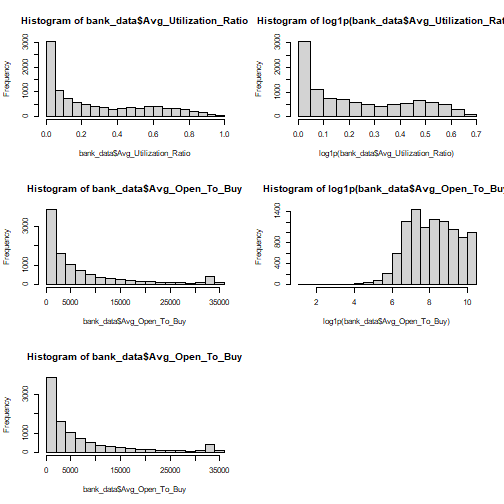

